This content cannot be displayed without JavaScript.  
Please enable JavaScript and reload the page.

#  LAB 

## LabAlchemy Documentation

  * Table of Contents
  * Getting Started0
    * Welcome to the Delphix Admin Training for Oracle Lab Guide
    * Lab Requirements
    * The Delphix Admin Training Cloud Lab
    * Important IP Addresses
    * Cloud Lab Usernames and Passwords
    * Guide Layout
  * Lab Exercises
    * Optional Advanced Exercise - Perform a Storage Performance Test through the CLI
    * Exercise 1 - Delphix Data Platform Configuration
    * Exercise 2 - Create the "delphix_db" User
    * Exercise 3 - Validate the Source Environment with Hostchecker
    * Exercise 4 - Add a Source Environment and Link a dSource
    * Exercise 5 - Validate the Target Environment with Hostchecker
    * Exercise 6 - Add Target Environments
    * Exercise 7 - Provision a VDB
    * Exercise 8 - Refresh a VDB
    * Exercise 9 - Rewind a VDB
    * Exercise 10 - Set a New Retention Policy
    * Exercise 11 - Create and Save a Hook Operation Template
    * Exercise 12 - Create a VDB Template
    * Exercise 13 - Provision a VDB with Hook and VDB Template
    * Optional Advanced Exercise - Measure Network Performance Test through the CLI
    * Optional Advanced Exercise - Configure Delphix Replication
  * Lab Solutions
    * Exercise 1 - Delphix Data Platform Setup
    * Exercise 2 - Create the "delphix_db" User0
    * Exercise 3 - Validate the Source Environment with Hostchecker0
    * Exercise 4 - Add a Source Environment and Link a dSource0
    * Exercise 5 - Validate the Target Environment with Hostchecker0
    * Exercise 6 - Add Target Environment
    * Exercise 7 - Provision a VDB0
    * Exercise 8 - Refresh a VDB0
    * Exercise 9 - Rewind a VDB0
    * Exercise 10 - Set a New Retention Policy0
    * Exercise 11 - Create and Save a Hook Operation Template0
    * Exercise 12 - Create a VDB Template0
    * Exercise 13 - Provision a VDB with Hook and VDB Template0

  * LabAlchemy Documentation

#  Delphix Admin for Oracle Lab Guide

# Table of Contents

**Table of Contents**  
**Getting Started**  
**Welcome to the Delphix Admin Training for Oracle Lab Guide**  
**Lab Requirements**  
**The Delphix Admin Training Cloud Lab**  
**Important IP Addresses**  
**Cloud Lab Usernames and Passwords**  
**Guide Layout**  
**Lab Exercises**  
**Optional Advanced Exercise - Perform a Storage Performance Test through the
CLI**  
**Exercise 1 - Delphix Data Platform Configuration**  
**Exercise 2 - Create the "delphix_db" User**  
**Exercise 3 - Validate the Source Environment with Hostchecker**  
**Exercise 4 - Add a Source Environment and Link a dSource**  
**Exercise 5 - Validate the Target Environment with Hostchecker**  
**Exercise 6 - Add Target Environments**  
**Exercise 7 - Provision a VDB**  
**Exercise 8 - Refresh a VDB**  
**Exercise 9 - Rewind a VDB**  
**Exercise 10 - Set a New Retention Policy**  
**Exercise 11 - Create and Save a Hook Operation Template**  
**Exercise 12 - Create a VDB Template**  
**Exercise 13 - Provision a VDB with Hook and VDB Template**  
**Optional Advanced Exercise - Measure Network Performance Test through the
CLI**  
**Optional Advanced Exercise - Configure Delphix Replication**  
**Lab Solutions**  
**Exercise 1 - Delphix Data Platform Setup**  
**Exercise 2 - Create the "delphix_db" User**  
**Exercise 3 - Validate the Source Environment with Hostchecker**  
**Exercise 4 - Add a Source Environment and Link a dSource**  
**Exercise 5 - Validate the Target Environment with Hostchecker**  
**Exercise 6 - Add Target Environment**  
**Exercise 7 - Provision a VDB**  
**Exercise 8 - Refresh a VDB**  
**Exercise 9 - Rewind a VDB**  
**Exercise 10 - Set a New Retention Policy**  
**Exercise 11 - Create and Save a Hook Operation Template**  
**Exercise 12 - Create a VDB Template**  
**Exercise 13 - Provision a VDB with Hook and VDB Template**

# Getting Started0

## Welcome to the Delphix Admin Training for Oracle Lab Guide

This guide is a supplement to the Delphix Admin Training for Oracle course,
and provides several exercises to perform throughout the class. If you
encounter any issues during the exercises, please do not hesitate to ask your
instructor for advice.

## Lab Requirements

In order to perform these lab exercises, you will need:

  * A modern HTML5 capable web browser (IE9+, Chrome, Firefox, Safari) 

## The Delphix Admin Training Cloud Lab

Your instructor should have provided you with a **Class Name** and a **Student
Number**. In order access your lab server, point your web browser to: http://
**classname**.agile.today/ **studentnumber**  
For example, if your **Class Name** is  "acmetech" and your **Student Number**
is 5, you would go to the site: <http://acmetech.agile.today/5>  
  
  
The Delphix Labs Login Dialog  
  
At the login screen, enter the username and password: delphix/delphix  
Once you have logged in, you will be connected to your lab server. This server
contains everything you will need to perform your lab exercises including:

  * Terminal with SSH (or Putty) to connect to Linux source/target database servers 

  * Chrome Web Browser to connect to your Delphix Data Platform 

  * A copy of this lab guide 

  * Notepad for class notes 

  * Oracle SQL Developer for remote connections 

**IMPORTANT NOTE:** Do not use the  "Log Out" function on your lab server. If
you do, it will break your lab connection.  
  
  
  
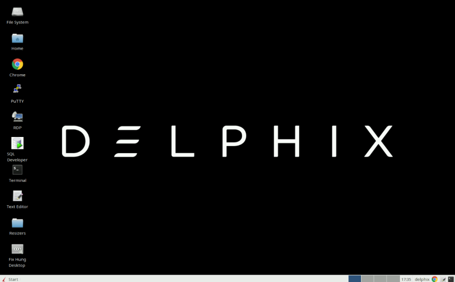  
The Delphix Lab Server

## Important IP Addresses

**Delphix Data Platform**

|

10.0.x.10  
  
---|---  
  
**Linux Source**

|

10.0.x.20  
  
**Linux Target**

|

10.0.x.30  
  
  
In the above IP addresses, the "x" denotes your **Student Number**. For
example, if your student number is  "5," your Delphix Data Platform will be
located at "10.0.5.10".

## Cloud Lab Usernames and Passwords

Initial Delphix **sysadmin** password

|

sysadmin  
  
---|---  
  
Initial Delphix **delphix_admin** password

|

delphix  
  
Source and Target **delphix** user password (via SSH)

|

delphix  
  
Source and Target **oracle** user password (via SSH)

|

delphix  
  
## Guide Layout

This guide is composed of two main sections: **Lab Exercises** and **Lab
Solutions**. The Lab Exercises section will cover the requirements of each Lab
Exercise, without providing the full details to perform each operation. If you
need assistance completing an Exercise, the **Lab Solutions** section will
provide detailed instructions.

#  Lab Exercises

Perform these exercises when instructed by your Delphix Instructor.

## Optional Advanced Exercise - Perform a Storage Performance Test through the
CLI

In this exercise, you will:

  * Log into the Delphix Data Platform prior to configuration via the Delphix Command Line Interface (CLI) 

  * Perform a Storage Test 

  * View the Storage Test results 

**Steps**  
As an advanced exercise, this lab has no corresponding Lab Solution. Instead,
we will walk through the steps to get you acquainted with your lab system and
the Delphix CLI.

  1. On your Lab Server desktop, double-click on Terminal 

  2. Type: _ssh sysadmin@10.0.x.10_ ('x' is your **Student Number** assigned by your instructor) 

    1. If you receive a prompt asking you if you are sure you want to connect, enter: Yes 

    2. Enter the password: sysadmin 

    3. Escape to the standard CLI prompt by typing _discard_ and then press the enter key 

    4. You are now at the root of the Delphix CLI as a System Administrator 

  3. Create a storage test by typing: **storage test create** and press the enter key 

    1. List the default storage test parameters by typing: **get**

    2. Override the duration and set it to 5 minutes: **set duration=5**

    3. Begin the storage test by typing: **commit**

_Note: The actual duration of the test may vary depending on the performance
of the attached storage._ _It is expected that this test will take anywhere
between 6 - 8 minutes to complete with duration set to 5._  
  
Example Storage Test Configuration

  1. View the storage test results 

    1. Get back to the storage test section of the CLI by typing: **storage test** and press the enter key 

    2. Type the command **list** and press the enter key 

You should see the completed test listed.

  1.     1. Type "select" followed by the name of the test from the list. For example: 

**select STORAGE_TEST-1**

  1.     1. Enter the result command by typing: **result**

    2. Then type: **commit**

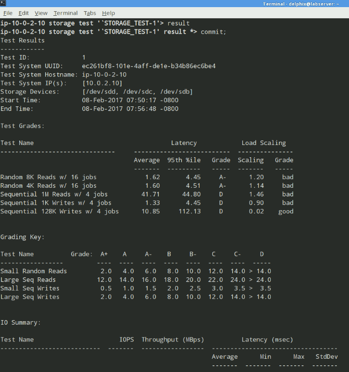  
Example Storage Test Results

## Exercise 1 - Delphix Data Platform Configuration

In this exercise, you will:

  * Access the Delphix Data Platform GUI for the first time 

  * Set up the Delphix SYSADMIN user 

  * Configure Timezone Preferences 

  * Configure Network Settings 

  * Configure Storage 

  * Complete the Delphix Data Platform configuration 

  * Set up the DELPHIX_ADMIN user 

**Steps**

  1. Connect to your Delphix Data Platform using Chrome on your lab server (see the **Important IP Addresses** section of the Getting Started guide above). 

  2. Set the new sysadmin password to: delphix 

  3. Configure the Delphix Data Platform with the following details: 

    1. NTP on using pool.ntp.org with your local timezone 

    2. Default network settings 

    3. Three 8GB volumes in the data pool 

    4. Uncheck the "Enable phone home service" box in the Serviceability tab 

    5. Default Authentication Service options 

    6. Registration is not required for this lab 

    7. Completed and saved System setup. 

  4. Log in with the initial delphix_admin user credentials 

  5. Set the new delphix_admin password to: delphix 

You will know this is successful when you see the main Delphix UI screen with
a single group (Untitled) on the left hand side.  
 **Related Links**  
[The delphix_admin and sysadmin User
Roles](https://docs.delphix.com/display/DOCS43/The+delphix_admin+and+sysadmin+User+Roles)  
[Setting Up the Delphix Data
Platform](https://docs.delphix.com/display/DOCS43/Setting+Up+the+Delphix+Engine)

##  Exercise 2 - Create the "delphix_db" User

In this exercise, you will:

  * Create a Delphix DB User on your source database 

**Steps**

  1. Use **Terminal** to SSH into your Linux Source (see the **Important IP Addresses** section of the Getting Started guide above). 

  2. Untar the hostchecker_linux_x86.tar file in your home directory 

  3. Inside the hostchecker folder run the createDelphixDBUser.sh command 

    1. export ORACLE_SID= **orcl**

    2. export ORACLE_HOME= **/u01/app/oracle/product/11.2.0/dbhome_1**

    3. cd hostchecker 

    4. ./createDelphixDBUser.sh 

  4. Use the following details during the running of this script: 

    1. Instance Name: **orcl**

    2. Delphix DB User Username: **delphix_db**

    3. Delphix DB User Password: **delphix_db**

    4. Decline the SELECT ANY DICTIONARY privilege. This is a sweeping privilege that is not required, but optional. 

The script should configure and create the user without error.

## Exercise 3 - Validate the Source Environment with Hostchecker

In this exercise, you will:

  * Use the 'hostchecker' program to run validation tests on your Linux Source 

**Steps**

  1. Use **Terminal** to SSH into your Linux Source (see the **Important IP Addresses** section of the Getting Started guide above). 

  2. Go to the hostchecker directory created in the previous exercise and type: ./hostchecker.sh 

**Note: If you exited your session or created a new session after completing
the previous exercise, you need to set your environment variables again.**  
export ORACLE_SID=orcl  
export ORACLE_HOME=/u01/app/oracle/product/11.2.0/dbhome_1

  1. Run hostchecker for a source and perform the following checks: 

    1. Check on the delphix homedir 

    2. Check the following ports on your Delphix Data Platform (10.0.x.10): 8415, 8341, 50001, and 873 

    3. Check the Oracle installation for your current $ORACLE_HOME value 

    4. Check the oratab file 

    5. Check all instances on the machine 

    6. Check for ssh connectivity 

    7. Check for sudo privileges as the delphix user 

    8. Check sshd_config for timeout 

    9. Check the toolkit path of: /u01/app/toolkit 

Were all tests successful? If not, which ones failed and why?  
 **Note** : The sshd_config test will return a WARNING response, which is
normal in a production installation due to permissions on the file. If
hostchecker is run as root for this test, it will perform the test properly.

## Exercise 4 - Add a Source Environment and Link a dSource

In this exercise, you will:

  * Connect Delphix to your Source Oracle Database server 

  * Create an Oracle dSource by syncing with your Source Oracle Database 

  * Create a Delphix Group to hold your dSource object 

**Steps**

  1. Log into the Delphix Data Platform as _delphix_admin_

  2. Add your Linux Source as an Environment with the following details: 

    1. Host OS: Unix/Linux 

    2. Server Type: Standalone 

    3. Environment Name: Source 

    4. Host Address: 10.0.x.20 ('x' will be your **Student Number** ) 

    5. OS Username: delphix 

    6. OS Password: delphix 

    7. Toolkit Path: /u01/app/toolkit 

Now, link the **_orcl_** dSource:

  1. Add the **_orcl_** dSource with the following details: 

    1. DB Username and Password: The username/password you created in Exercise 2 

    2. Use a new Group called: **DB Sources**

    3. Accept defaults for the Loading Options and Hooks 

You will know this is successful if the dSource completes in the **Actions**
pane without Errors. Click on **Actions** in the top menu bar if you don't see
this pane.

##  Exercise 5 - Validate the Target Environment with Hostchecker

In this exercise, you will:

  * Use the 'hostchecker' program to run validation tests on your Linux Target 

**Steps**

  1. Use **Terminal** to SSH into your Linux Target A (see the **Important IP Addresses** section of the Getting Started guide above). 

  2. Untar the hostchecker_linux_x86.tar file in your home directory 

  3. Set the Oracle environment variables for the delphix os user as follows: 

    1. export ORACLE_SID= **orcl**

    2. export ORACLE_HOME= **/u01/app/oracle/product/11.2.0/dbhome_1**

  4. Run hostchecker for a target and perform the following checks: 

  5. Check on the delphix homedir 

  6. Check the following ports on your Delphix Data Platform (10.0.x.10): 8415, 873, 22, 80, 443 

  7. Check the Oracle installation for your current $ORACLE_HOME value 

  8. Check for ssh connectivity 

  9. Check the oratab file 

  10. Check for sudo privileges as the delphix user 

  11. Check sshd_config for timeout 

  12. Check the toolkit path of: /u01/app/toolkit 

If you have completed all of the checks and they have returned SUCCESS and ALL
OK, you have completed this exercise.  
 **Note** : The sshd_config test will return a WARNING response, which is
normal in a production installation due to permissions on the file. If
hostchecker is run as root for this test, it will perform the test properly.

## Exercise 6 - Add Target Environments

In this exercise, you will:

  * Connect Delphix to your Target Oracle server 

**Steps**

  1. Add your Linux Target Environment with the following details: 

    1. Environment Name: **Target**

    2. Host Address: 10.0.x.30 ('x' will be your **Student Number** ) 

    3. OS Username: **delphix**

    4. OS Password: **delphix**

    5. Toolkit Path: **/u01/app/toolkit**

You can verify that this is complete by waiting for the _Create and discover
environment "10.0.x.30"_ action to complete on the right hand side of the
screen in the _Actions_ pane. Once it is complete, the _Target_ environment
will appear on the left side of the _Environments_ page.

##  Exercise 7 - Provision a VDB

In this exercise, you will:

  * Create a VDB called **devdb**

**Steps**

  1. Select the **orcl** dSource and Provision a VDB with the following details: 

    1. Destination Environment: **Target**

    2. Database Unique Name: **devdb**

    3. SID: **devdb**

    4. Database Name: **devdb**

    5. Mount Base: **/mnt/provision**

  2. Add the VDB to a new group called **DB Targets**

  3. Complete the VDB creation 

It may take a couple minutes for the VDB creation to complete. You can monitor
the progress on the left-hand side of the screen next to the **devdb** object
in the _DB Targets_ group. On the _Actions_ pane on the right-hand side of the
screen, you should see the _Provision virtual database "devdb"_ item move to
the _Recently completed_ pane without error. Once the VDB is created, you can
verify that the VDB is operational by:

  1. SSH to Linux Target as the delphix user 

  2. Run the following commands: 

export ORACLE_HOME=/u01/app/oracle/product/11.2.0/dbhome_1  
export ORACLE_SID=devdb  
export PATH=$ORACLE_HOME/bin:$PATH  
sqlplus / as sysdba  
select name from v$database;

## Exercise 8 - Refresh a VDB

In this exercise, you will:

  * Create a new table on your source database 

  * Snapshot the dSource 

  * Refresh your VDB - **devdb**

  * Verify the new table appears on the VDB 

**Steps**

  1. Connect to your Linux Source server as the delphix user via SSH 

  2. Run the following commands: 

export ORACLE_HOME=/u01/app/oracle/product/11.2.0/dbhome_1  
export ORACLE_SID=orcl  
export PATH=$ORACLE_HOME/bin:$PATH  
sqlplus / as sysdba  
create table sourcetab as select * from dba_objects;

  1. Go back to the Delphix Data Platform GUI 

  2. Take a snapshot of the **orcl** dSource 

  3. Select the _devdb_ VDB and click the _Refresh_ button 

  4. Refresh the _devdb_ VDB using the latest snapshot from the **orcl** dSource 

Once the refresh has completed, you can log into **devdb** to confirm.

  1. Connect to your Linux Target server as the delphix user via SSH 

  2. Run the following commands: 

export ORACLE_HOME=/u01/app/oracle/product/11.2.0/dbhome_1  
export ORACLE_SID=devdb  
export PATH=$ORACLE_HOME/bin:$PATH  
sqlplus / as sysdba  
select count

from sourcetab;  
If this returns a count of rows, the snapshot/refresh was successful.

## Exercise 9 - Rewind a VDB

In this exercise, you will:

  * Take a snapshot of the _devdb_ VDB 

  * Corrupt the _devdb_ VDB to introduce a bootstrap error 

  * Rewind the _devdb_ VDB to recover from the error 

**Steps**

  1. Take a snapshot of the _devdb_ VDB and note the time 

  2. Connect to your Linux Target server as the delphix user via SSH 

  3. Run the following commands: 

export ORACLE_HOME=/u01/app/oracle/product/11.2.0/dbhome_1  
export ORACLE_SID=devdb  
export PATH=$ORACLE_HOME/bin:$PATH  
sqlplus / as sysdba  
delete from sys.obj$;  
commit;  
shutdown abort;  
startup;  
Note that the database is unable to come online due to a bootstrap error. The
_devdb_ database is now corrupted. Now we will rewind the VDB to the last good
snapshot to fix this.

  1. Select the _devdb_ VDB 

  2. Select the snapshot associated with the date/time you recorded prior to corrupting your database. 

  3. Rewind the VDB to the snapshot you took prior to the corruption. 

Once the rewind operation is complete, you can confirm the rewind was
successful by connecting to the server again and querying the database:

  1. Connect to your Linux Target server as the delphix user via SSH 

  2. Run the following commands: 

export ORACLE_HOME=/u01/app/oracle/product/11.2.0/dbhome_1  
export ORACLE_SID=devdb  
export PATH=$ORACLE_HOME/bin:$PATH  
sqlplus / as sysdba  
select count

from dba_objects;  
The count should come back clean, and the database is online

## Exercise 10 - Set a New Retention Policy

There are four types of Policies in Delphix. In this exercise, you will:

  * Create a Retention Policy 

  * Set the new policy to keep snapshots and logs for 30 days, along with 3 monthly snapshots 

  * Apply the policy to the VDB we created in the previous exercise 

**Steps**

  1. Navigate to Manage -> Policies 

  2. Create a new retention policy for **devdb** with the following details: 

    1. Name: Long Term 

    2. 30 days of snapshot and log retention 

    3. 3 monthly snapshots taken on the 1st of the month 

## Exercise 11 - Create and Save a Hook Operation Template

In this exercise, you will:

  * Create a Hook Operation Template called _Create APPUSER_

  * Insert code into the template that will log into a database and add a user named _appuser_

**Steps**

  1. Create a new Hook Operation Template called: Create APPUSER 

    1. Type: Shell Command 

    2. Contents (enter exactly): 

$ORACLE_HOME/bin/sqlplus / as sysdba << EOF  
create user appuser identified by appuser;  
grant connect, resource to appuser;  
exit;  
EOF  
 **IMPORTANT:** Make sure the carriage returns you see here are the same in
the pasted contents.

  1. Finish and verify the Hook Operation Template appears in the list. 

## Exercise 12 - Create a VDB Template

In this exercise, you will:

  * Create a VDB Configuration template called _1G Template_

  * Set a custom Oracle parameter for this template 

**Steps**

  1. Navigate to Manage -> VDB Config Templates 

  2. Create a new Template with the name: 1G Template 

  3. Add a parameter to the template with the details: 

    1. Name: **memory_target**

    2. Value: **1G**

You can verify that this was successful by returning to the _VDB Configuration
Templates Wizard_ and clicking on the _1G Template_ item.

##  Exercise 13 - Provision a VDB with Hook and VDB Template

In this exercise, you will:

  * Create a VDB called **qadb** on _Target_

  * Use the VDB Configuration Template we created previously 

  * Use the Hook Operation Template we created previously 

  * Log into the VDB 

  * Verify the VDB Configuration Template and Hook Operation Template were successful 

**Steps**

  1. Select the **orcl** dSource and Provision a VDB with the following details: 

    1. Destination Environment: Target 

    2. Database Unique Name: **qadb**

    3. SID: **qadb**

    4. Database Name: **qadb**

    5. Mount Base: **/mnt/provision**

    6. Configuration Template: **1G Template**

    7. Group: **DB Targets**

    8. Configure Clone hook: Create APPUSER 

  2. Complete the VDB creation 

It may take a couple minutes for the VDB creation to complete. You can monitor
the progress on the left-hand side of the screen next to the _qadb_ object in
the _DB Targets_ group. On the _Actions_ pane on the right-hand side of the
screen, you should see the _Provision virtual database "qadb"_ item move to
the _Recently completed_ pane without error. Once the VDB is created, you can
verify that the VDB is operational by:

  1. SSH to Linux Target as the delphix user 

  2. Run the following commands: 

export ORACLE_HOME=/u01/app/oracle/product/11.2.0/dbhome_1  
export ORACLE_SID=qadb  
export PATH=$ORACLE_HOME/bin:$PATH  
sqlplus / as sysdba  
show parameter memory_target  
connect appuser/appuser  
This will verify that the VDB is online with the VDB Configuration Template we
specified, and that the APPUSER user was created by our hook.

## Optional Advanced Exercise - Measure Network Performance Test through the
CLI

In this exercise, you will:

  * Log into the Delphix Data Platform CLI as delphix_admin 

  * Perform a network latency test to Target 

  * Perform a network throughput test to Target 

**Steps**  
As an advanced exercise, this lab has no corresponding Lab Solution. Instead,
we will walk through the steps to get you acquainted the Delphix CLI for
delphix_admin.

  1. On your Lab Server desktop, double-click on Terminal 

  2. Type: **ssh delphix_admin@10.0.x.10** ('x' is your **Student Number** assigned by your instructor) 

    1. If you receive a prompt asking you if you are sure you want to connect, enter: Yes 

    2. Enter the password: **delphix**

    3. You are now at the root of the Delphix CLI as a Delphix Administrator 

  3. Create a network latency test by typing: **network test latency create**

    1. List the default/required parameters by typing: **get**

    2. Set the remoteHost value to the TargetA environment IP address: set remoteHost=10.0.x.30 ('x' will be your **Student Number** ) 

    3. Begin the test by typing: **commit**

  
Example Network Latency Test Submission

  1. View the results of the latency test: 

    1. Get to the latency test section again by typing: **network test latency**

    2. List the completed tests by typing: **ls**

    3. Type "select" followed by the name of the test from the list. For example: 

**select 10.0.1.30-2015-09-18T12:47:19.711Z**

  1.     1. View the results of the test by typing: **get**

  
Example Network Latency Test Results

  1. Create a network throughput test 

    1. While still logged into the CLI, return to the root by typing: **cd /**

    2. Begin a network throughput test by typing: **network test throughput create**

    3. List the default/required parameters by typing: **get**

    4. Set the remoteHost value to the TargetA environment IP address: **set remoteHost=10.0.x.30** ('x' will be your **Student Number** ) 

    5. Begin the test by typing: **commit**

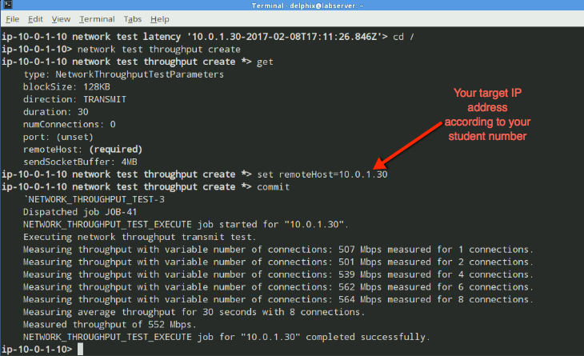  
Example Network Throughput Test Submission

  1. View the results of the throughput test: 

    1. Get to the throughput test section again by typing: **network test throughput**

    2. List the completed tests by typing: **ls**

    3. Type "select" followed by the name of the test from the list. 

For example:  
 **select 10.0.1.30-2015-09-18T13:13:08.152Z**

  1.     1. View the results of the test by typing: **get**

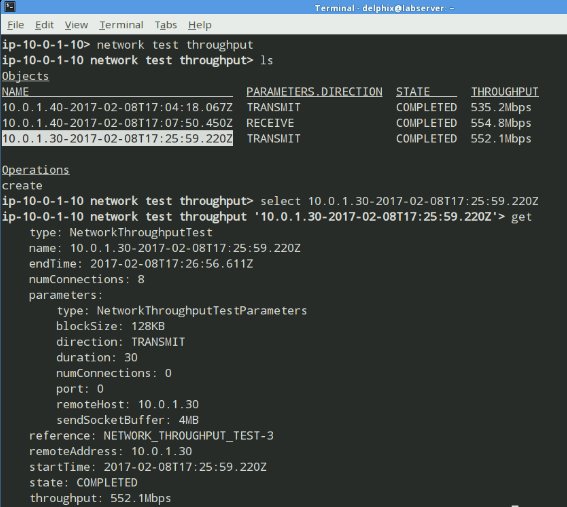  
Example Network Throughput Test Results

## Optional Advanced Exercise - Configure Delphix Replication

Note: This exercise is only possible if your classroom has been configured
with 2 or more students.  
In this exercise, you will:

  * Set up a replication profile 

  * Replicate your entire Delphix Data Platform to another Delphix Data Platform 

  * View the replicas in the target Delphix Data Platform 

**Steps**  
As an advanced exercise, this lab has no corresponding Lab Solution. Instead,
we will walk through the steps to get you acquainted the Delphix Replication
capability.

  1. In the Delphix GUI, select _System_ and then _Replication_ on the top menu bar 

  2. Add a Replication Profile called DR Replica 

    1. Click the _plus sign_ next to Replication Profiles on the top left 

    2. Enter a Replica Profile Name: **DR Replica**

    3. For Target Engine, enter the Delphix Data Platform IP address for the next student in your classroom environment. If you are the last student, use the Delphix Data Platform IP address for Student 1. For example, in a class with 3 students: 

      1. Student 1 Delphix Data Platform is at 10.0.1.10, and they will replicate to 10.0.2.10 

      2. Student 2 Delphix Data Platform is at 10.0.2.10, and they will replicate to 10.0.3.10 

      3. Student 3 Delphix Data Platform is at 10.0.3.10, and they will replicate to 10.0.1.10 

      4. Ask your instructor if you have any questions or confusion about this configuration. 

    4. Enter the User Name: **delphix_admin**

    5. Enter the Password: **delphix**

    6. Do not enable Automatic Replication or configure Traffic Options 

    7. For the Objects Being Replicated, select: Entire Delphix Data Platform 

    8. Click Create at the bottom when ready. 

  
Replication Profile Configuration

  1. Start the Replication by clicking the _Replicate Now_ button on the top right of your screen. 

  2. Click _Replicate_ to confirm you are ready to begin. 

  3. Once the initial full replication is complete, you will see a message stating "Last Replication Successful."

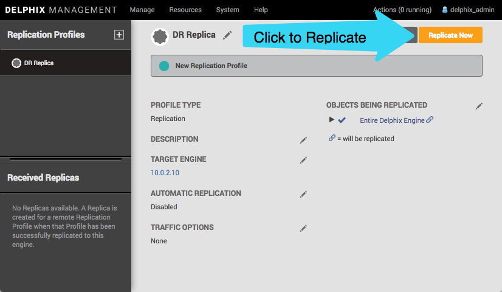  
Example Successful Replication

  1. Check the results on your target Delphix Data Platform 

    1. In your lab server browser, enter the IP address you used for the Target Engine in your replica profile. For example, if you are Student 1, your Delphix Data Platform is at 10.0.1.10, and your target would have been 10.0.2.10. 

    2. Log in as user delphix_admin with the password delphix 

    3. Observe the dropdown list under Datasets on the top left corner of your screen. It should have _Default_ _shown_ which is the default **Namespace** for Delphix replica targets. 

    4. In order to see the replica objects, click on the dropdown list and select the second entry, which should reflect the hostname of the source Delphix Data Platform that sent the replica. 

_Note: The hostname shown in the labs is based on the default hostname given
to the Delphix Data Platform in Amazon AWS, consisting of the prefix "ip"
followed by the IP address separated by hyphens._  
  
Example Received Replica

  1. While still logged into your target Delphix Data Platform, click on _System_ and then _Replication_

  2. Observe the _Received Replicas_ section at the bottom, indicating and verifying the target's receipt of replication data. 

    1. Note: The _Failover Now_ option will not work for these labs due to namespace collisions. This is an inherent outcome to plan for when using Active/Active replication. 

#  Lab Solutions

## Exercise 1 - Delphix Data Platform Setup

  1. Connect to your Delphix Data Platform using Firefox on your lab server. The IP address will be 10.0.x.10, where "x" is your **Student Number**. 

  2. Review the Welcome page to understand the setup process 

  3. Set an email address and new password for the _sysadmin_ user and click _Next_. 

  4. Configure Delphix to use NTP time with the pool.ntp.org NTP server. Change the timezone to your local timezone. Then click _Next_. 

  5. Review the network configuration and click _Next_. Do not make any changes to this section. 

  6. Review the disk layout and click _Next_. Do not make any changes to this section. 

  7. Review the Serviceability options and uncheck the "Enable phone home service" box then click _Next_. 

  8. Review the Authentication Service options and click _Next_. Do not make any changes to this section. 

  9. Click _Next_ on the Registration page without making any changes. 

  10. Review the summary and click _Submit_ to complete the System configuration. 

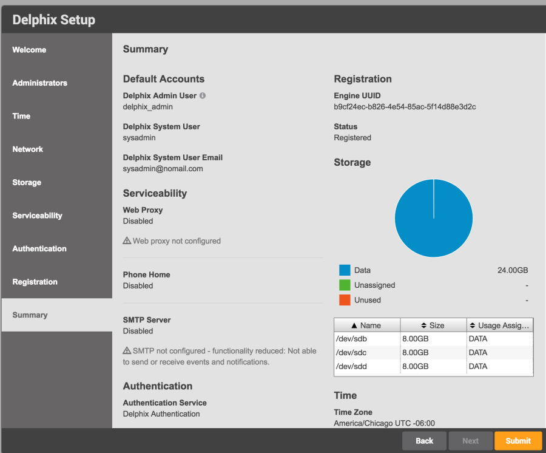  
_Figure 1 Delphix Setup Summary Screen_

  1. Click _Submit_ to save the configuration. 

  2. Click _OK_ to acknowledge completion 

  3. Log in with credentials: 

    1. Username: delphix_admin 

    2. Password: delphix 

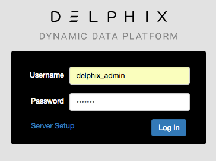  
_Figure 2_ _Delphix Data Platform Login_

  1. Set an email address and new password for the _delphix_admin_ user 

  
_Figure 3_ _Delphix Data Platform Home Page_

##  Exercise 2 - Create the "delphix_db" User0

  1. Connect to your Linux Source by opening **Terminal** on your Lab Server and running: conn 10.0.x.20 ('x' will be your **Student Number** ). 

  2. Observe the name and location of the hostchecker package by running the command: ls -ltr 

  3. Expand the hostchecker package by running: tar -xvf hostchecker_linux_x86.tar 

  4. Type: cd hostchecker 

  5. Observe the files present in this folder, which we will be using again: ls -ltr 

  6. Set the Oracle environment variables below: 

    1. export ORACLE_SID= **orcl**

    2. export ORACLE_HOME= **/u01/app/oracle/product/11.2.0/dbhome_1**

  7. Run the command: **_./createDelphixDBUser.sh_**

  8. Press Enter to accept the default instance name (orcl) 

  9. Enter the Delphix DB User Username: **delphix_db**

  10. Enter the Delphix DB User Password: **delphix_db**

  11. Type 'n' and press enter to accept the default to grant SELECT ANY DICTIONARY 

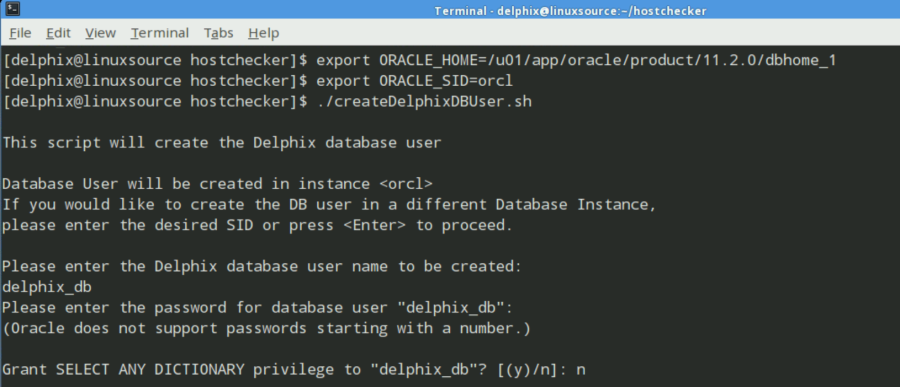  
_Figure 4_ _hostchecker createDelphixUser.sh_

##  Exercise 3 - Validate the Source Environment with Hostchecker0

  1. Connect to your Linux Source by opening **Terminal** on your Lab Server and running: conn 10.0.x.20 ('x' will be your **Student Number** ). 

  2. Set the Oracle environment variables below: 

    1. export ORACLE_HOME=/u01/app/oracle/product/11.2.0/dbhome_1 

    2. export ORACLE_SID=devdb 

    3. export PATH=$ORACLE_HOME/bin:$PATH 

  3. Ensure you are inside the hostchecker location with the command: **cd /home/delphix/hostchecker**

  4. Run Hostchecker utility by typing1 the command: **./hostchecker.sh**

  5. Indicate that this machine is a "source" by typing: **source**

  6. Review the available checks that can be run on this system 

  7. Type "1" and press Enter. The script will check homedir permissions and return SUCCESS and ALL OK. 

  
_Figure 5_ _Hostchecker Options_

  1. Type "3" and press Enter. 

    1. Enter an IP address of: 10.0.x.10 ('x' will be your **Student Number** ). 

    2. Enter the port: 8415 

    3. The script will test the port and return SUCCESS and ALL OK. 

  2. Repeat the previous step for the following ports: 8341, 50001, and 873 

  3. Type "5" and press Enter. 

    1. Type "1" to select the current ORACLE_HOME value, and press Enter 

    2. The script will test the Oracle Home and return SUCCESS and ALL OK 

  4. Type "6" and press Enter. 

    1. Type "0" to select all Oracle Instances, and press Enter 

    2. The script will test the Oracle Instances and return SUCCESS and ALL OK 

  5. Type "7" and press Enter. The script will test the /etc/oratab file and return SUCCESS and ALL OK 

  6. Type "8" and press Enter. 

    1. Enter a password of: delphix 

    2. The script will test the SSH connectivity to the host and return SUCCESS and ALL OK. 

  7. Type "9" and press Enter. 

    1. The script will return a WARNING due to permissions. This is normal. 

  8. Type "10" and press Enter. 

    1. Enter a password of: delphix 

    2. The script will test sudo privileges and return SUCCESS and ALL OK 

  9. Type "11" and press Enter. 

    1. Enter a path of: /u01/app/toolkit 

    2. The script will test the path and return SUCCESS and ALL OK 

  10. Type "quit" to exit hostchecker. 

## Exercise 4 - Add a Source Environment and Link a dSource0

Add Source Environment

  1. If you are not already logged in, login to your Delphix Data Platform as _delphix_admin_ using the password you set in the last exercise. 

  2. In the top menu bar, click _Manage_ and then _Environments_. 

  3. Click on the fly-out menu next to _Environments_ and select Add Environment. 

  4. Provide the following details in the Add Environment Wizard 

Host and Server

  1.     1. Host OS: **Unix/Linux**

    2. Server Type: **Standalone**

Click Next

  1. On the Environment Settings tab, enter the following details 

    1. Environment Name: **Source**

    2. Host Address: **10.0.x.20** ('x' will be your **Student Number** ) 

    3. OS Username: **delphix**

    4. OS Password: **delphix**

    5. Toolkit Path: **/u01/app/toolkit** 

_Figure 6 Add Source Environment_

  1. Click _Submit_

  2. You can view the status of the environment creation and discovery by clicking on the Actions menu on the top right-hand side of the page. Clicking on the job in the Actions pane will allow you to track its progress 

  
_Figure 7 Environment Creation Progress_

  1. View the Environment details 

    1. Click on the Environment on the left on review information on the Details tab 

  1.     1. Click on the Databases tab to view any discovered database installations and databases 

  
Create dSource:

  1. On the top menu bar, click _Manage_ , then _Datasets_

  2. Click the _plus sign_ next to the word _Datasets_ on the top left portion of your screen and select the _Add dSource_ option. 

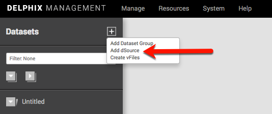  
_Figure 8 Add dSource_

  1. The Welcome page for the dSource Wizard will be displayed. Review the instructions to get an overview of the process and click Next. 

  2. Enter the following information on the Source tab 

    1. Select the **_orcl_** database from Data Source list 

    2. Choose delphix from the Environment User drop-down list (default) 

    3. Enter the DB Username and Password: 

      1. DB Username: **delphix_db**

      2. DB Password: **delphix_db**

    4. Click _Verify Credentials_

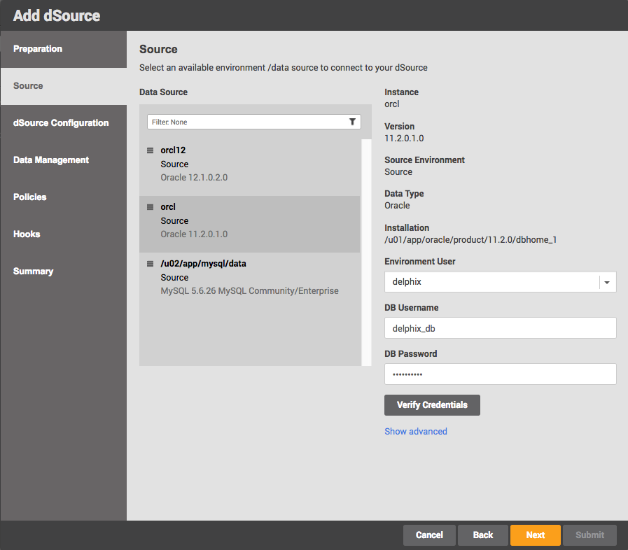

  1. Under the dSource Configuration tab we will provide a user-friendly name for the dSource and create a new Dataset Group to place it in. 

    1. Enter " **orcl** " for the dSource name 

    2. Click on the Add Dataset Group link and enter " _DB Sources_ " in the Name field. 

_Figure 9 dSource Configuration_

  1. Click _Next_

  2. On the Data Management tab, accept the default values and 

  3. Click Next 

  4. Accept the default policies 

  5. Click _Next_

  6. No Hooks will be added at this point. Click Next 

  7. Review the summary and click _Submit_

  
_Figure 10 Add dSource Summary_

  1. Wait for the dSource to be created 

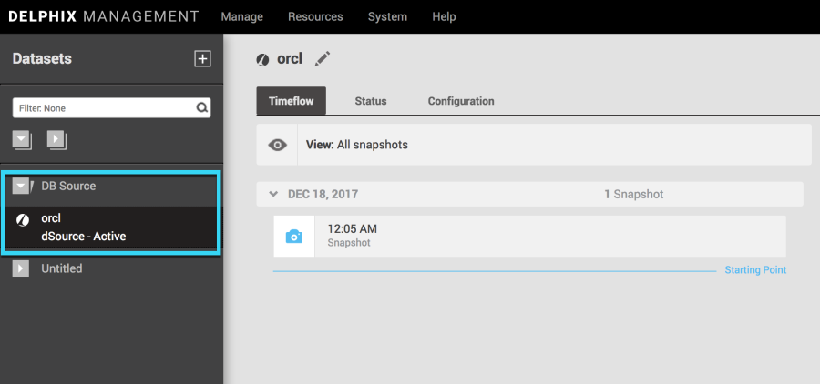  
_Figure 11 Completed dSource_

##  Exercise 5 - Validate the Target Environment with Hostchecker0

  1. Connect to your Linux Target A by opening **Terminal** on your Lab Server and running: conn 10.0.x.30 ('x' will be your **Student Number** ). 

  2. Observe the name and location of the hostchecker package by running the command: ls -ltr 

  3. Expand the hostchecker package by running: tar -xvf hostchecker_linux_x86.tar 

  4. Type: cd hostchecker 

  5. Run hostchecker.jar with the command: ./hostchecker.sh 

  6. Indicate that this machine is a "target" by typing: target 

  7. Review the available checks that can be run on this system 

  8. Type "1" and press Enter. The script will check homedir permissions and return SUCCESS and ALL OK. 

  
_Figure 12_ _Hostchecker Target Options_

  1. Type "3" and press Enter. 

    1. Enter an IP address of: 10.0.x.10 ('x' will be your **Student Number** ). 

    2. Enter the port: 8415 

    3. The script will test the port and return SUCCESS and ALL OK. 

  2. Repeat the previous step for the following ports: 873, 22, 80, 443 

  3. Type "5" and press Enter. 

    1. Type "1" to select the current ORACLE_HOME value, and press Enter 

    2. The script will test the Oracle Home and return SUCCESS and ALL OK 

  4. Type "6" and press Enter. The script will test the /etc/oratab file and return SUCCESS and ALL OK 

  5. Type "7" and press Enter. 

    1. Enter a password of: delphix 

    2. The script will test the SSH connectivity to the host and return SUCCESS and ALL OK. 

  6. Type "8" and press Enter. 

    1. The script will return WARNING due to permissions. This is normal. 

  7. Type "9" and press Enter. 

    1. Enter a password of: delphix 

    2. The script will test sudo privileges and return SUCCESS and ALL OK 

  8. Type "10" and press Enter. 

    1. Enter a path of: /u01/app/toolkit 

    2. The script will test the path and return SUCCESS and ALL OK 

  9. Type "quit" to exit hostchecker. 

## Exercise 6 - Add Target Environment

  1. If you are not already logged in, login to your Delphix Data Platform as _delphix_admin_ using the password you set in the last exercise. 

  2. In the top menu bar, click _Manage_ and then _Environments_. 

  3. Click on the fly-out menu next to _Environments_ and select Add Environment. 

  4. Provide the following details in the Add Environment Wizard 

Host and Server

  1.     1. Host OS: Unix/Linux 

    2. Server Type: Standalone 

Click Next

  1. On the Environment Settings tab, enter the following details 

    1. Environment Name 

    2. Host Address: 10.0.x.30 ('x' will be your **Student Number** ) 

    3. OS Username: delphix 

    4. OS Password: delphix 

    5. Click Validate 

    6. Toolkit Path: /u01/app/toolkit 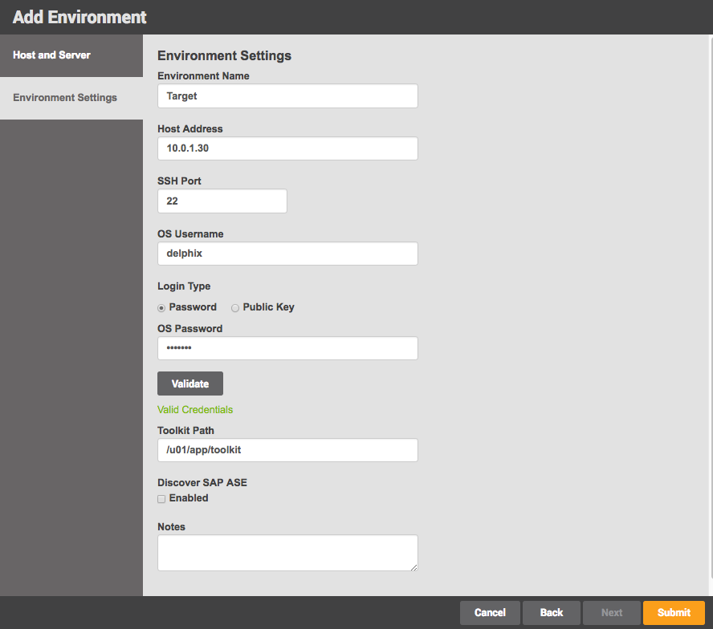

_Figure 13 Add Target Environment_

  1. Click _Submit_

  2. You can view the status of the environment creation and discovery by clicking on the Actions menu on the top right-hand side of the page. Clicking on the job in the Actions pane will allow you to track its progress. 

  3. View the Environment details 

    1. Click on the Environment Name on the left on review information on the Details tab 

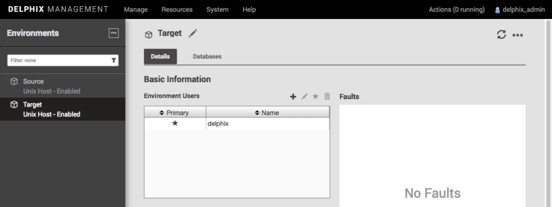

  1.     1. Click on the Databases tab to view any discovered database installations and databases 

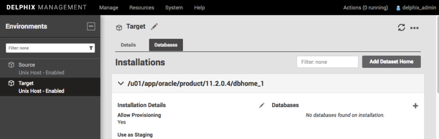

## Exercise 7 - Provision a VDB0

  1. Go the Datasets Home page by Clicking on the Manage menu and selecting Datasets 

  2. Expand the DB Source group and click on the **_orcl_** dSource object. This will reveal the Timeflow for the dSource by default. 

  3. Hovering over the Timeflow snapshot will reveal icons to provision a VDB, view LogSync and other information. 

Click on the Provision VDB icon
  
  
_Figure 14 Provision VDB_

  1. On the Target Environment tab, use the following information 

    1. Choose _Target_ under the list of Environments 

    2. Verify that the Installation Home is set to  /u01/app/oracle/product/11.2.0/dbhome_1 (11.2.0.1.0) 

    3. Ensure that the Environment User is set to delphix 

    4. Click Next 

  
_Figure 15 Provision VDB - Target Environment_

  1. Enter the details below on the Target Configuration tab 

    1. Database Unique Name: **devdb**

    2. Database Name: **devdb**

    3. SID: **devdb**

    4. Mount Base: **/mnt/provision**

  
_Figure 16 Provision VDB - Target Configuration_

  1. Click _Next_

  2. On the Configuration tab, we will provide a user-friendly name for the VDB as well as assign it to a new group. 

    1. VDB Name: **devdb**

    2. Click Add Dataset Group 

      1. Enter _DB Targets_ for the Group Name 

      2. Click Add 

    3. Verify that the _DB Targets_ Group is selected 

    4. Masking Job should be set to None 

    5. Check the box next to Enabled for _Auto VDB Restart_

    6. Click _Next_

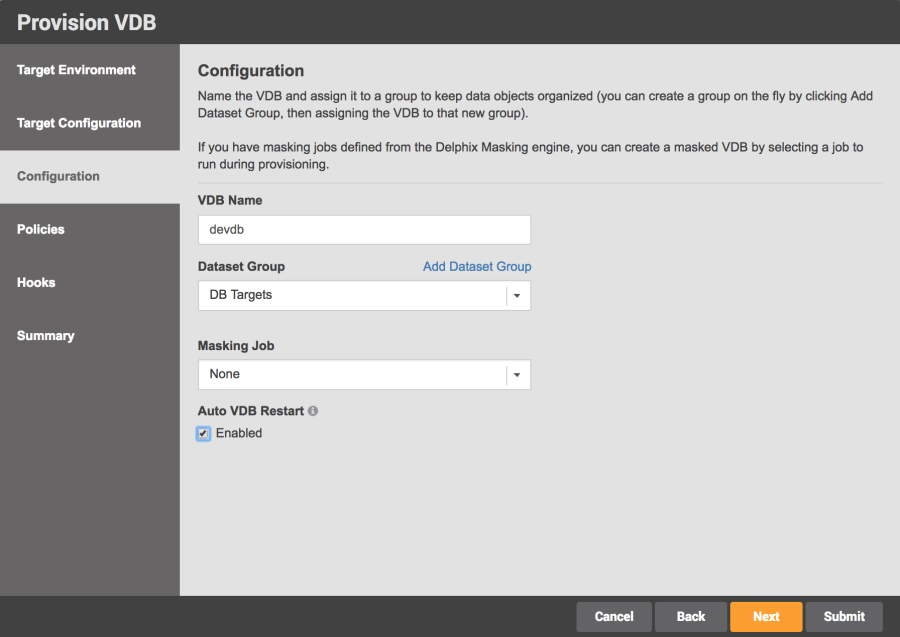  
_Figure 17 Provision VDB - Configuration_

  1. On the Policies tab, accept the defaults and click _Next_

  2. Accept the defaults on the Hooks tab and click _Next_

  3. Verify the summary information, and click _Submit_

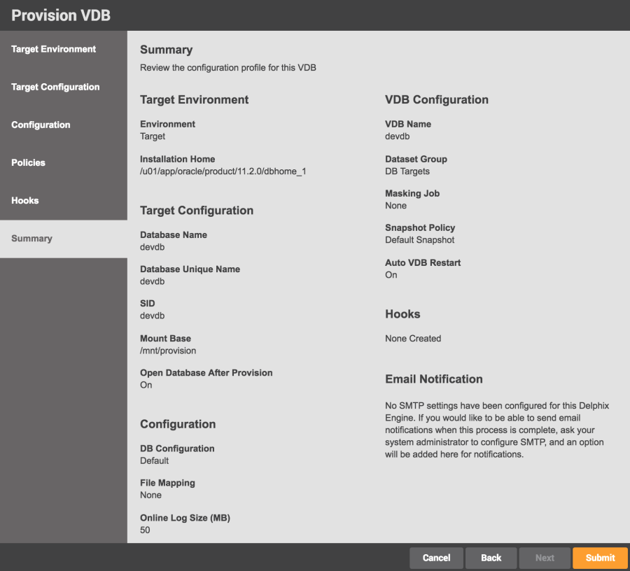  
_Figure 18 Provision VDB Summary_  
It may take a couple minutes for the VDB creation to complete. You can monitor
the progress on the left hand side of the screen next to the _devdb_ object in
the _DB Targets_ group. On the _Actions_ pane on the right hand side of the
screen, you should see the _Provision virtual database "devdb"_ item move to
the _Recently completed_ pane without error.  
Once the VDB is created, you can verify that the VDB is operational by:

  1. Using Terminal on your lab server, SSH to your Linux Target server at 10.0.x.30 ('x' will be your **Student Number** ). 

  2. Enter the username: delphix 

  3. Enter the password: delphix 

  4. Run the following commands: 

export ORACLE_HOME=/u01/app/oracle/product/11.2.0/dbhome_1  
export ORACLE_SID=devdb  
export PATH=$ORACLE_HOME/bin:$PATH  
sqlplus / as sysdba  
select name from v$database;  
  
_Figure 19 Validate VDB_

##  Exercise 8 - Refresh a VDB0

  1. Open Terminal on your Lab Server desktop and type: ssh delphix@10.0.x.20 ('x' will be your **Student Number** ) 

  2. Enter the username: delphix 

  3. Enter the password: delphix 

  4. Run the following commands: 

export ORACLE_HOME=/u01/app/oracle/product/11.2.0/dbhome_1  
export ORACLE_SID=orcl  
export PATH=$ORACLE_HOME/bin:$PATH  
sqlplus / as sysdba  
create table sourcetab as select * from dba_objects;

  1. Go back to the Delphix Data Platform in your browser (click the Delphix logo to go back to the main screen if required) 

  2. Click on the **orcl** dSource object on the left side of your screen (expand DB Source group if needed) 

  3. Click the _Camera Icon_ on the top-right to take a snapshot 

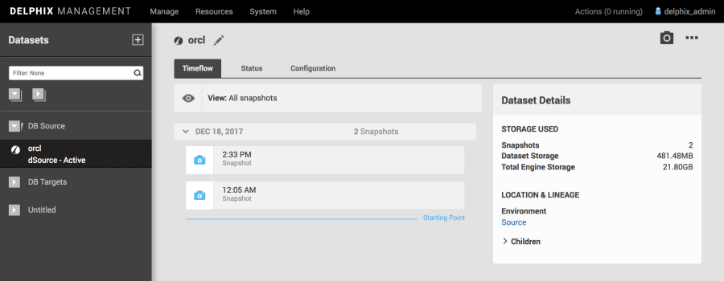  
_Figure 20 Snapshot dSource_

  1. Click on the _devdb_ VDB on the left side of your screen 

  2. Click the Timeflow tab 

  3. Click the _Refresh_ button on the top right next to the snapshot icon. 

  4. There are two options for refreshing the VDB, choose the "Faster" option to refresh from the most recent snapshot and click Next. 

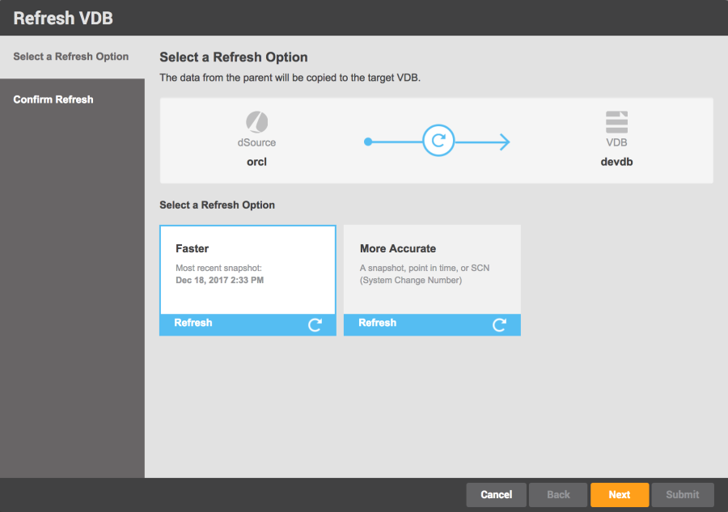  
_Figure 21 Refresh VDB_

  1. Click the _Submit_ button 

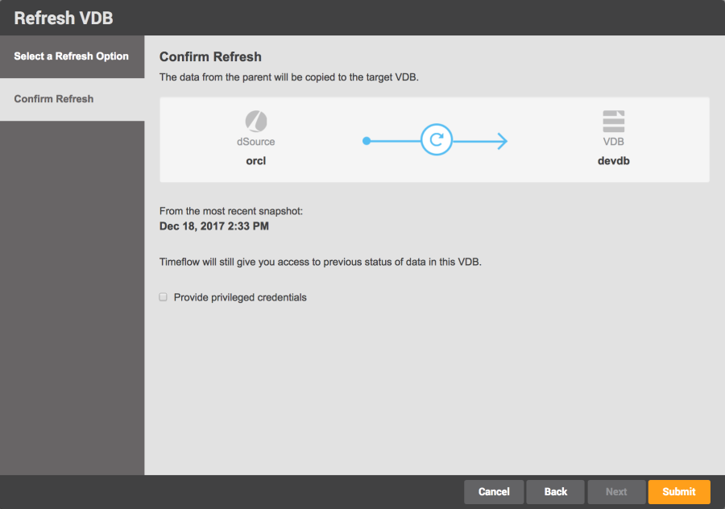  
_Figure 22 Refresh VDB from dSource_  
Once the refresh has completed, a new VDB snapshot will be generated and
reflected in the Timeflow.  
  
_Figure 23 VDB Refresh - Post Refresh_  
Log into _devdb_ to confirm.

  1. Open Terminal on your Lab Server desktop and type: ssh delphix@10.0.x.30 ('x' will be your **Student Number** ) 

  2. Enter the username: delphix 

  3. Enter the password: delphix 

  4. Run the following commands: 

export ORACLE_HOME=/u01/app/oracle/product/11.2.0/dbhome_1  
export ORACLE_SID=devdb  
export PATH=$ORACLE_HOME/bin:$PATH  
sqlplus / as sysdba  
select count

from sourcetab;  
  
_Figure 24 Validate Refresh_  
If this returns a count of rows, the snapshot/refresh was successful.

## Exercise 9 - Rewind a VDB0

  1. On the Delphix main screen, select the _devdb_ VDB 

  2. Click the _Camera_ icon on the top right to take a snapshot of the VDB 

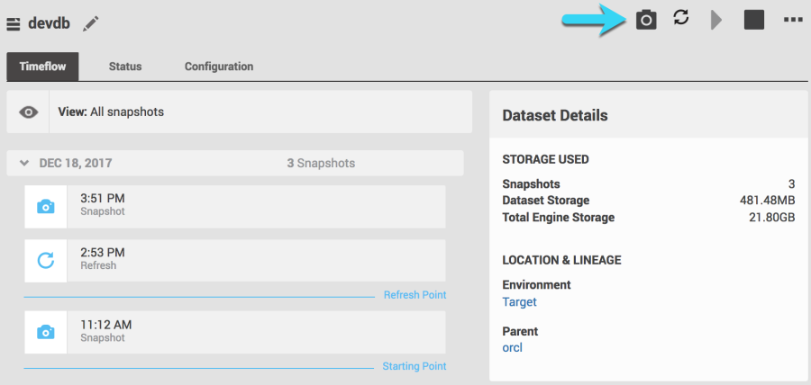  
_Figure 25 Snapshot VDB_

  1. A new snapshot card will be created on the _devdb_ Timeflow. Make a note of the date/time for the latest snapshot card. 

  2. Open Terminal on your Lab Server desktop and type: ssh delphix@10.0.x.30 ('x' will be your **Student Number** ) 

  3. Enter the username: delphix 

  4. Enter the password: delphix 

  5. Run the following commands: 

export ORACLE_SID=devdb  
sqlplus / as sysdba  
delete from sys.obj$;  
commit;  
shutdown abort;  
startup;  
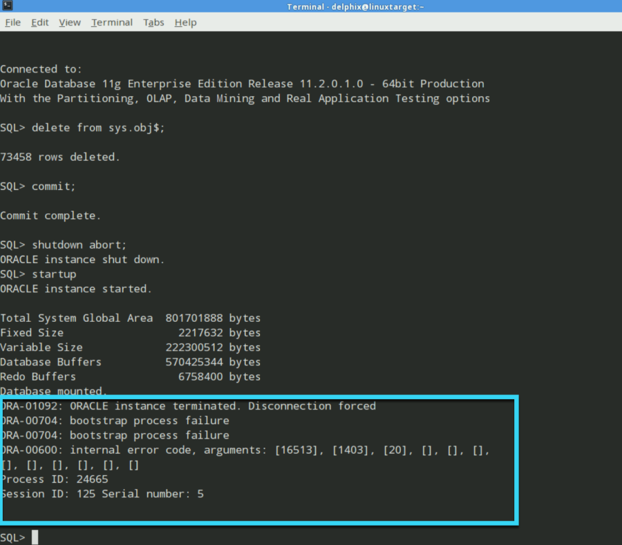  
_Figure 26 Corrupt VDB_  
Note that the database is unable to come online due to a bootstrap error. The
_devdb_ database is now corrupted. Now we will rewind the VDB to the last good
snapshot to fix this.

  1. In the Delphix Data Platform (web browser), click on the _devdb_ VDB if it is not already selected 

  2. Click on the Timeflow tab and select the snapshot associated with the date/time you recorded prior to corrupting your database. This will most likely be the latest snapshot. 

  3. Hover over the snapshot to reveal the Rewind button. 

  4. Click the _Rewind VDB_ button on the Timeflow 

  
_Figure 27 Rewind VDB_

  1. Confirm that you wish to rewind the VDB by clicking _Rewind_. 

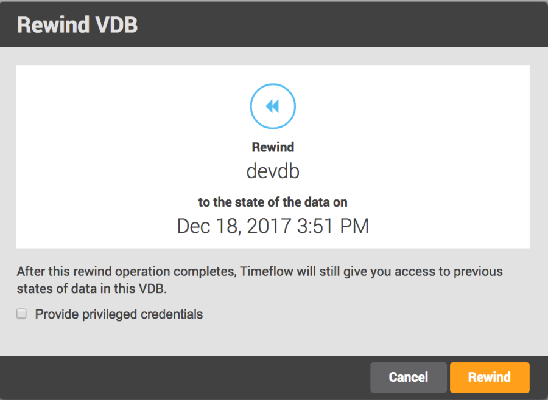  
_Figure 28 Rewind VDB Dialog_  
Once the rewind operation is complete, you can confirm the rewind was
successful by connecting to the server again and querying the database:

  1. Open Terminal on your Lab Server desktop and type: ssh delphix@10.0.x.30 ('x' will be your **Student Number** ) 

  2. Enter the username: delphix 

  3. Enter the password: delphix 

  4. Run the following commands: 

export ORACLE_HOME=/u01/app/oracle/product/11.2.0/dbhome_1  
export ORACLE_SID=devdb  
export PATH=$ORACLE_HOME/bin:$PATH  
sqlplus / as sysdba  
select count

from dba_objects;  
  
_Figure 29 Validate VDB Rewind_

##  Exercise 10 - Set a New Retention Policy0

  1. In the top menu bar, click on _Manage_ and then _Policies_

  2. Click the _Retention_ tab, click _+Retention_

  3. Provide the following details: 

    1. Policy Name: **Long Term**

    2. Keep Logs for: **30 days**

    3. Keep Snapshots for: **30 days**

  4. Click the Show a _dvanced link_

  5. Click the checkbox next to _Keep 3 Snapshot(s) on 1 st of every month_

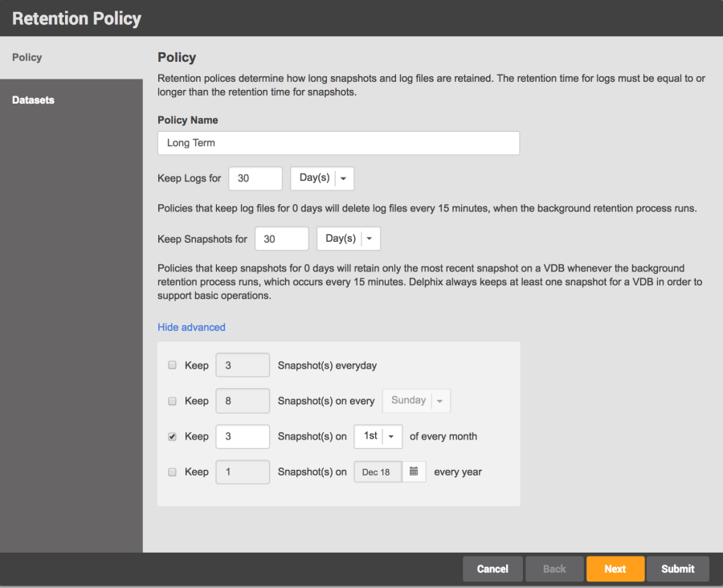  
_Figure 30 Create Retention Policy_

  1. Click _Next_

  2. On the Datasets tab click the checkbox for the _devdb_

  3. Click Submit 

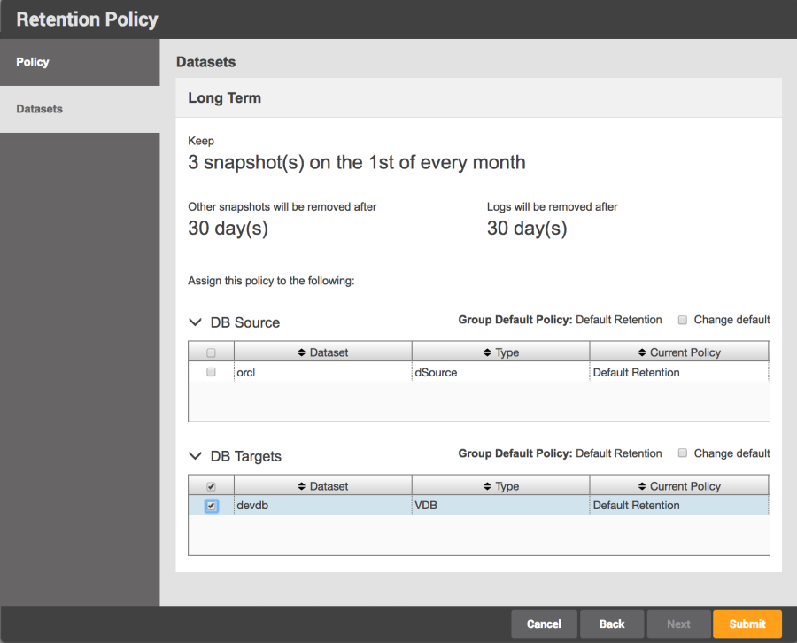  
_Figure 31 Apply Retention Policy_  
Expand the policies menu to validate that the new Long Term policy has been
applied to the _devdb_ VDB.  
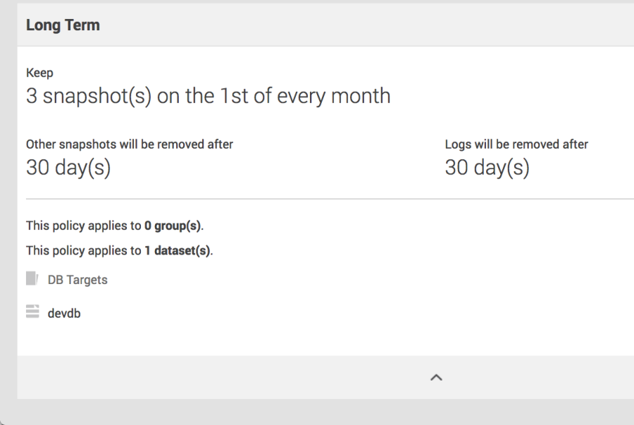  
_Figure 32 Retention Policy Settings_

##  Exercise 11 - Create and Save a Hook Operation Template0

  1. In the top menu bar, click _Manage_ , then _Operation Templates_

  2. Click the plus sign under the word _Templates_ in the Hook Operation Templates Wizard 

  3. Provide the _Name_ : Create APPUSER 

  4. Ensure _Type_ is set to: System Shell Command 

  5. Under _Contents_ , enter the following code: 

$ORACLE_HOME/bin/sqlplus / as sysdba << EOF  
create user appuser identified by appuser;  
grant connect, resource to appuser;  
exit;  
EOF  
  
_Figure 33 Create Hook Operation Template_

  1. Click _Create_

  2. Verify the Hook Operation Template is in the list, then click _Close_

  
_Figure 34 Hook Template_

  1. Figure Verify Hook Operation Template 

## Exercise 12 - Create a VDB Template0

  1. In the top menu bar, click _Manage_ , then _VDB Config Templates_

  2. Click the _plus sign_ next to the word _VDB Config_ _Templates_ and select _New Template_ from the drop-down. 

  3. Name: 1G Template 

  4. Click _Create_

  5. Click the pencil icon on the top right of the VDB Configuration Templates screen 

  6. Click the plus sign on the **top right** to add a new parameter 

    1. Double-click the row to enter a new value 

  7. In the row that is now highlighted, enter the following information: 

    1. Name: **memory_target**

    2. Value: **1G**

  8. Click the checkmark to save the Template. 

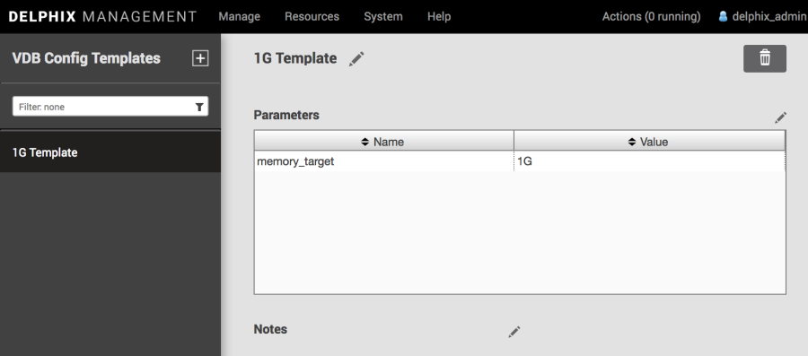  
_Figure 35 Create VDB Configuration Template_

##  Exercise 13 - Provision a VDB with Hook and VDB Template0

  1. Return to the Delphix home screen by clicking the Delphix logo on the top left of the screen 

  2. Click on the **_orcl_** dSource object in the Datasets panel 

  3. Select the latest Snapshot, click the _Provision_ button 

  4. On the left hand side of the _Target Environment_ tab, click the _Target_ environment Target 

  5. Click Next 

  6. On the Target Configuration tab, enter the following details: 

    1. Database Unique Name: **qadb**

    2. SID: **qadb**

    3. Database Name: **qadb**

    4. Mount Base: **/mnt/provision** (this should already be filled in) 

  7. Click the _Show advanced_ link and check the box next to _Configure VDB Config Templates_

  
_Figure 36 Provision VDB w/ Config Template_

  1. Click Next 

  2. Click the _1G Template_ that we created earlier from the Select template drop-down list 

  
_Figure 37 Apply VDB Config Template_

  1. Click _Next_

  2. Accept the default VDB Name - qadb 

  3. Select _DB Targets_ from the Datasets Group drop-down list, then click _Next_

  4. Accept the default policies and click Next 

  5. On the Hooks tab with _Configure Clone_ already selected on the left side of the _Provision VDB Wizard_ , click the _plus sign_ on the right hand side of the wizard and select  "Create New from Template" from the drop-down list 

  6. Enter the name QA APPUSER for the Hook Operation and click the Create button 

  
_Figure 38 Add Hook Template_

  1. Click on the _Create APPUSER_ template we created earlier, then click _Import_

  
_Figure 39 Configure Clone Hook Operation Template_

  1. Click _Next_

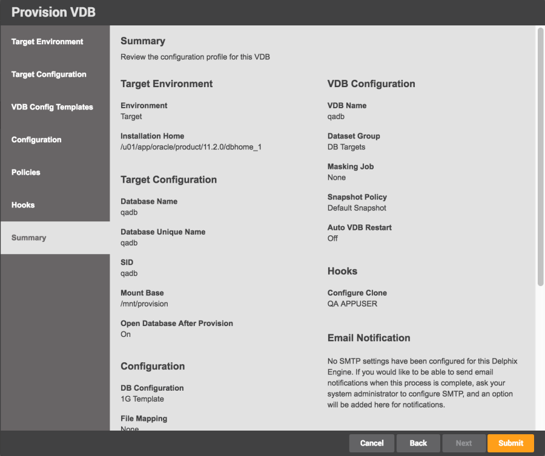  
_Figure 40 Provision VDB Summary_

  1. Verify the summary information, and click _Submit_

It may take a couple minutes for the VDB creation to complete. You can monitor
the progress on the left-hand side of the screen next to the _qadb_ object in
the _DB Targets_ group. On the _Actions_ pane on the right-hand side of the
screen, you should see the _Provision virtual database "qadb"_ item move to
the _Recently completed_ pane without error.  
Once the VDB is created, you can verify that the VDB is operational by:

  1. Using Terminal on your lab server, SSH to your Linux Target server at 10.0.x.30 ('x' will be your **Student Number** ). 

  2. Enter the username: delphix 

  3. Enter the password: delphix 

  4. Run the following commands: 

export ORACLE_SID=qadb  
export ORACLE_HOME=/u01/app/oracle/product/11.2.0/dbhome_1  
export PATH=$ORACLE_HOME/bin:$PATH  
sqlplus / as sysdba  
show parameter memory_target  
connect appuser/appuser  
This will verify that the VDB is online with the VDB Configuration Template we
specified, and that the APPUSER user was created by our hook.  
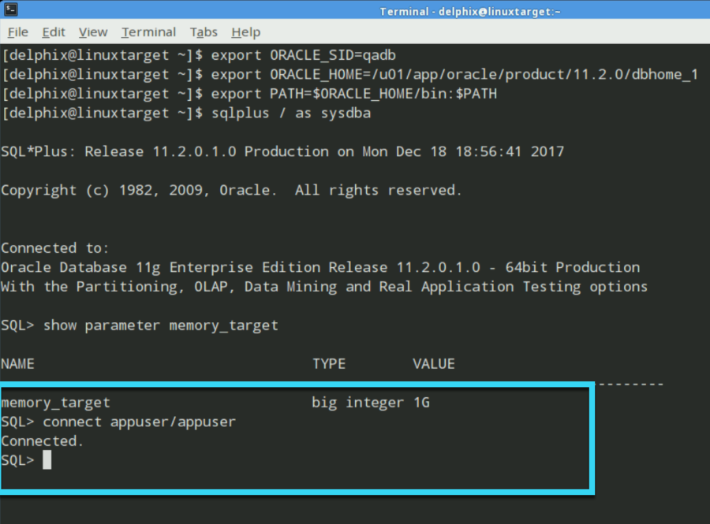  
_Figure 41 View VDB Parameters_

