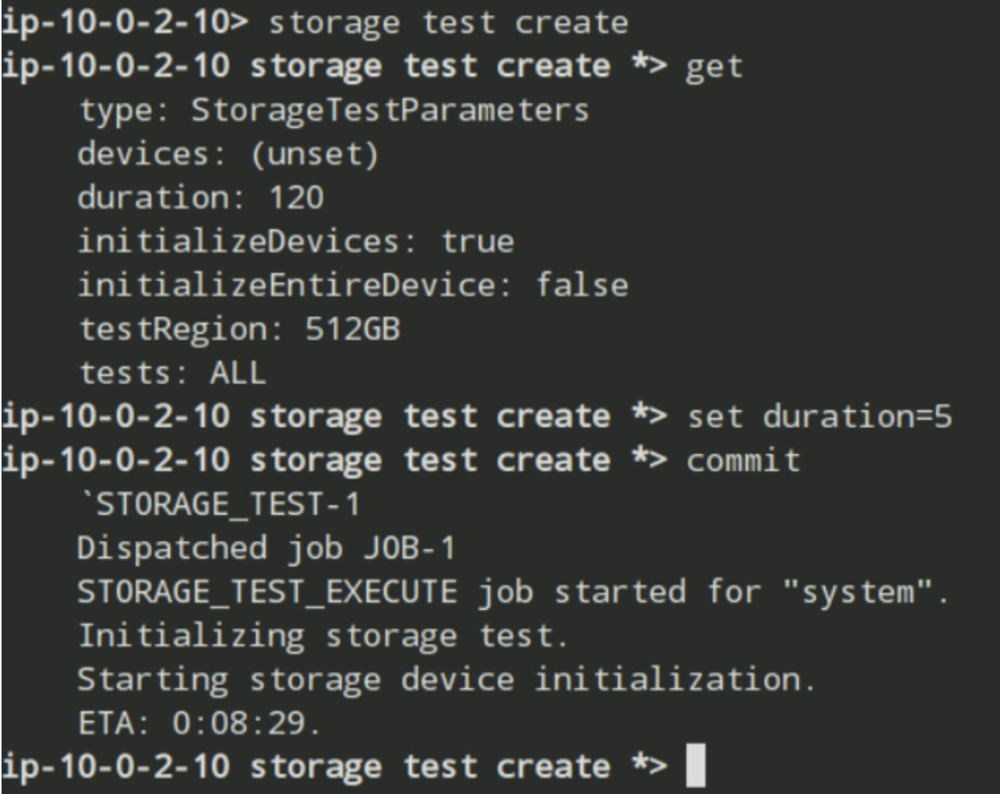
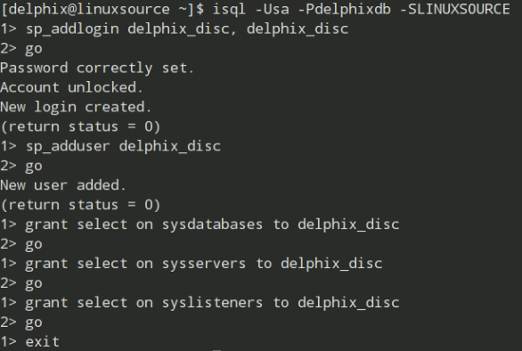
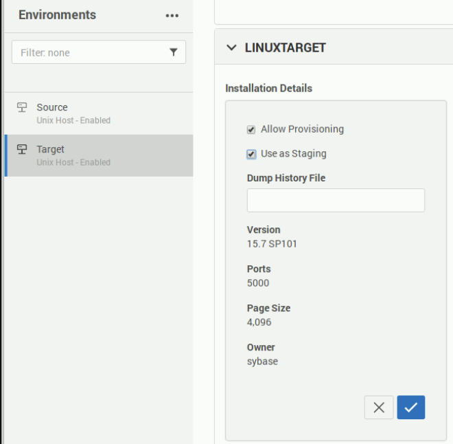

Table of Contents
=================

* [Background](#_background)

* [Lab Exercises](#lab-exercises)

* [Part I](#part-i)

* [Optional Advanced Exercise – Perform a Storage Performance Test through the CLI](#option1)

* [Exercise 1 - Delphix Engine Configuration](#exercise1)

* [Exercise 2 - Create delphix_disc login on Source and delphix_db login on target](#exercise2)

* [Exercise 3 - Validate Environment with Hostchecker](#exercise3)

* [Exercise 4 – Add a Source and Target Environment](#exercise4)

* [Exercise 5 – Link a dSource](#exercise5)

* [PartII](#part-ii)

* [Exercise 6 – Create and Save a Hook Operation Template](#exercise6)

* [Exercise 7 – Provision a VDB](#exercise7)

* [Exercise 8 – Set a New Retention Policy](#exercise8)

* [Exercise 9 – Refresh a VDB](#exercise9)

* [Exercise 10 – Rewind a VDB](#exercise10)

* [Optional Advanced Exercise - Configure Delphix Replication](#option3)


# <a id="_background"></a>Background

This guide will get you started with Delphix&#39;s virtualization for SAP ASE. You will learn how to to securely copy and share datasets. Using virtualization, you will ingest data from sources and create virtual copies, which are full read-write capable database instances that use a small fraction of the resources a normal database copy would require.

Delphix Virtualization's functionality is exposed through two interfaces: management/admin and self-service. Through the management/admin interface (the topic of this guide), DB administrators connect to source datasets and create resources such as virtual databases. Through the self-service interface, non-admin users can operate on data provided by administrators. A guide for self-service can be found <a href="https://github.com/delphix/lab-guides/blob/master/self-service/INSTRUCTIONS.md">here</a>.

We also provide a guide for Delphix <a href="https://github.com/delphix/lab-guides/blob/master/masking/INSTRUCTIONS.md">masking</a>, and for other virtualization data sources such as <a href="https://github.com/delphix/lab-guides/blob/master/mssql-admin/INSTRUCTIONS.md"> MS SQL </a> and <a href="https://github.com/robertodelphix/lab-guides/blob/master/postgresql/instructions.md"> postgresql</a>.

## <a id="lab-exercises"></a>Lab Exercises
=============

Perform these exercises when instructed by your Delphix Instructor.

## <a id="_IPs"></a>Important IP Addresses

| Host | IP |  
| :--- | :--- |
| **Delphix Data Platform** | 10.0.x.10 |
| **Source** | 10.0.x.20 |
| **Target** | 10.0.x.30 |

In the above IP addresses, the **x** denotes your **Student Number**. For example, if your student number is **5** , your Delphix Data Platform will be located at 10.0. **5**.10.

## <a id="_usrs"></a>Cloud Lab Usernames and Passwords

| User | Password |
| :--- | :--- |
| Initial Delphix **sysadmin** | sysadmin |
| Initial Delphix **admin** | delphix |

At the login screen for the lab server, enter the username and password: delphix/delphix

## <a id="part-i"></a>Part I
======

## <a id="option1"></a>Optional Advanced Exercise - Perform a Storage Performance Test through the CLI

In this exercise, you will:
-  Log into the Delphix Engine *prior to configuration* via the Delphix Command Line Interface (CLI)
-  Perform a Storage Test
-  View the Storage Test Results

**Steps**

As an advanced exercise, this lab has no corresponding Lab Solution. Instead, we will walk through the steps to get you acquainted with your lab system and the Delphix CLI.

1. On your Lab Server desktop, double-click on Terminal
2. Type: ssh <sysadmin@10.0.x.10> ('x' is your **Student Number** assigned by your instructor)
    
    a.  If you receive a prompt asking you if you are sure you want to connect, enter: Yes
    
    b.  Enter the password: sysadmin
    
    c.  Escape to the standard CLI prompt by typing: discard
    
    d.  You are now at the root of the Delphix CLI as a System Administrator
3.  Create a storage test by typing: storage test create (see figure !!!)
    
    a.  List the default storage test parameters by typing get
    
    b.  Override the duration and set it to 5 minutes: set duration=5
    
    c.  Begin the storage test by typing: commit
    
    d.  This test will take anywhere between 5-10 minutes to complete.  

    * Note: If you receive an error, it could be because the Delphix Engine is already configured. In this case:
    *   Connect to your Delphix Engine using Chrome on your lab server (see the **Important IP Addresses** section of the Getting Started guide above).
    *   Log into the setup console as the sysadmin user
    *   Click on the 3 dots in the upper right hand corner and select **Factory Reset** - this may take several minutes to complete.



4.  View the storage test results

    a.  Get back to the storage test section of the CLI by typing: storage test list
    
    b.  View a list of completed tests by typing: ls
    
    c.  Type "select" followed by the name of the test from the list. For example: select STORAGE_TEST-1
    
    d.  Enter the result command by typing: result
    
    e.  Then type: commit

## <a id="exercise1"></a>Exercise 1 - Delphix Engine Configuration

In this exercise, you will:
* Access the Delphix Engine GUI for the first time
* Set up the Delphix SYSADMIN user
* Set up the Delphix ADMIN user
* Configure Timezone Preferences
* Configure Network Settings
* Configure Disks
* Complete the Delphix Engine Configuration

**Steps**
1.  Connect to your Delphix Engine using Firefox on your lab server (see the Important IP Addresses
section of the Getting Started guide above).
2.  Set the new sysadmin password to: delphix
3.  Configure the Delphix Engine and accept all defaults (confirm that it is your local timezone).

    Note - you can just mark the appliance as registered; no support credentials are required for this lab.

4. Log in with the initial admin user credentials (see Usernames and Passwords section above)
5. Set the new admin password to: delphix
You will know this is successful when you see the main Delphix UI screen with a single group (Untitled) on the
left hand side.

Additional resources to learn more:

[The admin and sysadmin User Roles](https://docs.delphix.com/docs/configuration/user-and-authentication-management/users-and-groups)

[Setting Up the Delphix Data Platform](https://docs.delphix.com/docs/deployment/installation-and-initial-system-configurations/initial-setup)

## <a id="exercise2"></a>Exercise 2 - Create delphix_disc login on Source and delphix_db login on target

In this exercise, you will:
* Create a Delphix delphix_disc user on your source Sybase Instance
* Create a Delphix delphix_db user on your target Sybase Instance

**Context**

Delphix requires access to database users with certain privileges. These are configured through automated scripts.

**Steps**
1.  Use Terminal to SSH into your Linux Source (see the Important IP Addresses section of the Getting
Started guide above).
2.  Execute the following on the source instance. This is creating the delphix_disc user with select on privileges on sysdatabases, sysservers, and
syslisteners:
    
    ```
    isql –Usa –Pdelphixdb –SLINUXSOURCE
    sp_addlogin delphix_disc, delphix_disc
    go
    sp_adduser delphix_disc
    go
    grant select on sysdatabases to delphix_disc
    go
    grant select on sysservers to delphix_disc
    go
    grant select on syslisteners to delphix_disc
    go
    exit
    ```

See below for what this will look like:


**Steps**
1.  Use Terminal to SSH into your Linux Target (see the Important IP Addresses section of the Getting
Started guide above).
2.  Execute the following on the target instance. This is creating the delphix_db user and grant sa_role and sybase_ts_role to delphix_db login

    ```
    isql –Usa –Pdelphixdb –SLINUXTARGET
    sp_addlogin delphix_db, delphix_db
    go
    sp_adduser delphix_db
    go
    sp_role “grant”, sa_role, delphix_db
    go
    sp_role “grant”, sybase_ts_role, delphix_db
    go
    exit
    ```

## <a id="exercise3"></a>Exercise 3 - Validate Environment with Hostchecker

**a. Validate Source Environment with Hostchecker**

In this exercise, you will:
  * Use the **hostchecker** program to run validation tests on your Linux Source

**Steps**
    
1. Use Terminal to SSH into your Linux Source (see the Important IP Addresses section of the Getting
Started guide above).
2. Unpack the hostchecker tarball, by typing `tar -xvf hostchecker_linux_x86.tar`
3. Type `./hostchecker/hostchecker.sh` to run the hostchecker utility.
4. Indicate that this machine is a source when prompted by typing `source`
5. Review the list of checks that you are able to run. We'll now run a common series of these checks. Each should return SUCCESS and ALL OK.
    a. Check on the delphix homedir, by typing 1 and ENTER. The script will check homedir permissions.
    b. Check the following ports on your Delphix Engine (10.0.x.10): 22,80,443. You will do this by typing 3, and then running the test for each of these ports. 
    c. Check for ssh connectivity by typing 8. You will be prompted to enter the password for the current OS user (delphix).
    d. Check for sudo privileges as the delphix user, by typing 10.
    e. Check sshd_config for timeout, by typing 9.
    f. Check the toolkit path by typing 11. You will then be prompted to enter the path where the Delphix Engine toolkit will be installed: **/u01/app/toolkit**

If you have completed all of the checks and they have returned SUCCESS and ALL OK, you have completed
this exercise. You can type `quit` to exit hostchecker.

Note: The sshd_config test may return a WARNING response, which is normal in a production installation due
to permissions on the file. If hostchecker is run as root for this test, it will perform the test properly.

**b. Validate the Target Environment with Hostchecker**

In this exercise, you will:
* Use the ‘hostchecker’ program to run validation tests on your Linux Target

**Steps**

1. Use Terminal to SSH into your Linux Target A (see the Important IP Addresses section of the Getting
Started guide above).
2. Untar the hostchecker_linux_x86.tar file in your home directory, by typing `tar -xvf hostchecker_linux_x86.tar`
3. Type `./hostchecker/hostchecker.sh` to run the hostchecker utility.
4. Indicate that this machine is a target when prompted by typing `target`
5. Run hostchecker for a target and perform the following checks:
    a. Check on the delphix homedir by typing 1 and ENTER. The script will check homedir permissions.
    b. Check the following ports on your Delphix Engine (10.0.x.10): 8415, 22, 111,1110. You will do this by typing 3, and then running the test for each of these ports. 
    c. Check for ssh connectivity by typing 7. You will be prompted to enter the password for the current OS user (delphix).   
    d. Check for sudo privileges as the delphix user, by typing 9.   
    e. Check sshd_config for timeout, by typing 8.
    f. Check the toolkit path by typing 10. You will then be prompted to enter the path where the Delphix Engine toolkit will be installed: **/u01/app/toolkit**

If you have completed all of the checks and they have returned SUCCESS and ALL OK, you have completed
this exercise. You can type `quit` to exit hostchecker.

Note: The sshd_config test may again return a WARNING response, which is normal in a production installation due
to permissions on the file. If hostchecker is run as root for this test, it will perform the test properly

## <a id="exercise4"></a>Exercise 4 - Add a Source and Target Environment

In this exercise, you will:

* Connect Delphix to your Source Sybase Server
* Create a Sybase dSource by syncing with your Sybase Source database
* Create a Delphix Group to hold your dSource object
    
**a. Adding Source Environment**

**Context**

Before users can create their own virtual databases, Delphix needs to connect to source data. In Delphix, an environment is a host that runs database software. The environment is where the Delphix engine will search for available data sources. Credentials to access the host need to be provided while configuring an environment.

**Steps**

1. Log into the Delphix Engine as **admin**
2. Add your Linux Source as an Environment (by selecting Manage -> Environments, and then selecting the 3 dots on the left side) with the following details:
    a. Environment Name: Source
    b. Host Address: 10.0.x.20 (‘x’ will be your Student Number)
    c. OS Username: delphix
    d. OS Password: delphix
    e. Toolkit Path: /u01/app/toolkit
    f. Check the "Discover SAP ASE" checkbox   
    g. SAP ASE Discovery credentials (Note: You may need to select a "Discover SAP ASE" checkbox, if you are working off an older engine version.)
     i. ASE DB Username: delphix_disc    
     ii. ASE DB Password: delphix_disc
3. Review summary and click Submit.

You should now see the Source environment listed under the Environments panel.

**b. Adding a Target Environment**

**Context**

The target environment is the host where the virtual databases will be created.

**Steps**

1. Log into the Delphix Engine as **admin**
2. Add your Linux Source as an Environment (by selecting Manage -> Environments, and then selecting the 3 dots on the left side) with the following details:
    a. Environment Name: Target
    b. Host Address: 10.0.x.30 (‘x’ will be your Student Number)
    c. OS Username: delphix
    d. OS Password: delphix
    e. Toolkit Path: /u01/app/toolkit
    f. SAP ASE Discovery credentials 
      i. ASE DB Username: delphix_db
      ii. ASE DB Password: delphix_db

You should now see the Target environment listed under the Environments panel.

## <a id="exercise5"></a>Exercise 5 - Link a dSource

**Context**

With an environment set up, users can then sync databases into Delphix. The Delphix engine will read the source database and create a dSource (a custom object). The dSource is not a functional image of the database but a storage-efficient object from which virtual databases can be created. When creating a dSource, Delphix will pull over the complete data set using standard database protocols. Subsequent sync operations, as governed by user-defined policies, will pull only incremental changes. Additional details on sync functionality can be found [here](https://docs.delphix.com/docs/datasets/getting-started/managing-data-sources-and-syncing-data).

**Steps**

Perform the following steps after the Source and Target Environment is created:
1. SSH to the Linux Source (`ssh 10.0.x.20` with x as your student number) as the delphix user. Run the following commands:

```
  cd labs
  ./dumpfull_testdb.sh
```
*Special Note*: This lab has a specific configuration that leverages the Target Host as a Staging Host. This is fine for simple use cases. However, for optimal performance, the two should be separate. In order to complete this lab, you must register the Target Host as the Staging Host as well. This is done by accessing the Target Host from the "Environments" tab, going to the "Databases" tab, selecting the edit pencil on LINUXTARGET, and the clicking the "Use as Staging" option. See below:


2. From the Delphix admin console click the Source environment on the left side of the screen
3. Click on the Databases tab.
4. Under LINUXSOURCE > testdb, click Add dSource. You will be brought to the Add dSource wizard.
5. Under the entry testdb, enter the username/password you created in Exercise 2 (case sensitive). 
    a. DB Username: delphix_disc
    b. DB Password: delphix_disc
    c. Click to validate credentials.
6. Click Next
7. Keep default dSource Name of _testdb_
8. Click _Add Dataset Group_ to create a new Target Group called "DB Source" and assign the dSource to the group by selecting this new group name from the drop down. Click Next.
9. On the Data Management screen, fill in the following information:
    a. For Initial Load, choose Most Recent Existing Full Backup
    b. For Backup Path, enter: `/u02/sybase_back`
    c. Choose Target as the Staging Environment and LINUXTARGET as the Repository
    d. Click Enabled for LogSync
10. Accept defaults for the Hooks and Policies
11. Review and click Submit on the Summary screen

You will know this is successful if the dSource completes in the Actions pane without errors. Click on Actions in the top menu bar if you don’t see this pane. You can monitor job progress here, and see what fails or is completed.

12. Go to Manage -> Datasets. The dSource _testdb_ should now be listed under the DB Source group.

## <a id="part-ii"></a>Part II

## <a id="exercise6"></a>Exercise 6 - Create and Save a Hook Operation Template

In this exercise, you will:

* Create a Hook Operation Template called APPUSER
* Insert code into the template that will log into a database and add a user named appuser

**Context**

Hook operations allow users to execute custom operations at select points during linking sources and managing virtual datasets.

**Steps**

1. Create a new Hook Operation Template:
    a. Select Manage -> Hook Templates.
    b. Click on the plus (+) icon on the left side of the screen.
    c. Name the hook operation template "Shell Command Hook"
    d. Contents (enter exactly):
```
$SYBASE/OCS-15_0/bin/isql –Usa –Pdelphixdb –SLINUXTARGET << EOF
sp_addlogin appuser, appuser
go
sp_adduser appuser
go
EOF
```

**IMPORTANT: Make sure the carriage returns you see are the same as above.**
    e. Click the Create button

2. Verify the Hook Operation Template appears in the list on the left side of the screen.

## <a id="exercise7"></a>Exercise 7 - Provision a VDB

In this exercise, you will:

* Create a VDB called devdb
* Use the Hook Operation Template we created previously
* Log into the VDB
* Verify the Hook Operation ran successfully

**Context**

The objective of Delphix virtualization is to provide easy access to virtualized databases that resemble production and other data systems. Here, we provision a Virtual Database (VDB). VDBs are fully functional database images that can be created from dSources.

**Steps**

1. Go to Manage -> Datasets, and select the _testdb_ dSource. Provision a VDB by clicking on the leftmost icon on the snapshot. In the wizard, include the following details:
    a. Destination Environment: Target
    b. Select "Add Dataset Group" and name this target group "DB Target"
    c. Database Name: _devdb_ 
    d. Truncate Log On Checkpoint: Enabled
    e. Click Next
    f. Accept default policies
    e. Click Next to proceed without masking
    g. On the Hooks page, click the plus sign. Select "Create from Template."
    h. Call the new Hook Operation "Create APPUSER" and select Hook Point = "Configure Clone."
    i. Click Create, then Next
    j. Review the summary and click Submit.

2. Complete the VDB creation

  >It may take a couple minutes for the VDB creation to complete. You can monitor the progress on the left hand
  >side of the screen next to the devdb object in the DB Targets group. On the Actions pane on the right hand
  >side of the screen, you should see the Provision virtual database “devdb” item move to the Recently completed
  >pane without error. Once the VDB is created, you can verify that the VDB is operational by:
3. SSH to Linux Target A as the delphix user
4. Run the following commands:

```
isql –Usa –Pdelphixdb –SLINUXTARGET
sp_helpdb devdb
go
sp_displaylogin appuser
go
```

This will verify that the VDB is online with the VDB Operation Template we specified, and that the appuser user was created by our hook.

## <a id="exercise8"></a>Exercise 8 - Set a New Retention Policy

There are four types of Policies in Delphix. In this exercise, you will:
* Create a Retention Policy
* Set the new policy to keep snapshots and logs for 30 days, along with 3 monthly snapshots
* Apply the policy to the VDB we created in the previous exercise

**Context**

Both dSources and VDBs timeflow is governed by snapshots, which are either created manually or through policies. Retention policies govern the lifespan of such snapshots and help clean older ones that are no longer relevant.

**Steps**

1. Navigate to Manage -> Policies. Click on the Retention tab.
2. Click on the "+ Retention" button to create a new Retention policy for devdb with the following details:
    a. Policy Name: Long Term
    b. 30 days of snapshot and log retention
    c. 3 monthly snapshots taken on the 1st of the month (this may be in the "Advanced" section)
3. Click Next, review the summary, and click Submit.
    
## <a id="exercise9"></a>Exercise 9 - Refresh a VDB

In this exercise, you will:

* Create a new table on your source database
* Snapshot the dSource
* Refresh your VDB
* Verify the new table appears on the VDB

**Context**

VDBs can get out of sync as new data comes into the source system. Refreshing a VDB will re-provision it from the dSource. Refreshing a VDB will delete any changes that have been made to it over time.

**Steps**

1. SSH to your Linux Source server as the delphix user.
2. Run the following commands:

```
isql –Usa –Pdelphixdb –SLINUXSOURCE
use testdb
go
create table t1 ( comments varchar(100))
go
insert into t1 values (‘test data’)
go
exit
```

Transaction log dump on testdb:
```
cd /home/delphix/labs
./dumptran_testdb.sh
```

3. Go back to the Delphix Engine
4. Wait for a minute or two for Delphix Engine to ingest the new transaction log dump.
5. Select the devdb VDB.
6. Refresh the devdb VDB (clicking the refresh icon in the upper right hand corner) using the latest snapshot from the testdb dSource. You can select "Faster" as a refresh option.

Once the refresh has completed, you can log into devdb to confirm:

7. Connect to your Linux Target A server as the delphix user via SSH
8. Run the following commands:

```
isql –Usa –Pdelphixdb –SLINUXTARGET
use devdb
go
select * from t1
go
```

If this returns a count of 1 row, the refresh was successful.

## <a id="exercise10"></a>Exercise 10 - Rewind a VDB

In this exercise, you will:

* Take a snapshot of the devdb VDB
* Drop a table in the devdb VDB
* Rewind the devdb VDB to recover from the action

**Context**

Rewinding a VDB rolls it back to a previous point in its Timeflow and re-provisions the VDB. The VDB will no longer contain changes after the rewind point. it can be triggered when changes to the VDB do not need to be saved.

**Steps**

1. Connect to your Linux Target A server as the delphix user via SSH
2. Run the following commands:

```
isql –Usa –Pdelphixdb –SLINUXTARGET
use devdb
go
insert into t1 values (‘before rewind’)
go
```

3. Take a snapshot of the devdb VDB (on the Delphix Engine devdb page, click the camera icon in the upper right hand corner)
4. Run the following commands, still on the Target server:

```
isql –Usa –Pdelphixdb –SLINUXTARGET
use devdb
go
drop table t1
go
```

We just dropped the t1 table. Now we will rewind the VDB to that last good snapshot to fix this.

5. Select the devdb VDB
6. Select the snapshot card associated with the date/time you recorded prior to corrupting your database.
7. Rewind the VDB to the snapshot card you took prior to the corruption. (the leftmost icon on that snapshot, looks like a rewind button on a music player)

Once the rewind operation is complete, you can confirm the rewind was successful by connecting to the server again and querying the database:

8. Connect to your Linux Target A server as the delphix user via SSH
9. Run the following commands:

```
isql –Usa –Pdelphixdb –SLINUXTARGET
use devdb
go
select * from t1
go
```

The count should return 2 rows. You are back in action!


## <a id="option3"></a>Optional Advanced Exercise - Configure Delphix Replication

Note: This exercise is only possible if your classroom has been configured with 2 or more students.

In this exercise, you will:
* Set up a replication profile
* Replicate your entire Delphix Engine to another Delphix Engine
* View the replicas in the target Delphix Engine

**Steps**

As an advanced exercise, this lab has no corresponding Lab Solution. Instead, we will walk through the steps
to get you acquainted the Delphix Replication capability.

1. In the Delphix GUI, select System and then Replication on the top menu bar
2. Add a Replication Profile called DR Replica
    
    a. Click the plus sign next to Replication Profiles on the top left

    b. Enter a Replica Profile Name: DR Replica
    
    c. For Target Engine, enter the Delphix Engine IP address for the next student in your classroom
environment. If you are the last student, use the Delphix Engine IP address for Student 1. For
example, in a class with 3 students:
    
      i. Student 1 Delphix Engine is at 10.0.1.10, and they will replicate to 10.0.2.10
      ii. Student 2 Delphix Engine is at 10.0.2.10, and they will replicate to 10.0.3.10
      iii. Student 3 Delphix Engine is at 10.0.3.10, and they will replicate to 10.0.1.10
      iv. Ask your instructor if you have any questions or confusion about this configuration.

    d. Enter the User Name: delphix_admin
  
    e. Enter the Password: delphix

    f. Do not enable Automatic Replication or configure Traffic Options

    g. For the Objects Being Replicated, select: Entire Delphix Engine
  
    h. Click Create at the bottom when ready.

3. Start the Replication by clicking the Replicate Now button on the top right of your screen.
4. Click Replicate to confirm you are ready to begin.
5. Once the initial full replication is complete, you will see a message stating “Last Replication
Successful.”

6. Check the results on your target Delphix Engine
  
    a. In your lab server browser, enter the IP address you used for the Target Engine in your replica
profile. For example, if you are Student 1, your Delphix Engine is at 10.0.1.10, and your target
would have been 10.0.2.10.
  
    b. Log in as user delphix_admin with the password delphix
Lab Exercises 21 © 2015 Delphix Corp. All rights reserved

    c. Observe the dropdown list next to Databases on the top left corner of your screen. It currently
says Available which is the default Namespace for Delphix replica targets.

    d. In order to see the replica objects, click on the dropdown list and select the second entry, which
should be the IP address of the Source Delphix Engine that sent the replica.

 
7. While still logged into your target Delphix Engine, click on System and then Replication
8. Observe the Received Replicas section at the bottom, indicating and verifying the target’s receipt of
replication data.
    a. Note: The Failover Now option will not work for these labs unless all objects on the target
engine are deleted due to object name collisions. This is an inherent outcome to plan for when
using Active/Active replication. By sending/receiving replication data, this concludes the
Replication exercise. 