Table of Contents
=================

* [Lab Exercises](#lab-exercises)
* [Part I](#part-i)
* [Exercise 1 - Logging in to the Masking Engine](#exercise-1-logging-in-to-the-masking-engine)
* [Exercise 2 - Add an Application](#exercise-2-add-an-application)
* [Exercise 3 - Add an Environment](#exercise-3-add-an-environment)
* [Exercise 4 - Create a Basic Connector](#exercise-4-create-a-basic-connector)
* [Exercise 5 - Create a Ruleset](#exercise-5-create-a-ruleset)
* [Exercise 6 - Manage the Inventory](#exercise-6-manage-the-inventory)
* [Exercise 7 - Create a Profiling Job](#exercise-7-create-a-profiling-job)
* [Exercise 8 - Create a Masking Job](#exercise-8-create-a-masking-job)
* [Part II](#part-ii)
* [Exercise 9 - Create a Secure Lookup algorithm](#exercise-9-create-a-secure-lookup-algorithm)
* [Exercise 10 - Create a Segmented Mapping algorith](#exercise-10-create-a-segmented-mapping-algorithm)
* [Exercise 11 - Export an Inventory](#exercise-11-export-an-inventory)
* [Exercise 13 - Refresh a Rule Set](#exercise-13-refresh-a-rule-set)
* [Exercise 14 - Copy a Rule Set](#exercise-14-copy-a-rule-set)
* [Exercise 15 - Export an Environment](#exercise-15-export-an-environment)
* [Exercise 16 - Import an Environment](#exercise-16-import-an-environment)

Lab Exercises
=============

Perform these exercises when instructed by your Delphix Instructor.

Part I
======

Exercise 1 - Logging in to the Masking Engine
----------------------------------------------

In this exercise, you will:

-   Access the Masking Engine GUI

-   Log in to the Delphix Masking Engine

**Steps**

1.  Connect to your Delphix Engine using Google Chrome on your lab
    server (see the **Important IP Addresses** section of the Getting
    Started guide above).

    http://10.0.x.10:8282/dmsuite (replace 'x' with your student number)

2.  Enter your User Id and Password

    a.  Default Username is **delphix\_admin**

    b.  Default Password is **Delphix\_123**

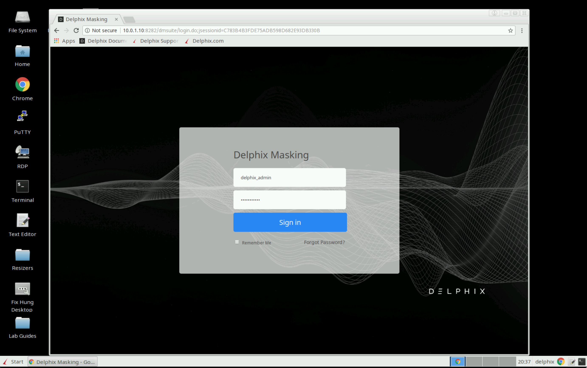

Exercise 2 - Add an Application
--------------------------------

In this exercise, you will:

-   Add an Application

**Steps**

1.  On the Environments List/Summary screen click on the *Add
    Application* button

2.  Enter "**Medical App Dev**" for the Application name in the
    Application pop up box

    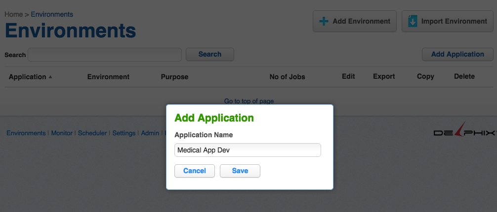

3.  Click Save

The application should be added successfully.

Exercise 3 - Add an Environment
--------------------------------

In this exercise, you will:

-   Add a new Environment

**Steps**

1.  On the Environments List/Summary screen click on the *Add
    Environment* button

    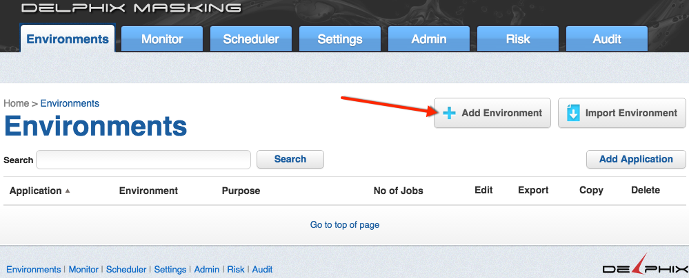

2.  Select the Application from the drop-down list created in the
    previous exercise

3.  Enter "**Oracle Dev DB**" for the Environment Name

4.  Select *Mask* from the Purpose drop-drown list

    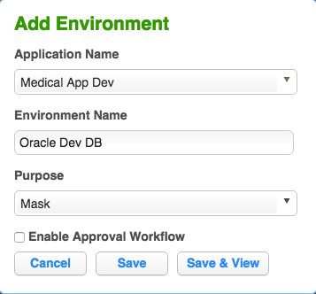

5.  Click on the Save button

The environment should be visible in the Environment List/Summary
screen.

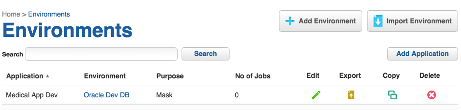

Exercise 4 - Create a Basic Connector
--------------------------------------

In this exercise, you will:

-   Select an Environment

-   Create a Basic Oracle Database Connection

**Steps**

**Note: If your class was stopped you will need to manually start it
from the Delphix Engine before proceeding with the following exercise.**

1.  Log into the Masking Engine

2.  Click on the **Oracle Dev DB** environment created in the previous
    exercise

3.  Click on the Connector tab

4.  Click the *Create Connection* button

    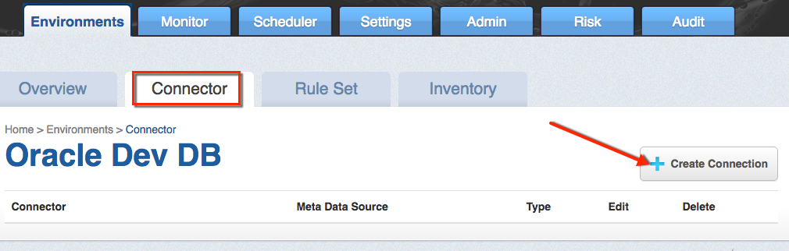

5.  Enter Connection Details

    a.  Chose *Database - Oracle* from the Type drop-down list

    b.  Verify that the *Basic* radio button next to the Type

    c.  Enter "**Oracle 11g Dev**" for the connection name

    d.  Type **DELPHIXDB** (in uppercase) in the Schema Name text box

    e.  Enter the IP address of TargetA (10.0.x.30) in the Host Name/IP field

    f.  Enter **devdb** as the SID

    g.  Enter **1521** as the port number for the listener on Linux Target

    h.  Enter **DELPHIXDB** (in uppercase) as the DB login ID

    i.  Provide the password **delphix**

    j.  Click the *Test Connection* button. A Success message indicates whether the test was successful or not.

 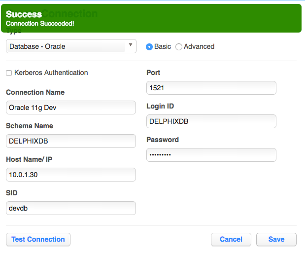

k.  Save the connection

The connector should now be visible in the Connectors list for the
environment.

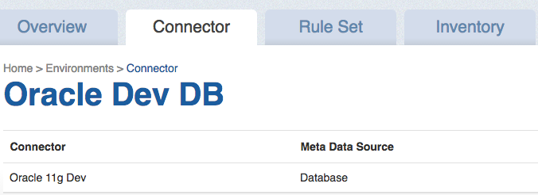

Exercise 5 - Create a Ruleset
------------------------------

In this exercise, you will:

-   Create a Rule Set for Patient data

**Steps**

1.  On the Environment List/Summary screen, click on the Environment
    Name created in the previous exercise

2.  Click on the *Rule Set* tab

3.  Click on the *Create Rule Set* button

4.  Provide the details for the rule set as follows

    a.  Enter "**Patient Rule Set**" in the name field for the Rule Set

    b.  Select **Oracle 11g Dev** from the Connector drop-down list

    c.  Check the boxes next to MEDICAL\_RECORDS, PATIENT and PATIENT\_DETAILS tables

 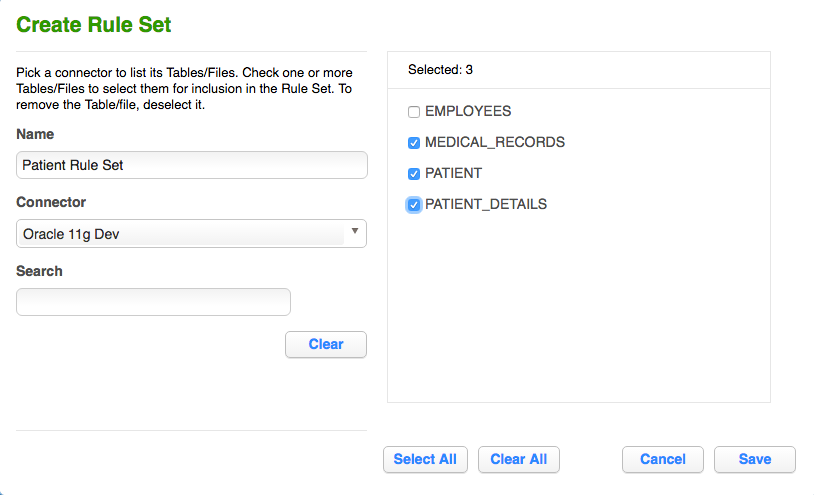

5.  Click on the Save button

You will see the newly created Rule Set in the list for the environment

Exercise 6 - Manage the Inventory
----------------------------------

In this exercise, you will:

-   Review an Inventory after creation of a Rule Set

-   Edit an Inventory to add or remove an assignment

**Steps**

1.  On the Environment List/Summary screen, click on the Environment
    Name created in the previous exercise

2.  Click on the *Inventory* tab

3.  From the Select Rule Set drop-down menu choose the **Patient Rule
    Set** created previously

4.  A list of tables will be displayed under the Contents section.
    Clicking on the name of each table will allow you to view the table
    metadata.

    a.  Click on the PATIENT table

    b.  Verify if there are any primary keys, foreign keys or indexes identified

    c.  Validate the datatype of each column

5.  Edit the ADDRESS column by clicking on the corresponding pencil icon

    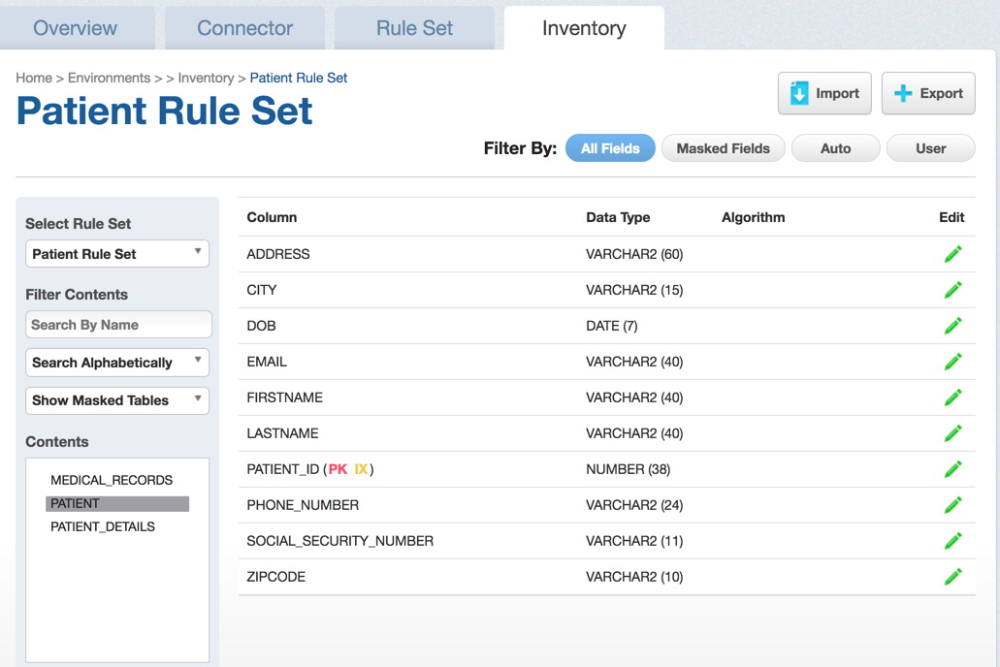

6.  Change properties of the column

    d.  Set Domain to ADDRESS

    e.  Choose the ADDRESS LINE SL algorithm

    f.  Select User for ID Method

 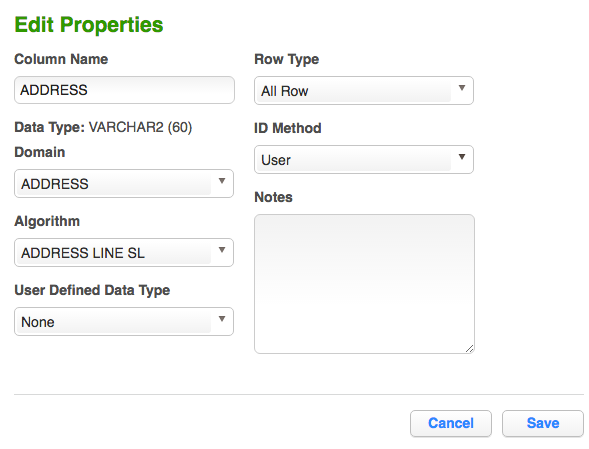

g.  Click Save
This concludes the exercise.

Exercise 7 - Create a Profiling Job
------------------------------------

In this exercise, you will:

-   View Profiler Settings

-   Create a profiling job

-   Execute a profiling job

-   Assign Rule Set and Profile Set

-   Review inventory after profiling job has run

**Steps**

1.  Click on the *Settings* tab

    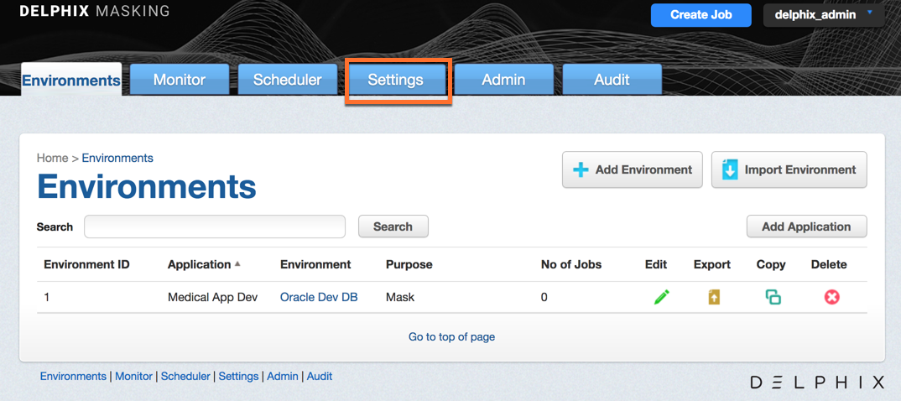

2.  Click on *Profiler* under Domains in the left margin of the settings
    page

    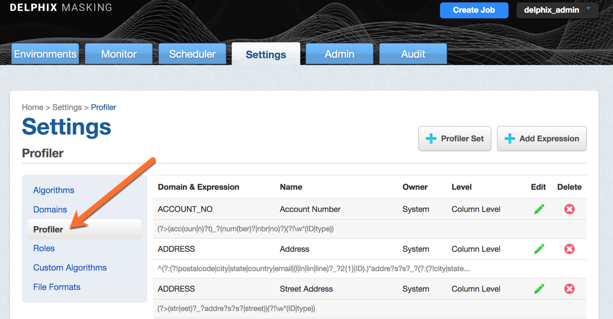

3.  View the profiler expressions

    a.  *Domain & Expression*

    b.  *Name*

    c.  *Level*

 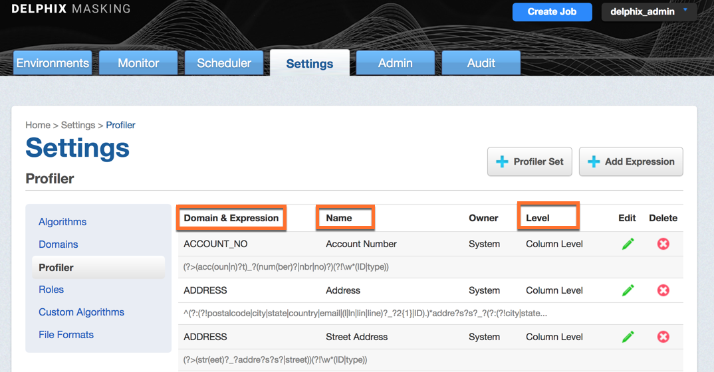

4.  Click on the *Add* *Profiler Set* button to view the default Profile Sets

    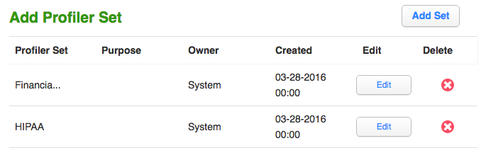

5.  Click Cancel and navigate back to the *Environment List/Summary* screen

In the next part of the exercise we will create and execute a profiling job.

6.  Click on the **Oracle Dev DB** Environment

7.  Click on the *Profile* button

8.  On the Create Profile Job screen enter the details as follows:

    d.  Select **Patient Rule Set** from the Rule Set drop-down list

    e.  Enter **Profile Patient Job** for the job name

    f.  Choose **HIPAA** from the Profile Sets drop-down list

    g.  Change No. of Streams from 20 to 1

    h.  Leave other fields at their default values

    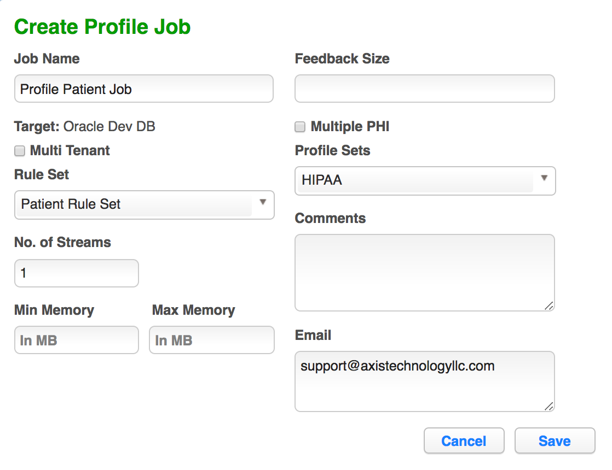

    i.  Click the Save button

9.  The newly created profiling job will be displayed at the bottom of the Environment Overview screen with a status of *Created*

    

10. Click on the blue play button under *Action* to execute the job. The status should change to Running and the stop Action button will be enabled.

    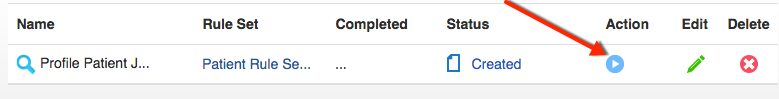

11. Click on the *Monitor* tab to see the list of jobs and their progress

    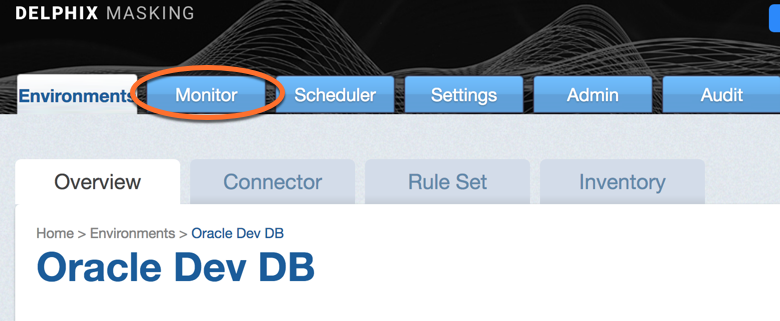

12. Click on the job name to view the job details

 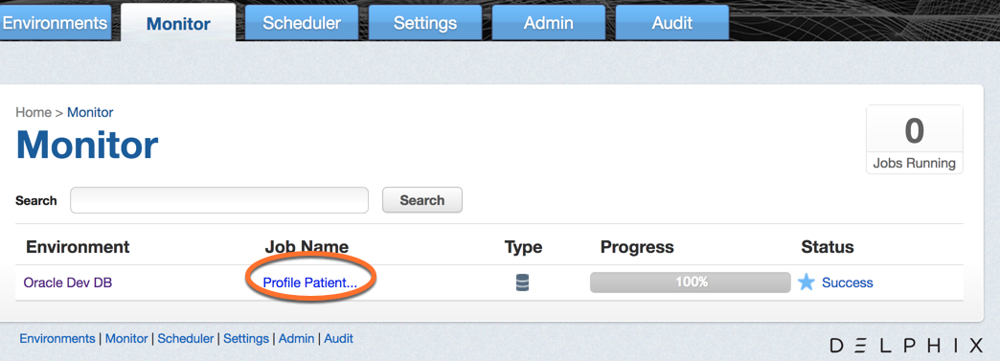

13. View the Completed, Processing, Waiting and Results tabs for the job

    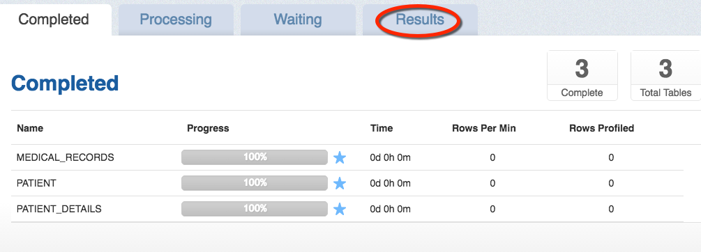

 **Note that the Results tab displays the number of sensitive columns and tables discovered by the profiler**

 

 In the next part of the exercise, we will review the Inventory after running the profile job.

14. Go to the *Environment List/Summary* screen by clicking on the *Environments* tab and choose the **Oracle Dev DB** environment

15. Click on the *Inventory* tab for the environment

16. Select the **Patients Rule Set** from the Rule Set drop-down list

17. Click on the MEDICAL\_RECORDS table

    Note that the _Algorithm_ column has been populated for sensitive columns identified during profiling

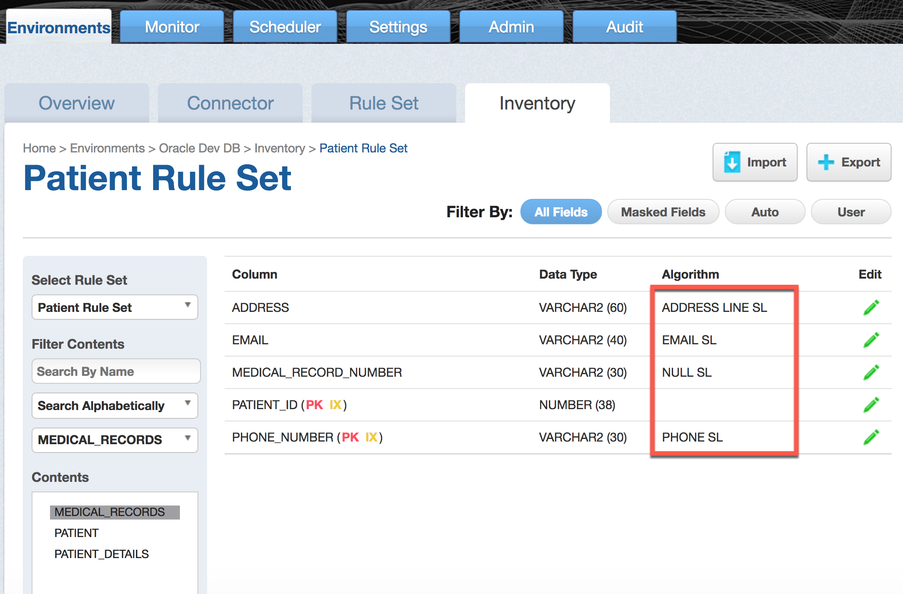

18. Click on the PATIENT and PATIENT\_DETAILS tables, and note the Algorithms for the sensitive columns

Exercise 8 - Create a Masking Job
----------------------------------

In this exercise, you will:

-   Create an In-Place Masking Job

-   Execute Masking Job

-   View Results from Masking Job

**Steps**

1.  On the Environment List/Summary screen, click on the **Oracle Dev
    DB** Environment Name created in the previous exercise

2.  Click on the *Mask* button

 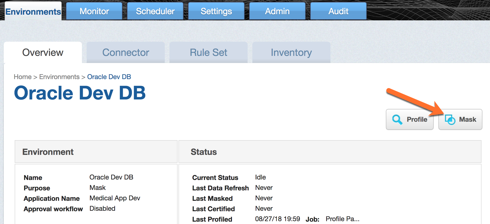

3.  Enter Details in the Create Masking Job dialog

    a.  Job Name: **Patient Masking**

    b.  Masking Method: **In-Place**

    c.  Rule Set: **Patient Rule Set**

    d.  No. of Streams: **1**

    e.  Update Threads **1**

    f.  Leave other fields at the default values

 The Create Masking Job dialog should look like the screenshot shown below.

 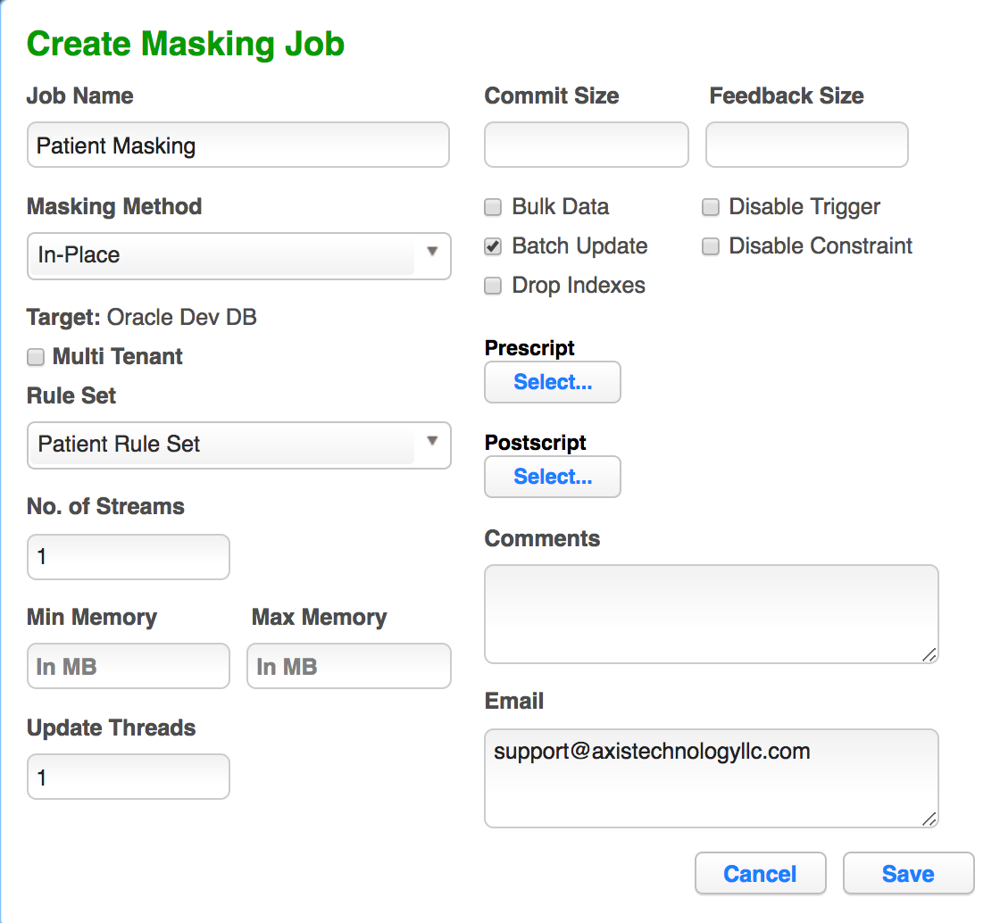

    g.  Click on the Save button

4.  The Masking job will appear on the Environment summary screen with astatus of **Created**

 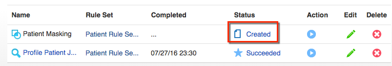

5.  Before executing our masking job, we need to check the values of the PATIENT table before running our masking job, and again after to verify that the data has indeed been masked.

6.  Open the Terminal app on the lab desktop

7.  Type the following commands in the terminal window to run the script to query the PATIENT table

 > Note: You may need to widen your terminal window to prevent the output from wrapping. After typing in each command press the Enter or Return key on your keyboard.

  a. `cd Scripts/Masking`

  b.  `./check_patient_devdb.sh`

 > NOTE: Oracle SQL Developer is also available on the desktop to view the tables

 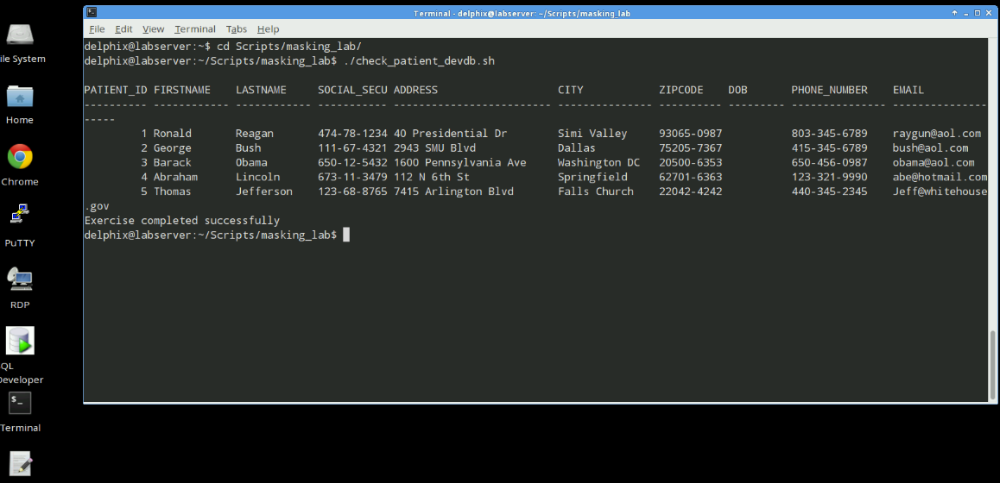

 > **Do not close the terminal window as you will need to validate that the data has changed after successfully executing the masking job.**

8.  Click on the blue play button under the Action column that corresponds to the newly created Masking job to execute it

 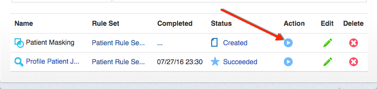

 The job status will change to Running

9.  Click on the *Monitor* tab to view the progress and status of the job

 

10. Click on the name of the job to view its details

 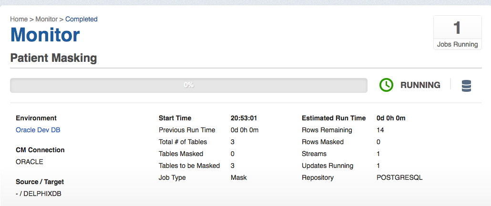

11. Click on the Completed, Process and Waiting tabs in the job details screen and note the results once the job has completed

 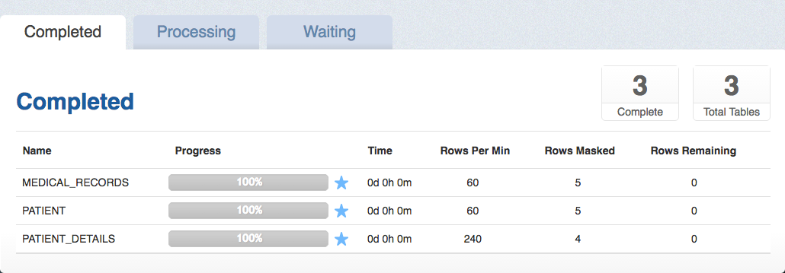

12. Click on the environment name to go back to the Environment summary screen. The status of the masking job should now be Succeeded

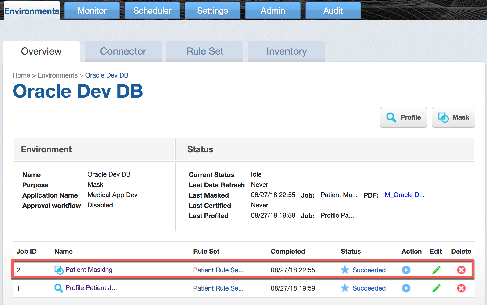

13. Open a new terminal window on the lab desktop and execute the **check\_patient\_devdb.sh** script.

 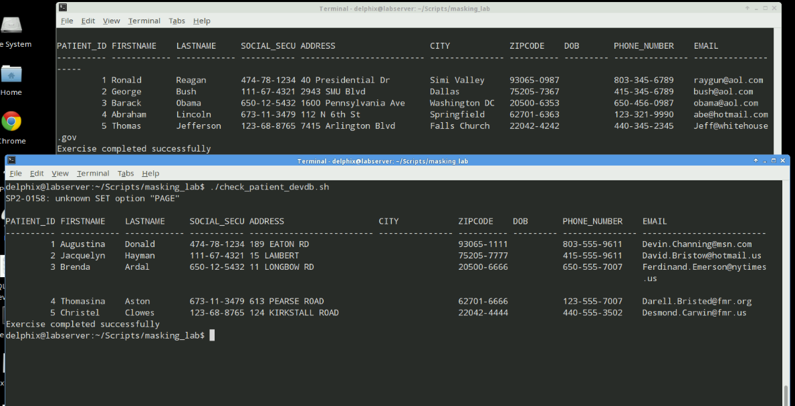

 > Note: The values for the *Firstname*, *Lastname*, *Address*, *Zipcode*, *Phone*\_*number*, and *Email* have been masked using the secure lookup algorithm while the values for the *City* column have been set to NULL.

Part II
=======

Exercise 9 - Create a Secure Lookup algorithm 
-----------------------------------------------

In this exercise, you will:

-   Create a lookup file

-   Build a secure lookup algorithm

-   Update your inventory to use the new algorithm

**Steps**

1.  Open the text editor on the desktop (mousepad)

2.  Enter several names in the editor, one value per line and save to desktop as FN2

 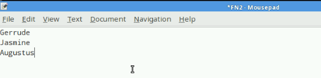

3.  Navigate to SETTINGS/ALGORITHMS in the masking UI

4.  Select 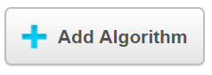

5.  With Secure Lookup Algorithm radial button selected enter algorithm name, description as shown below and select the file created in step 2 from your desktop

6.  Save the algorithm and navigate to the inventory of the Patient Rule Set

7.  Select the Patient table from the table list on the left hand margin

8.  On the Algorithm drop down select the new FN2 algorithm and save the
    change

    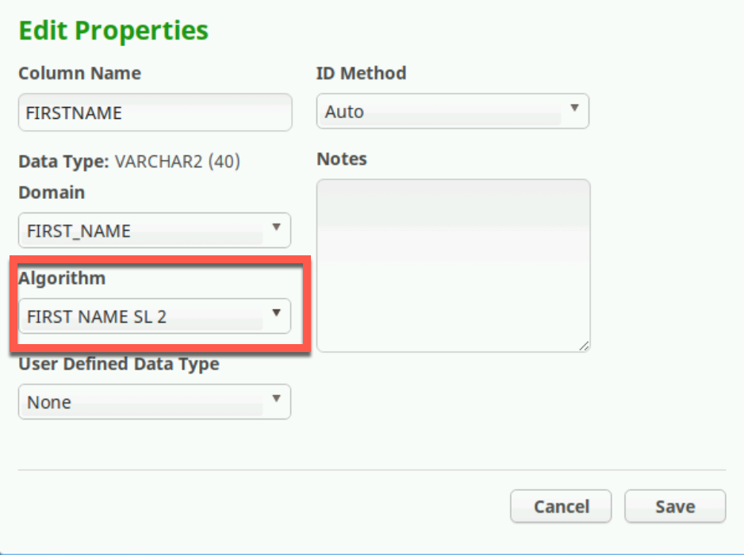

Exercise 10 - Create a Segmented Mapping algorithm
---------------------------------------------------

In this exercise, you will:

-   Create a segmented mapping algorithm

-   Assign the algorithm to your inventory

-   Execute a masking job

-   View the masked data

**Steps**

1.  Navigate to Settings / Algorithm

2.  Select Add Algorithm

3.  With the Segmented Mapping Algorithm radio button selected

    a.  Name the algorithm SSN SM

    b.  Define 3 alpha numeric segments of 3, 2, and 4 length

    c.  Click the Ignore comma checkbox

    d.  Define ignore characters of "-"," ","/" (dash, space, forward slash)

    e.  Save the algorithm

 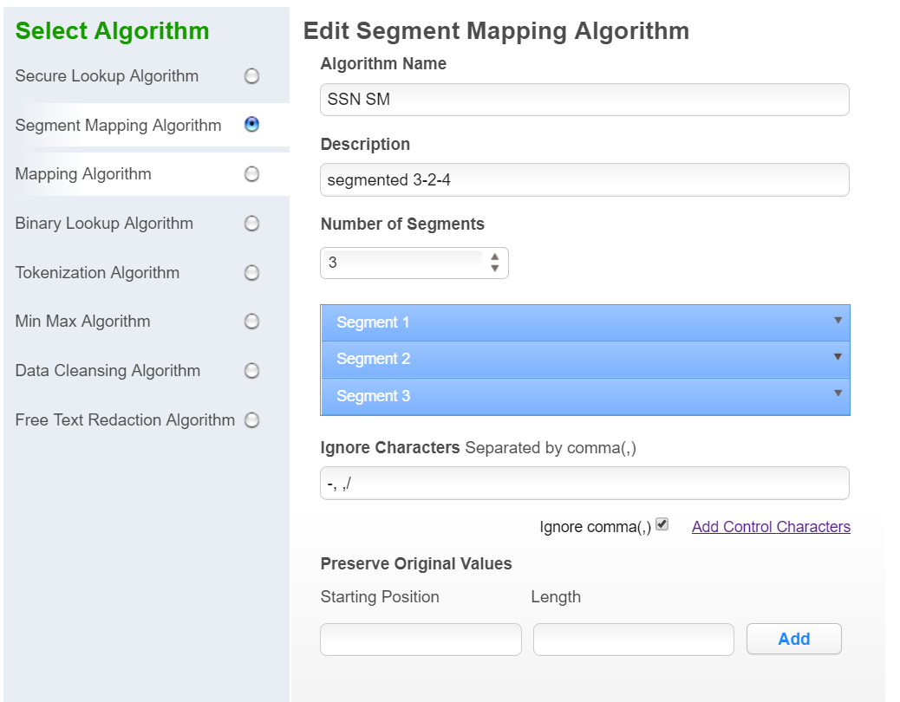
 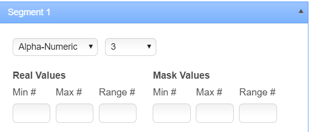

4.  Navigate to your Environments

5.  Click the Oracle DEV DB environment then choose the Inventory tab

6.  Select the Patient table from the table list on the left hand margin

7.  Click the edit pencil next to the SOCIAL\_SECURITY\_NUMBER column

8.  From the domain drop down select the SSN domain

9.  From the algorithm drop down select your SSN algorithm and save the changes

    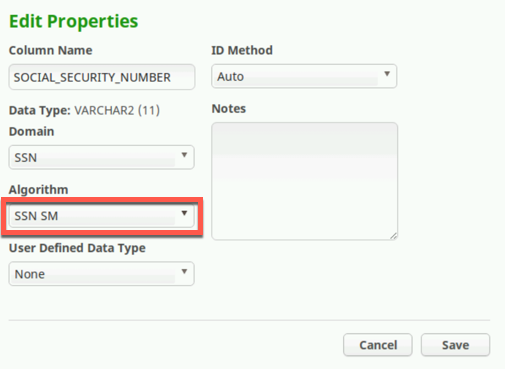

10. Navigate to the Overview tab and select the blue play button to run the **Patient Masking** job

11. When the job completes, view the Patient table data (with the check\_patient\_devdb.sh script from terminal session or SQL Developer)

12. Note that the FIRST\_NAME column now contains values from our lookup file

13. Note that the SOCIAL\_SECURITY\_NUMBER column has now been masked

This concludes the exercise.

Exercise 11 - Export an Inventory
----------------------------------

In this exercise, you will:

-   Export an Inventory

**Steps**

14. On the Environment List/Summary screen, click on the Environment Name created in the previous exercise

15. Click on the *Inventory* tab

16. From the Select Rule Set drop-down menu choose the **Patient Rule Set** created previously

17. Click on the *Export* button

    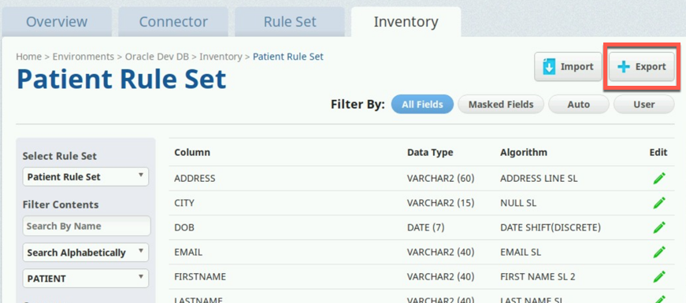

18. Accept the default inventory name and file name

    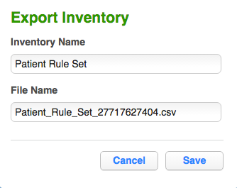

19. Click the Save button

**Note that a pop-up window should appear with a link to Download the inventory file. If the pop-up window does not appear, check the browser to see if it was blocked and allow it to display pop-ups.**

20. Right-click on the link that appears on the pop-up window and select
    "Save link as..."

21. Save the file to the Desktop

This concludes the exercise.

Exercise 12 - Modify an Inventory
---------------------------------

In this exercise, you will:

-   View exported Inventory

-   Modify an exported Inventory
>  Note: You should have completed the "Export an Inventory" exercise before proceeding.

**Steps**

1.  Open the exported CSV file from the previous exercise (opens with LibreOffice Calc by default)

    NOTE: LibreOffice is the open source equivalent for MS Office Excel

    Uncheck the Tab and Semicolon checkboxes under **Separator options** in the Import dialog box. Only the comma box should be checked.

    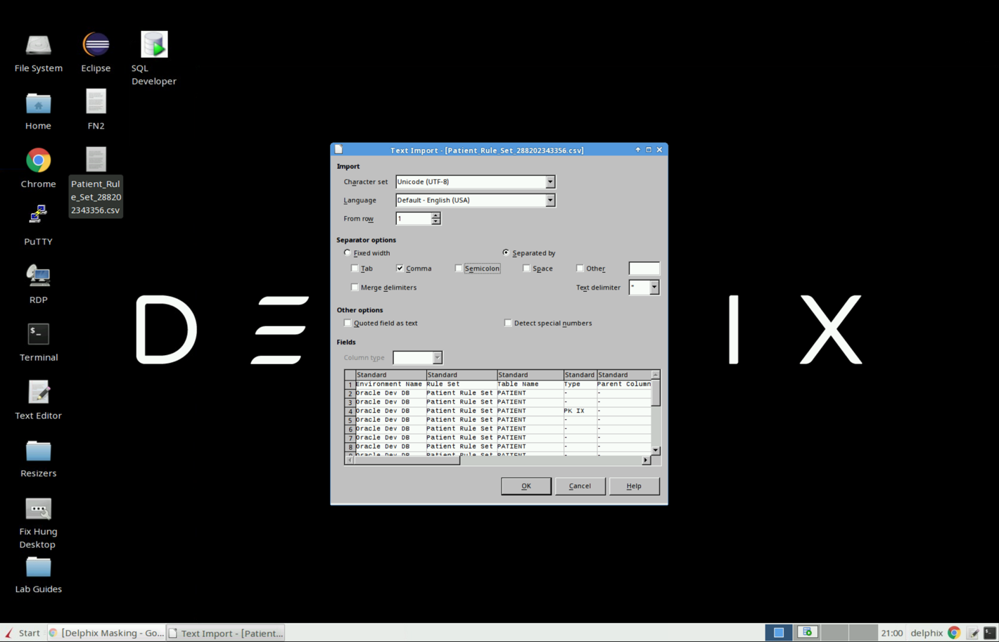

2.  Remove a column from the masking inventory

    a.  Note that columns H, I, J contain a domain, algorithm and "true" for sensitive columns

    b.  Note that columns H, I, J contain '-', '-', 'false' for columns that are not sensitive

    c.  For Patient table, DOB column, copy a dash into column H and I and copy false from another row into column J.

    d.  Save the changes

 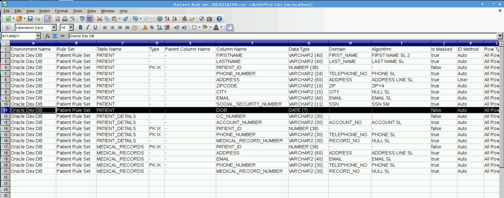

3.  Navigate to the inventory for this ruleset and press the import button

4.  Select the modified CSV file from your desktop

5.  Refresh the masking UI browser session

6.  DOB should no longer be selected for masking

 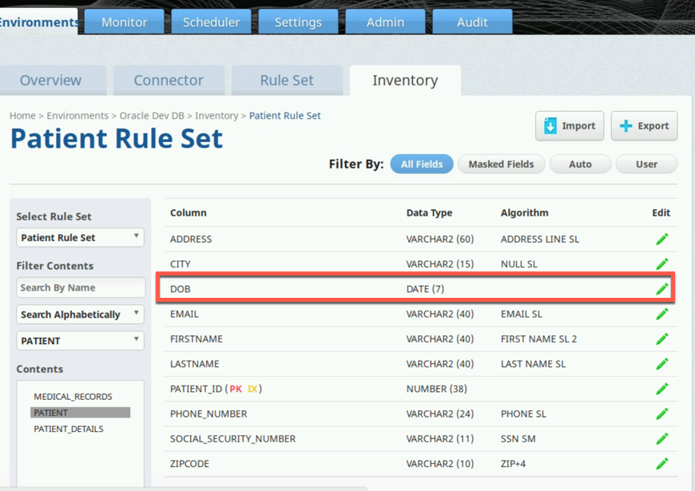

Note: This method of modifying an inventory can be used to speed up a large number of changes as compared to making inventory changes via the UI

This concludes the exercise.

Exercise 13 - Refresh a Rule Set
----------------------------------

In this exercise, you will:

-   Refresh a rule set

**Steps**

1.  Using SQL developer add a new column called BIRTHDAY to the PATIENT\_DETAILS table, data type is date

 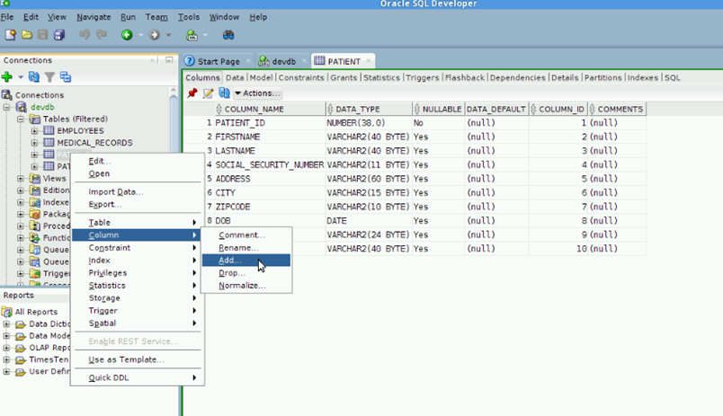

 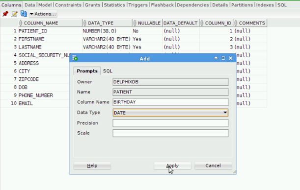

2.  Navigate to the inventory tab in the Masking UI and select our Patient Rule Set

3.  Select the PATIENT\_DETAILS table in the table list on the left

    > Note: The new column is not shown in the inventory

    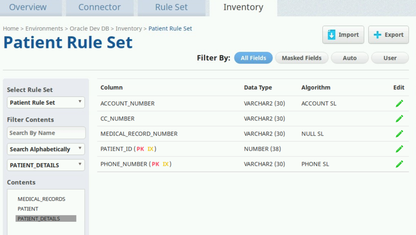

4.  Click the Rule Set tab and select the blue refresh symbol

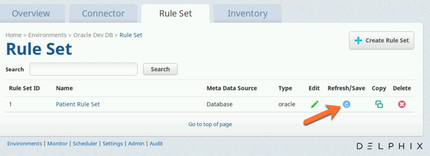

5.  Click the Inventory tab and note that the new column now appears in the inventory

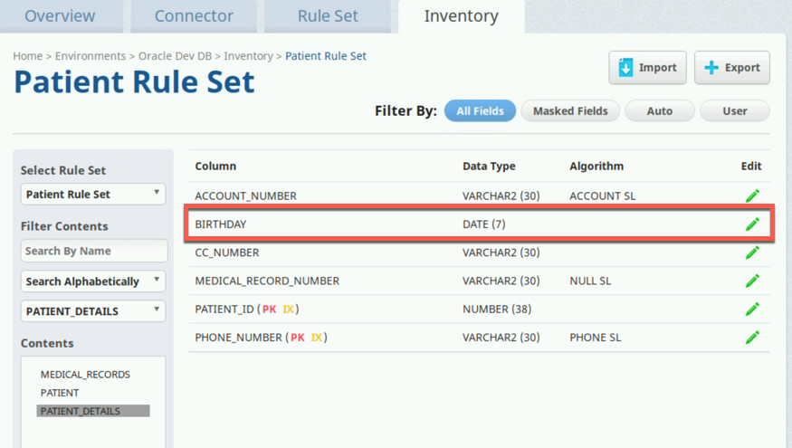

> Note: This method is used to bring schema changes into the masking inventory

This concludes the exercise.

Exercise 14 - Copy a Rule Set
-------------------------------

In this exercise, you will:

-   Copy a rule set

**Steps**

1.  Navigate to the Rule Set tab in the UI

2.  Click the Copy icon

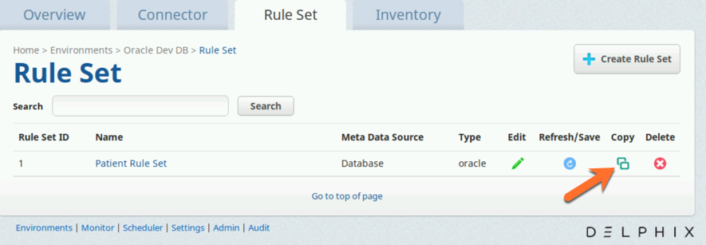

3.  Name the new Rule Set Patient Copy and click Save

    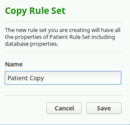

    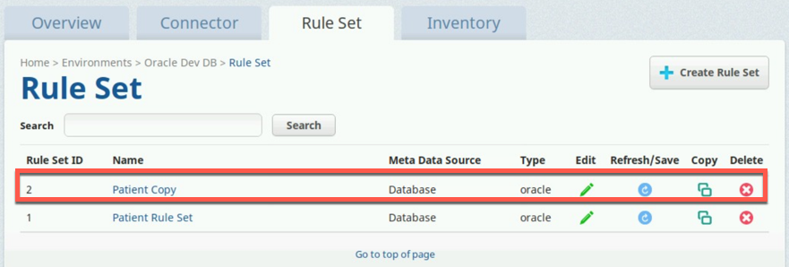

4.  Click the Inventory tab, select the new Rule Set from the "Select Rule Set" drop down

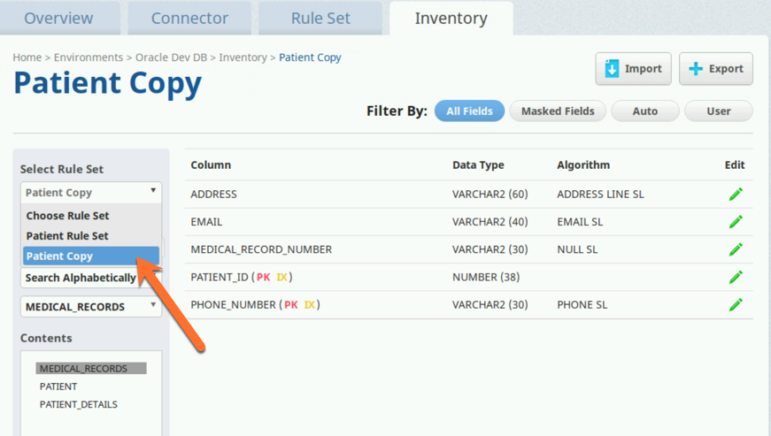

5.  Confirm that the Masking Inventory is copied along with column definitions

 > Note: This method is used to duplicate an inventory

This concludes the exercise.

Exercise 15 - Export an Environment
------------------------------------

In this exercise, you will:

-   Select an Environment

-   Export an Environment

1.  Log into the Masking Engine

2.  Click on the **Export** icon corresponding to the **Oracle Dev DB**
    environment

 

3.  On the Export Environment dialog box accept the default Environment name and File Name

 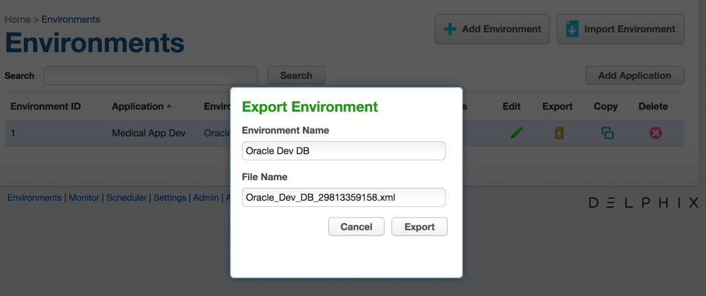

4.  Click the *Export* button

>Note that a pop-up window should appear with a link to Download the environment XML file. If the pop-up window does not appear, check the browser to see if it was blocked and allow it to display pop-ups.

5.  Right-click on the link that appears on the pop-up window and select
    "Save link as..."

 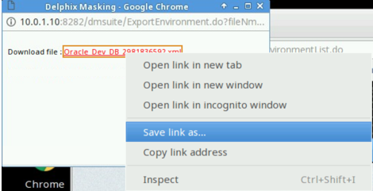

6.  Save the file to the Desktop

 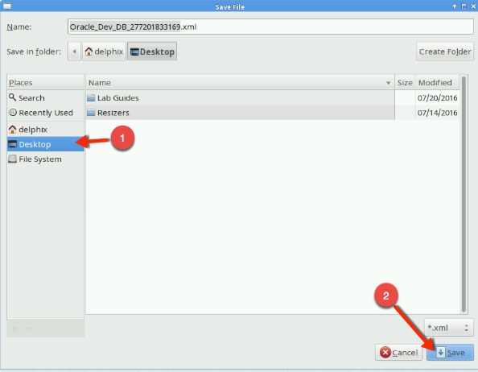

This concludes the exercise.

Exercise 16 - Import an Environment
------------------------------------

In this exercise, you will:

-   Import an Environment from a previously created export file

**Note: You will need to perform the exercise "Export an Environment" before proceeding **

1.  Add a new application for QA

    a.  Click the *Add Application* button

      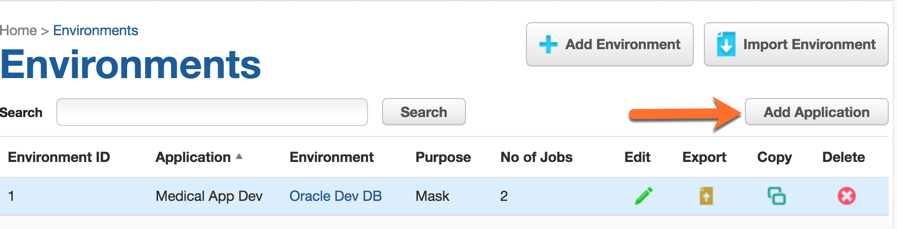

    b.  Enter the name **Medical App QA**

      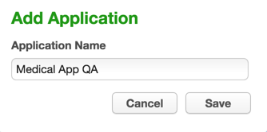

2.  On the Environments List/Summary screen click on the *Import Environment* button

    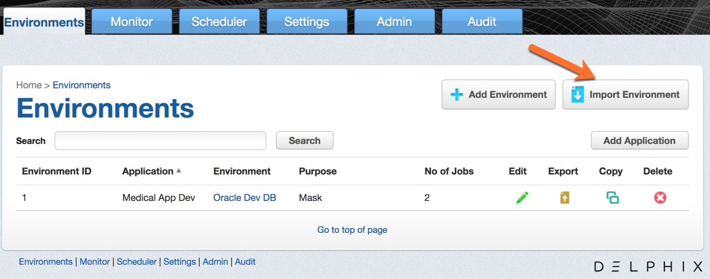

3.  On the Import Environment dialog box, select **Medical App QA** from the Application Name drop down

 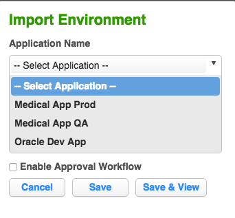

4.  Enter "Oracle QA DB" for the environment name

5.  Click on the Select button and browse to the location of the previously exported file

 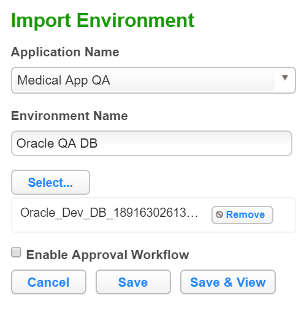

6.  Click on the Save button.

 The **Oracle QA DB** environment will be displayed on the Environment list/Summary screen

> Note: You may need to navigate to another tab and click Environments tab again to see the imported environment.

 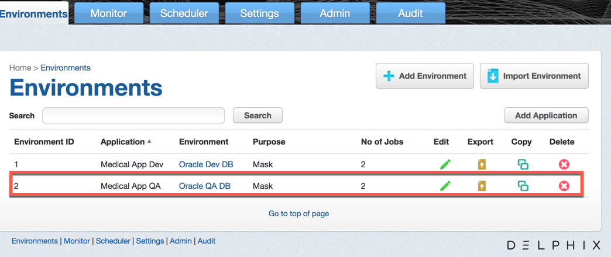
> Note: This function is used to replicate a Masking environment and jobs for another copy of the schema

This completes the lab session
