#  Delphix Admin for MS SQL Lab Guide

### Table of Contents
* [Prerequisite - Join the Delphix Domain](#joindomain)
* [Optional Advanced Exercise - Perform a Storage Performance Test through the CLI](#stroragetest)
* [Exercise 1 - Delphix Engine Configuration](#exercise1)
* [Exercise 2 - Configure the DB User on the Source](#exercise2)
* [Exercise 3 - Take a Backup of the Source Database](#exercise3)
* [Exercise 4 - Configure the Windows Target/Staging Server](#exercise4)
* [Exercise 5 - Create a Target Environment](#exercise5)
* [Exercise 6 - Add the Source Environment](#exercise6)
* [Exercise 7 - Add the dSource](#exercise7)
* [Exercise 8 - Provision a VDB](#exercise8)
* [Exercise 9 - Refresh a VDB](#exercise9)
* [Exercise10 - Rewind a VDB](#exercise10)
* [Exercise 11 - Set a New Retention Policy](#exercise11)
* [Exercise 12 - Create and Save a Hook Operation Template](#exercise12)
* [Exercise 13 - Provision a VDB with Hook Template](#exercise13)
* [Exercise 14 - Recovering a deleted table using log sync](#exercise14)
* [Exercise 15 - Delink a dSource](#exercise15)
* [Exercise 16 - Create a new User with Delphix_Admin privileges](#exercise16)
* [Exercise 17- Check the Audit logs for user related actions](#exercise17)

## Hands-On Lab Guides
 * [Getting Started](/README.md/#mssqlipaddresses)
 * [Oracle](/oracle-admin/INSTRUCTIONS.md)
 * [Self-Service ](/self-service/INSTRUCTIONS.md)

## Lab Exercises

Perform these exercises when instructed by your Delphix Instructor.

##  <a id="stroragetest"></a>Optional Advanced Exercise - Perform a Storage Performance Test through the CLI

In this exercise, you will:

  * Log into the Delphix Engine prior to configuration via the Delphix Command Line Interface (CLI)
  * Perform a Storage Test
  * View the Storage Test results

### Steps
1. On your Lab Server desktop, double-click on Terminal
2. Type: `ssh sysadmin@10.0.x.10` ('x' is your **Student Number** assigned by your instructor)
  * If you receive a prompt asking you if you are sure you want to connect, enter: Yes
  * Enter the password: sysadmin
  * Escape to the standard CLI prompt by typing: discard
  * You are now at the root of the Delphix CLI as a System Administrator
3. Create a storage test by typing: `storage test create`
  * List the default storage test parameters by typing: `get`
  * Override the duration and set it to 5 minutes: `set duration=3`
  * Check all values by typing `ls` at the command prompt
  * Begin the storage test by typing: `commit`
  * Note that this test will take anywhere between 7-10 minutes to complete

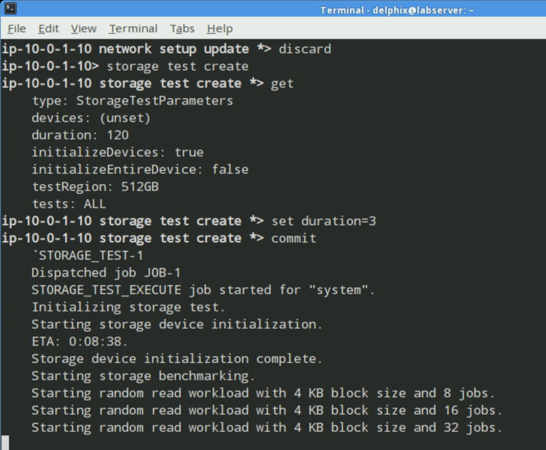
Example Storage Test Configuration
1. View the storage test results
  * Get back to the storage test section of the CLI by typing: `storage test`
  * View a list of completed tests by typing: `ls`
  * Type "select" followed by the name of the test from the list. For example: `select STORAGE_TEST-1`
  * Enter the result command by typing: `result`
  * Then type: `commit`
  * Scroll up to view the Test Grades section

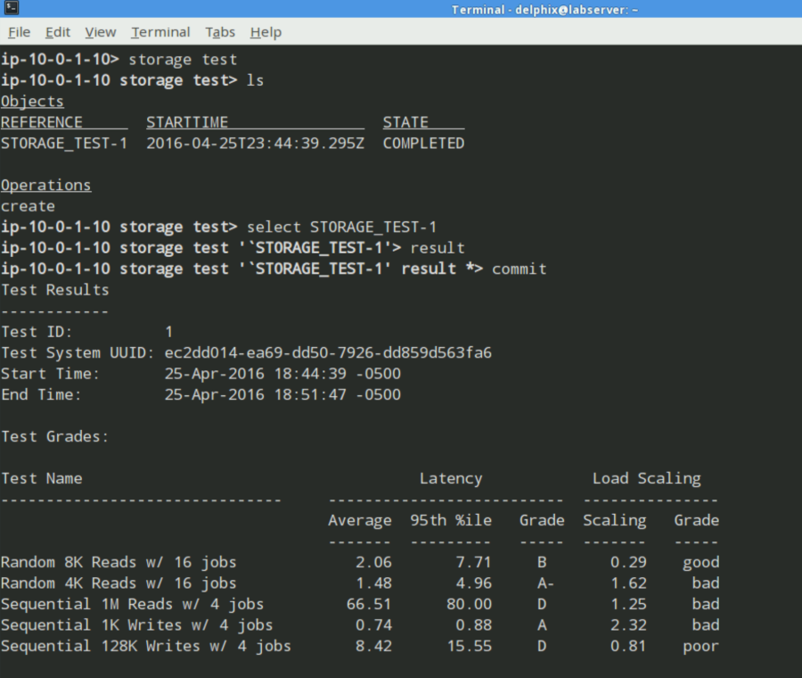
Example Storage Test Results

###  <a id="joindomain"></a>Prerequisite - Join the Delphix Domain
From your Student Desktop home screen, double click the **RDP** icon. This
will open Remmina Remote Desktop client. Before we can continue these labs,
you must connect to your Windows Source and Target and join them to the
_delphix.local_ domain.

Please note, it may take some time for the Windows servers to come online. If
the _Connecting_ dialog stays open for more than 5-10 seconds, cancel and try
again in a few minutes.
### Steps

1. Double click on **Windows Source**
2. When prompted, enter the password: delphix
3. Once you are logged in, click on **Start** and then **Run**. (Note: you might need to expand the screen to see **Start** on the Windows server.) 
4. Type: sysdm.cpl
5. Press Enter
6. Click the **Change** button
7. Under the **Member of** section, click the radio button next to **Domain**
8. Enter the domain: delphix.local
9. Click OK
10. When prompted, enter the login details:
  * delphix_src
  * delphix
11. Wait for the Welcome message and click OK, then click OK again to acknowledge the need to restart
12. Click **Close**
13. Click **Restart Now**

Once you have completed these steps, perform the following steps to set up the
**Windows Target** :
1. Go back to your **Student Desktop** click on **Windows Target** in your RDP application
2. When prompted, enter the password: delphix
3. Once you are logged in, click on **Start** and then **Run**
4. Type: sysdm.cpl
5. Press Enter
6. Click the **Change** button
7. Under the **Member of** section, click the radio button next to **Domain**
8. Enter the domain: delphix.local
9. Click OK
10. When prompted, enter the login details:
  * delphix_trgt
  * delphix
11. Wait for the Welcome message and click OK, then click OK again to acknowledge the need to restart
12. Click **Close**
13. Click **Restart Now**

See **The RDP Client** under **Getting Started** for more information on using
the RDP application.


## <a id="exercise1"></a>Exercise 1 - Delphix Engine Configuration

In this exercise, you will:
  * Access the Delphix Engine GUI for the first time
  * Set up the Delphix SYSADMIN user
  * Configure Timezone Preferences
  * Configure Network Settings
  * Configure Disks
  * Complete the Delphix Engine configuration
  * Set up the DELPHIX_ADMIN user

### Steps

1. Connect to your Delphix Engine using Chrome on your lab server (see the **Important IP Addresses** section of the Getting Started guide above).
2. Set the new sysadmin password to: delphix
3. Configure the Delphix Engine with the following details:
  * NTP on using pool.ntp.org with your local timezone
  * Default network settings
  * Three 8GB volumes in the data pool
  * Default Serviceability options
  * Default Authentication Service options
  * Appliance marked registered (no support credentials are required for this lab)
  * Completed and saved System setup.
4. Log in with the _admin_ user (password = 'delphix')
5. When prompted, set the new _admin_ password to: delphix

You will know this is successful when you see the main Delphix UI screen with
a single group (Untitled) on the left hand side.

 **Related Links**
[The delphix_admin and sysadmin User
Roles](https://docs.delphix.com/display/DOCS43/The+delphix_admin+and+sysadmin+User+Roles)
[Setting Up the Delphix
Engine](https://docs.delphix.com/display/DOCS43/Setting+Up+the+Delphix+Engine)

##  <a id="exercise2"></a>Exercise 2 - Configure the DB User on the Source

In this exercise, you will:

* Connect to the Windows Source
* Configure domain user privileges
* Configure the local Delphix user

### Steps

1. Double click "RDP" icon on the Student Desktop
2. Double click "Windows Source" icon
3. Login as the delphix_src user (login details are in the **Getting Started** section of this guide)
4. On the Windows Source machine, go to Start -> All Programs -> Microsoft SQL Server 2008 R2 -> SQL Server Management Studio

_Note: You may need to scroll down on the right-hand side of the RDP window to
see the Windows Start button or expand the screen_.

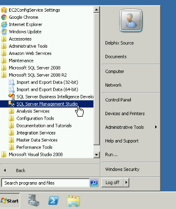

  * Under Authentication, select "SQL Server Authentication"
  * Log in as sa/delphix

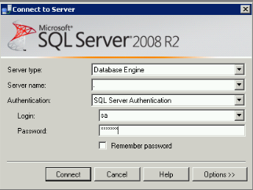

5. Configure the domain user privileges
  * Expand the Security folder, then Logins
  * Double Click on DELPHIX\delphix_src
  * Click on "User Mapping"
  * Check the box next to "master"
  * Select "db_datareader" for the database role membership
  * Click OK
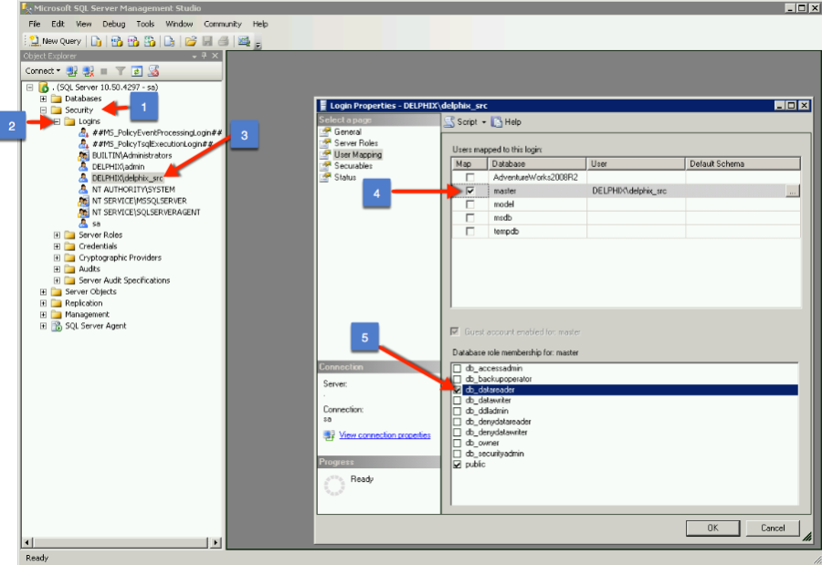

6. Right click Logins
7. Select New Login
8. Fill in the following details on the General Screen:
  * Login Name: delphix_db
  * SQL Server Authentication
  * Password: delphix
  * Unclick "Enforce password expiration"
  * Unclick "User must change password at next login"
  * On the left, click "User Mapping"
  * Check master, then select "db_datareader" from the role list

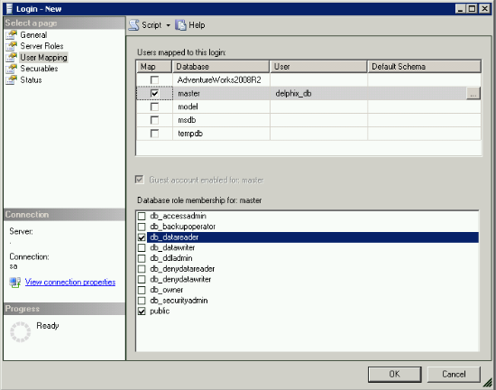

  * Check msdb, then select "db_datareader" from the role list

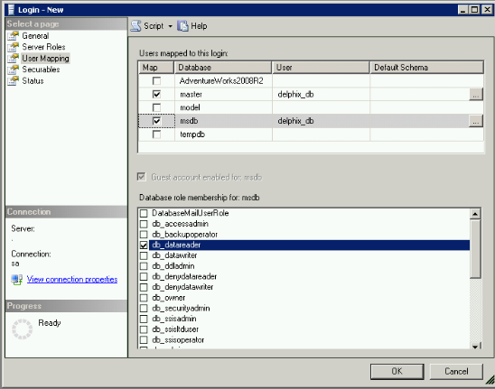

  * Check AdventureWorks2008R2, then select "db_backupoperator" from the role list to allow copy only full backups

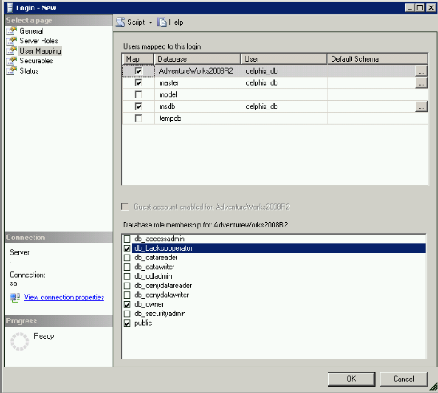

  * Click OK

## <a id="exercise3"></a>Exercise 3 - Take a Backup of the Source Database

In this exercise, you will:

  * Take a backup of the AdventureWorks2008R2 database
  * Verify the backup location share

### Steps

1. On the Windows Source machine, go to Start -> All Programs -> Microsoft SQL Server 2008 R2 -> SQL Server Management Studio
  * Under Authentication, select "SQL Server Authentication"
  * Log in as sa/delphix
2. Expand "Databases"
3. Right click AdventureWorks2008R2, then select Tasks -> Back Up...
4. Note the backup destination in C:\Backups and click OK

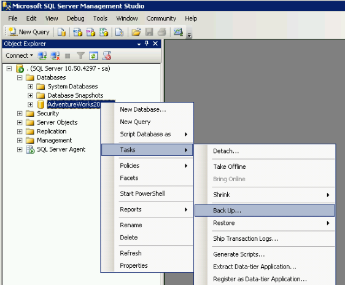

5. Click OK once the backup is complete
6. Open Windows Explorer and navigate to C:\
7. Right click "Backups" and select Properties
8. Select the Sharing tab
9. Click the "Share" button
10. Ensure the Delphix Source user is the Owner and Delphix Target user has read/write privileges

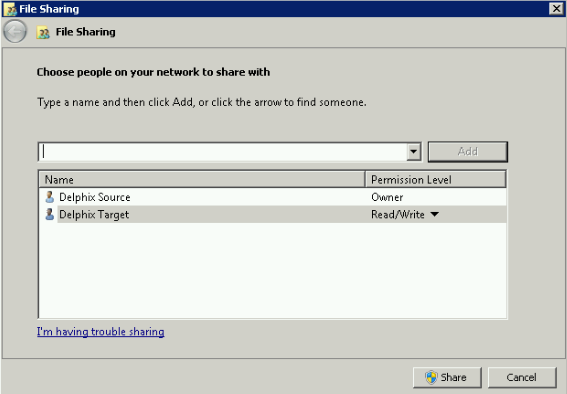

11. Click Cancel

## <a id="exercise4"></a>Exercise 4 - Configure the Windows Target/Staging Server

In this exercise, you will:

  * Download the Delphix Connector
  * Install the Delphix Connector
  * Enable Powershell scripts on the target

Before we start this exercise is important to mention that in Delphix, a
Target and Staging server have the same configuration. It's a Delphix best
practice to isolate the Staging workload from the VDB workload, so that's why
we call them in a different way, but from a requirements point of view, they
are the same.
### Steps

1. Double click "RDP" icon on the Student Desktop
2. Double click "Windows Target" to connect to the Windows Target server
3. Login as the delphix_trgt user (login details are in the **Getting Started** section of this guide)
4. Open Google Chrome from your Windows Target desktop
5. Navigate to your Delphix Engine at 10.0.x.10 ('x' is your **Student Number** )
  * Log in as the delphix_admin user
  * Go to Manage -> Environments
  * Click the ellipses (…) and select _Add Environment_

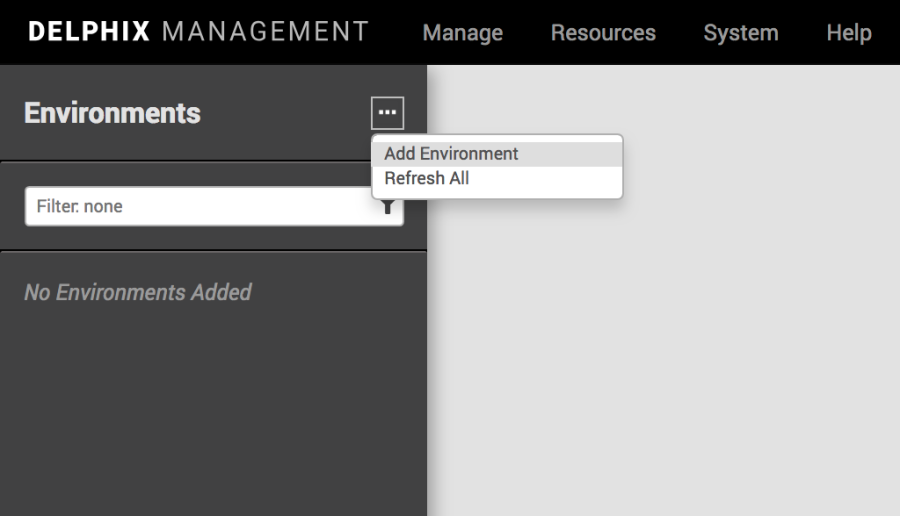

  On the _Host and Server_ tab choose **Windows** as the _Host OS_ and **Target** as the _Host Type_ then click Next

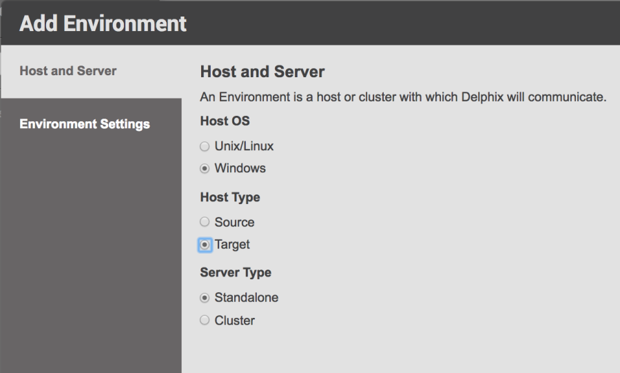

  Click the " _Download Delphix Connector Installer_ "

  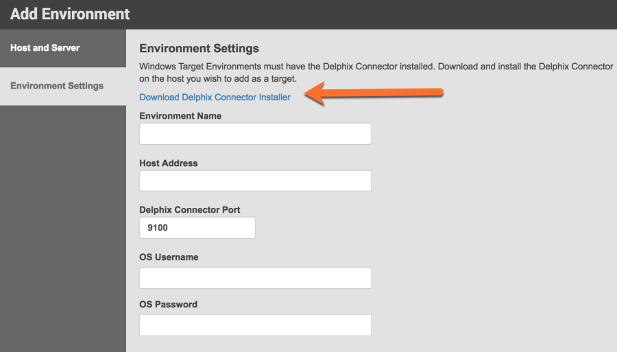

  Once it finishes downloading, click Keep

6. Open Windows Explorer and go to Downloads
7. Double click on DelphixConnectorInstaller
   * Click "Run"
   * Click "Next"
   * Agree to the terms and conditions and click Next
   * Accept the default Connector Port of 9100 by clicking Next
   * Accept the default location of C:\Program Files\Delphix\DelphixConnector\ by pressing Next. (Note: you do not need to fill this in, it will auto-populate on the next screen after you press next)
   * Click Next to install
   * Click Yes to allow the installation when the User Account Control (UAC) dialog pops up
   * Once it finishes, click Close
8. Go to Start -> All Programs -> Accessories -> Windows PowerShell
9. Right click on Windows PowerShell and select Run as Administrator

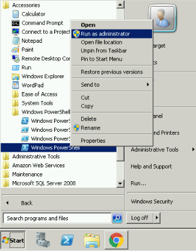

10. Click Yes to run with elevated privileges
11. Type: _Set-ExecutionPolicy Unrestricted_ at the Powershell prompt
12. Press "Y" and enter

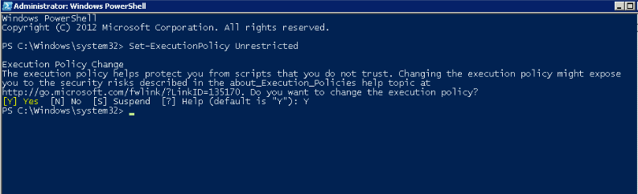

## <a id="exercise5"></a>Exercise 5 - Create a Target Environment

In this exercise, you will:

  * Connect Delphix to your Windows Target server

## Steps
1. Navigate to your Delphix Engine at 10.0.x.10 ('x' is your **Student Number** )
  * Log in as the delphix_admin user
  * Go to Manage -> Environments
  * Click the ellipses (…) and select _Add Environment_


2. On the _Host and Server_ tab choose **Windows** as the _Host OS_ and **Target** as the _Host Type_ then click Next

  
3. Under the Environment Settings tab, enter the details:
  * Environment Name: WINTARGET
  * Host Address: 10.0.x.60 (`x` is your **Student Number** )
  * Delphix Connector port: 9100
  * OS Username: delphix\delphix_trgt
  * OS Password: delphix
  * Click Validate Credentials
  * Click Submit
The creation is successful when "Create and discover environment 10.0.x.60"
completes without error and WINTARGET appears on your Delphix Environments
page

  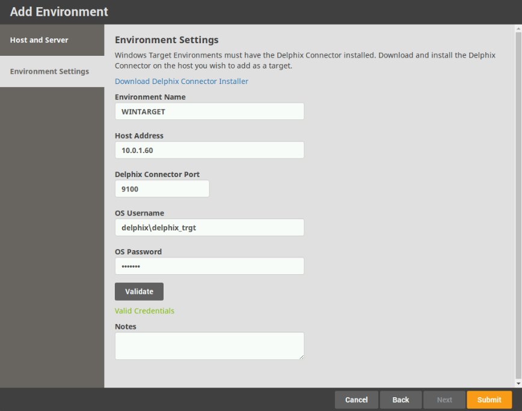

## <a id="exercise6"></a>Exercise 6 - Add the Source Environment

In this exercise, you will:

  * Connect Delphix to your Windows Source Server

### Steps

1. Navigate to your Delphix Engine at 10.0.x.10 ('x' is your **Student Number** )
2. Log in as the delphix_admin user
3. Go to Manage -> Environments
4. Click the ellipses (…) and select _Add Environment_
5. On the _Host and Server_ tab choose **Windows** as the _Host OS,_ **Source** as the _Host Type_ and **Standalone** as the _Server Type_ then click Next
6. Enter the details:
  * Environment Name: WINSOURCE
  * Host Address: 10.0.x.50 ('x' is your **Student Number** )
  * Connector Environment: Click on WINTARGET
  * OS Username: delphix\delphix_src
  * OS Password: delphix
7. Click Validate Credentials
8. Click Submit

  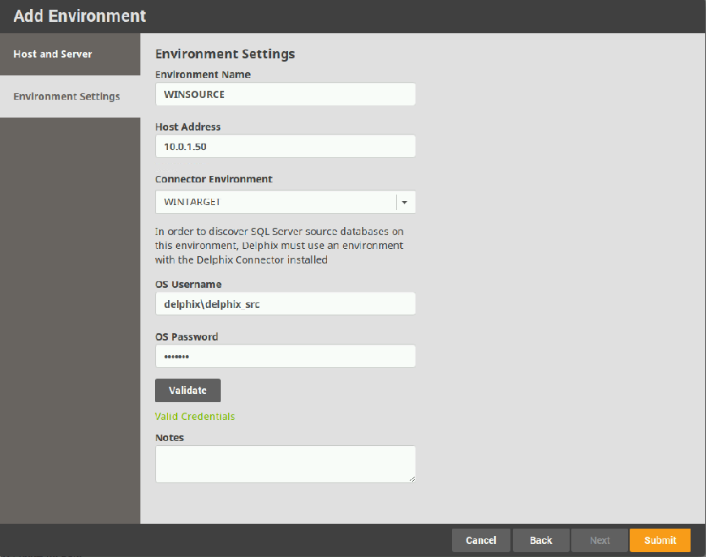

The creation is successful when "Create and discover environment 10.0.x.50"
completes without error and WINSOURCE appears on your Delphix Environments
page

## <a id="exercise7">Exercise 7 - Add the dSource
In this exercise, you will:

  * Add the AdventureWorks2008R2 dSource into Delphix and bring in the initial backup

### Steps

1. Navigate to Manage -> Datasets
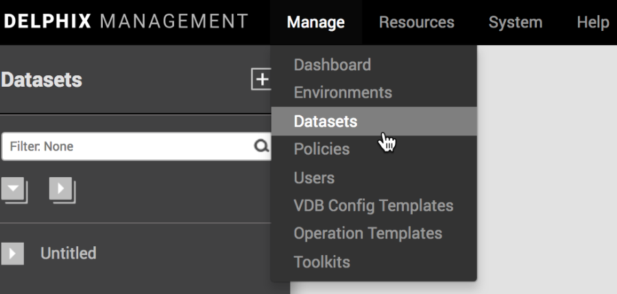

2. Click the Plus  and choose Add dSource from the drop-down

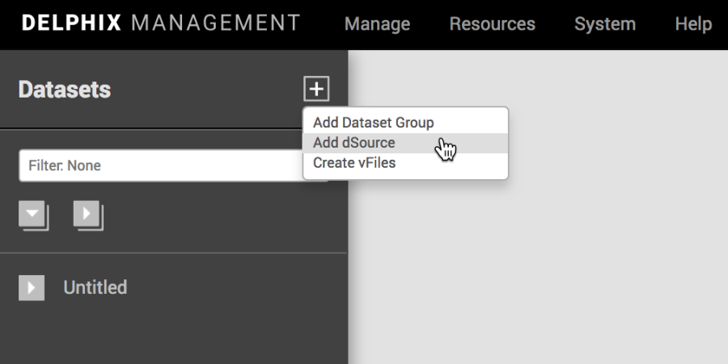

3. On the Add dSource wizard, review the information and pre-requisites on the Preparation tab then click Next

4. On the Source tab click the **AdventureWorks2008R2** Data Source to select it and enter the information below

  1. Environment User: **delphix\delphix_src**

  2. Select the **Database User** radio button

  3. Database Username: **delphix_db**

  4. Database Password: **delphix**

5. Click **Validate**

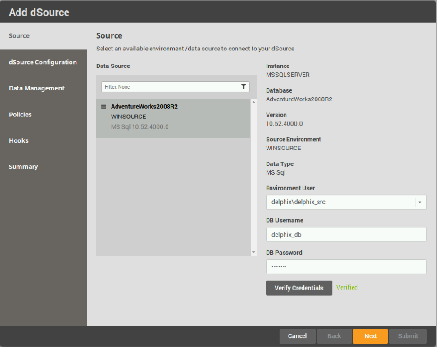

  1. Click Next

  2. Click the "Add Dataset Group" link

  3. Enter the Group Name: MS SQL Databases

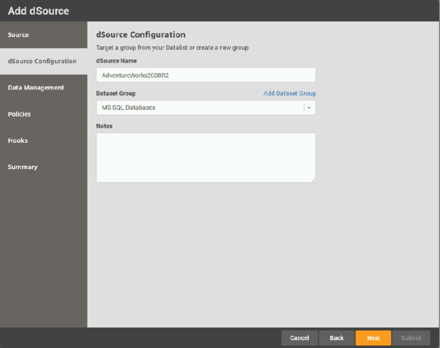

  1. Click OK and select the new group in the list

  2. Click Next

  3. Select "Use the most recent full or differential backup"

  4. For Backup Path, enter: \\\10.0.x.50\Backups ('x' is your **Student Number** )

  5. For Staging Environment, select WINTARGET

  6. For Validated Sync Mode, select Transaction log backups and click Enabled next to LogSync

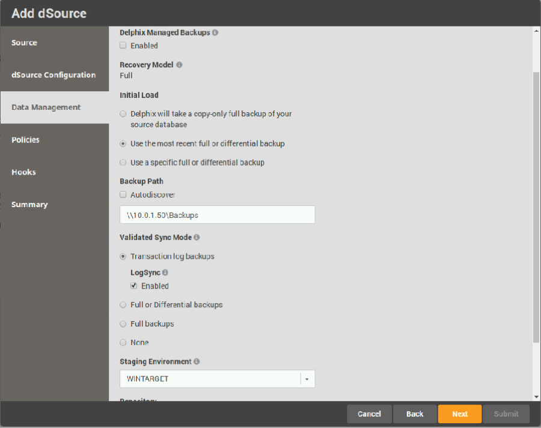

  1. Click Next

  2. Click Next

  3. Verify your settings and click Submit

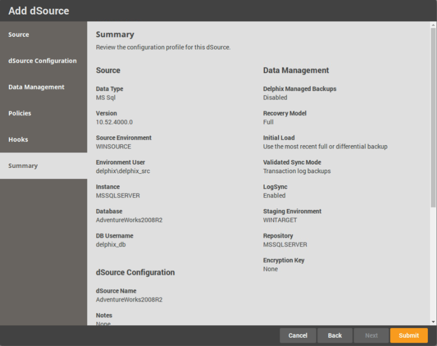

  1. Go to the main Delphix page by clicking Delphix in the top left corner of the GUI

  2. Monitor the AdventureWorks dSource addition via the progress bar and the Actions pane

##  <a id="exercise8">Exercise 8 - Provision a VDB

In this exercise, you will:

  * Create a VDB called _devdb_

  * Log into the VDB

**Steps**

1. Click the AdventureWorks2008R2 dSource in the MS SQL Databases group

2. Select the most recent snapshot and click Provision

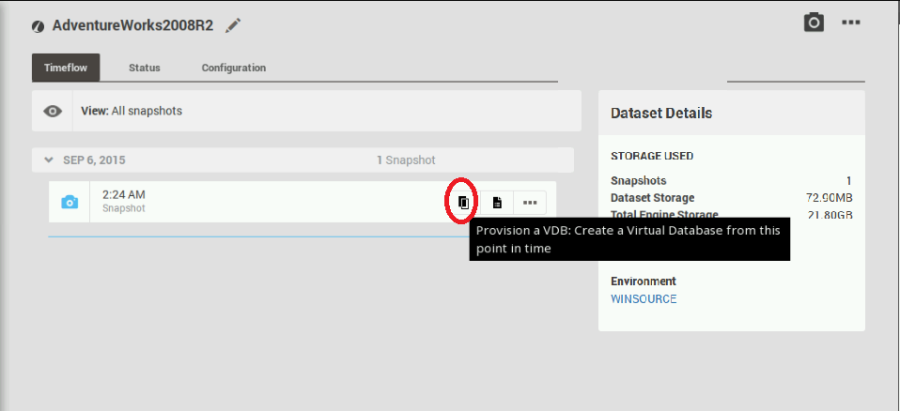

3. Select WINTARGET on the left pane of the wizard and click Next.

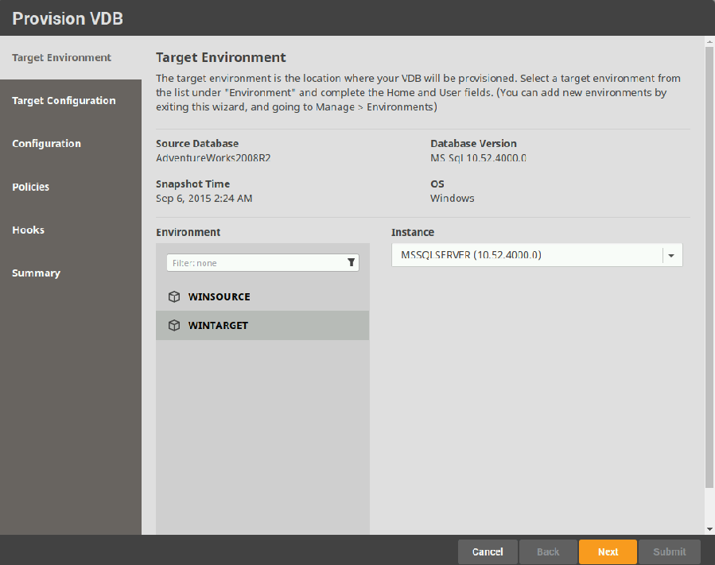

4. Enter the Database Name: devdb

5. Click Next

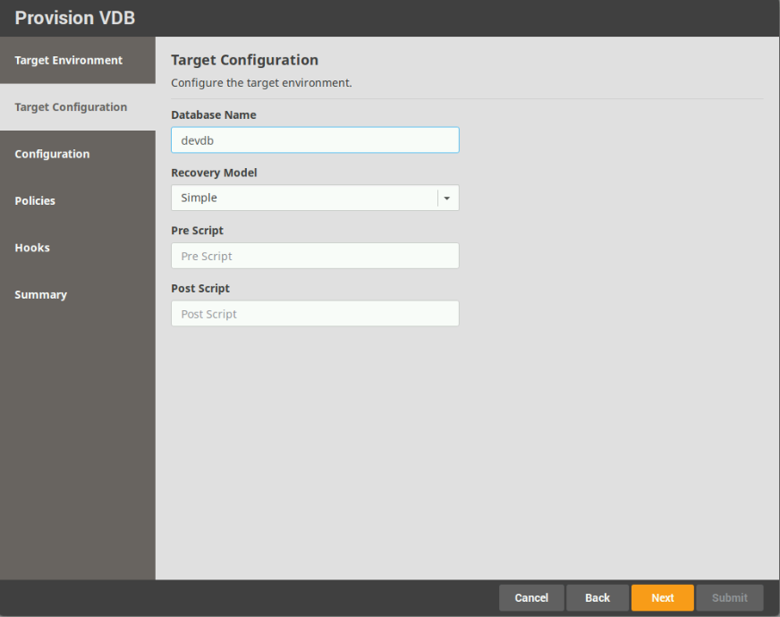

6. Select the dataset group "MS SQL Databases group"

7. Click Next

8. Keep the defaults values for retention and click Next

9. Keep the defaults for hooks and click Next

10. Verify settings and click Submit

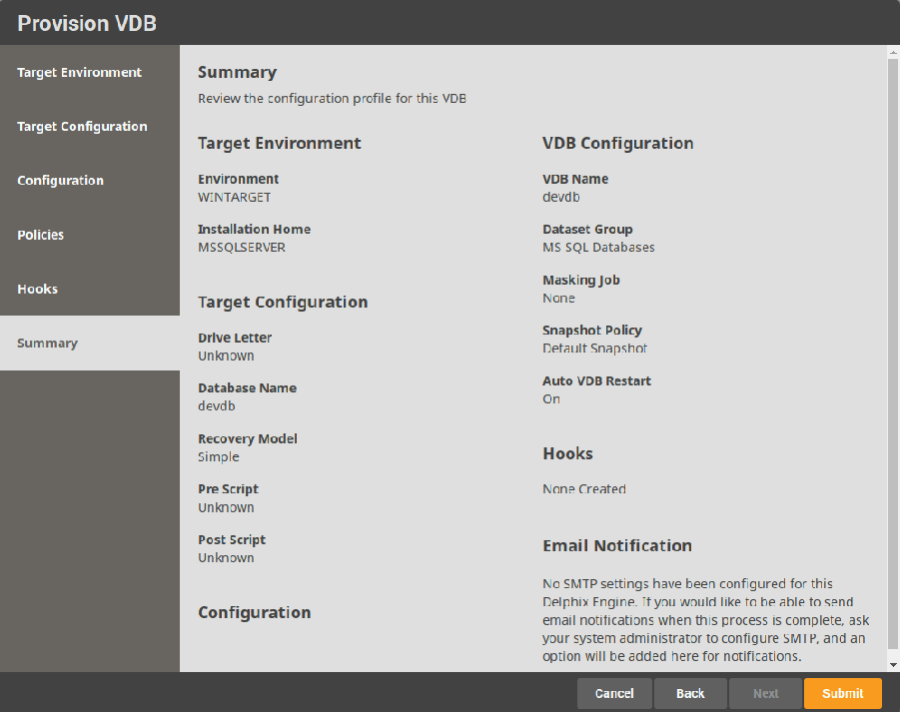
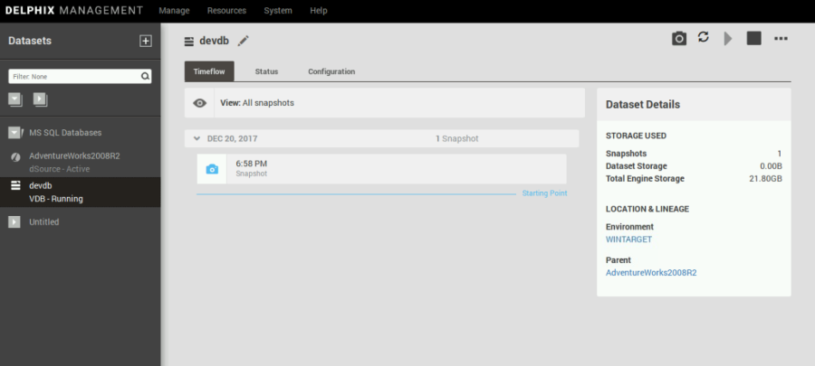
It may take a couple minutes for the VDB creation to complete. You can monitor
the progress on the left hand side of the screen next to the _devdb_ object in
the MS SQL Databases group. On the _Actions_ pane on the right hand side of
the screen, you should see the _Provision virtual database "devdb"_ item move
to the _Recently completed_ pane without error. Once the VDB is created, you
can verify that the VDB is operational by:

1. Log into the Target via RDP

2. Click Start and go to SQL Server Management Studio

3. Click Connect to log in as delphix\delphix_trgt

4. Expand Databases

5. Note the "devdb" virtual database

6. Note the validated sync database (named with a GUID)

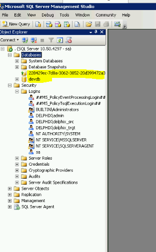

## <a id="exercise9">Exercise 9 - Refresh a VDB

In this exercise, you will:

  * Create a new table on your source database

  * Snapshot the dSource

  * Refresh your VDB - devdb

  * Verify the new table appears on the VDB

**Steps**

1. Log into the Source via RDP

2. Go to Start -> All Programs -> Microsoft SQL Server 2008 R2 -> SQL Server Management Studio

  1. Under Authentication, select "SQL Server Authentication"

  2. Log in as sa/delphix

3. Expand "Databases"

4. Right click AdventureWorks2008R2, then select New Query

5. Run the following command (by clicking **Execute**):

_select * into sourcetab_ _from
AdventureWorks2008R2.HumanResources.vEmployee;_

  1. Take a transaction log backup, by right-clicking the **AdventureWorks2008R2** folder, selecting **Tasks** and **Back Up**, and then choose Backup Type = "Transaction Log."

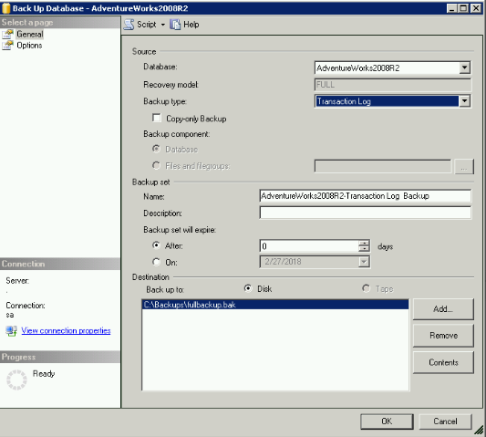

  1. Go back to the Delphix Engine GUI

  2. Within a couple of minutes a new timecard will appear for the dSource

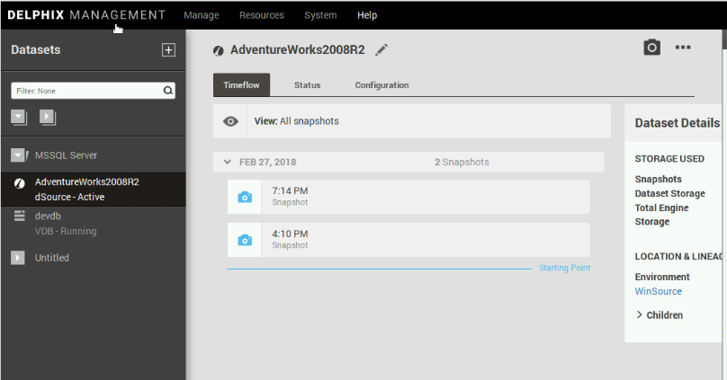

  1. Select the _devdb_ VDB and click the _Refresh_ button

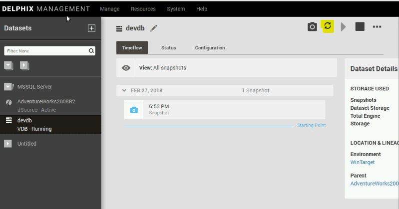

  1. Refresh the _devdb_ VDB using the latest snapshot from the AdventureWorks2008R2 dSource

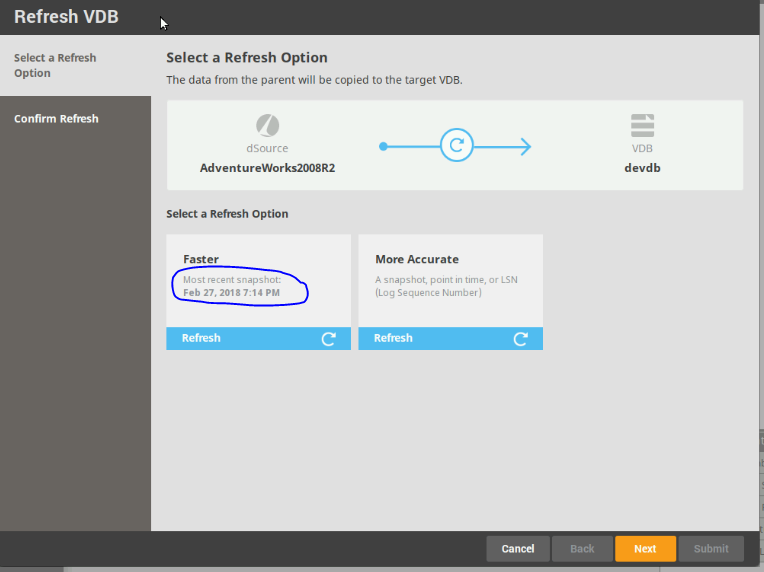

  1. Click Submit button

Once the refresh has completed, you can log into _devdb_ to confirm.

  1. Log into the Target via RDP

  2. Go to Start -> All Programs -> Microsoft SQL Server 2008 R2 -> SQL Server Management Studio

    1. Under Authentication, select "SQL Server Authentication"

    2. Log in as sa/delphix

  3. Expand "Databases"

  4. Right click devdb, then select New Query

  5. Run the following command:

_select count(*) from_ _sourcetab;_

If this returns a count of rows, the snapshot/refresh was successful.

## <a id="exercise10">Exercise10 - Rewind a VDB

In this exercise, you will:

  * Take a snapshot of the _devdb_ VDB

  * Delete a table

  * Rewind the _devdb_ VDB to recover the table

**Steps**

  1. Take a snapshot of the _devdb_ VDB and note the time

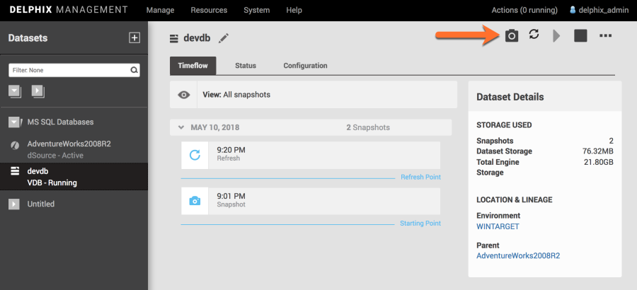

  1. Log into the Target via RDP

  2. Go to Start -> All Programs -> Microsoft SQL Server 2008 R2 -> SQL Server Management Studio

    1. Under Authentication, select "SQL Server Authentication"

    2. Log in as sa/delphix

  3. Expand "Databases"

  4. Right click **devdb** , then select New Query

  5. Run the following commands:

_drop table sourcetab;_
 _select count(*) from sourcetab;_

You will receive an error "Invalid Object name 'sourctab'.
Do not close the query window.
Now we will rewind the VDB to the last good snapshot to recover the table.

  1. Select the _devdb_ VDB

  2. Select the snapshot card associated with the date/time you recorded prior to dropping the table.

  3. Rewind the VDB to the snapshot card.

Once the rewind operation is complete, you can confirm the table has been
recovered:
Go to SQL Server Management Studio on Target SQL server and run the following
command.
 _select
count(*) from sourcetab;_
The should receive a count of the table.

## <a id="exercise11">Exercise 11 - Set a New Retention Policy

There are four types of Policies in Delphix. In this exercise, you will:

  * Create a Retention Policy

  * Set the new policy to keep snapshots and logs for 30 days, along with 3 monthly snapshots

  * Apply the policy to the VDB we created in the previous exercise

**Steps**

  1. Navigate to Manage -> Policies

  2. Create a new retention policy (by going to the "Retention" tab and clicking the "+ Retention" blue button) for _devdb_ with the following details:

    1. Name: Long Term

    2. 30 days of snapshot and log retention

    3. 3 monthly snapshots taken on the 1st of the month

  3. To do this click on **+ Retention** and then fill the fields as shown in the screenshot below:

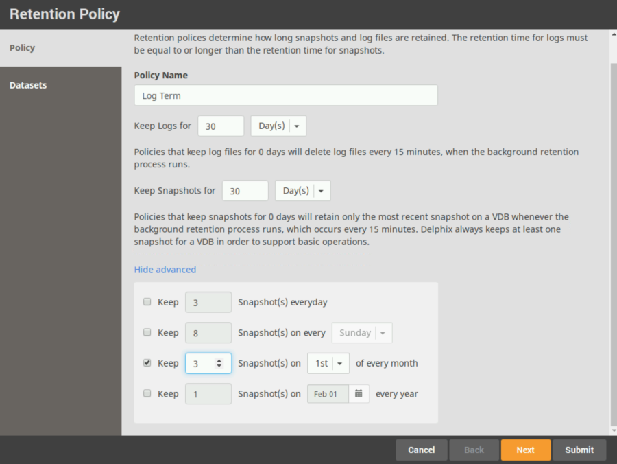

  1. Click Next and select **devdb** on the bottom of the pop up and then click Submit.

##  <a id="exercise12">Exercise 12 - Create and Save a Hook Operation Template

In this exercise, you will:

  * Create a Hook Operation Template called: _CREATE APPUSER_

  * Insert code into the template that will create a Login and database user named _appuser_

**Steps**

1. Create a new Hook Operation Template called: Create APPUSER

  1. Click on the **Manage** menu

  2. Click on Hook Templates

2. Click on Plus sign

  2. Name - CREATE APPUSER

  3. Type - Powershell Script

  4. Contents (enter exactly - opening the lab in the lab server and copy/pasting this is highly recommended):

   ```
    [System.Reflection.Assembly]::LoadWithPartialName('Microsoft.SqlServer.SMO')
    $sqlserver = "."
    $dbname = $env:VDB_DATABASE_NAME
    $name = "appuser"
    $Server = New-Object ('Microsoft.SqlServer.Management.Smo.Server') $sqlserver
    if (-Not $Server.Logins.Contains($name))
    {
    $Login = New-Object -TypeName Microsoft.SqlServer.Management.Smo.Login -ArgumentList $Server,
    $name
    $Login.LoginType = 'SqlLogin'
    $Login.Create('delphix')
    }
    $database = $server.Databases["$dbname"]
    $user = new-object ('Microsoft.SqlServer.Management.Smo.User') $database, $name
    $user.Login = $name
    $user.Create()
   ```
---|---

**IMPORTANT:** Make sure the carriage returns you see here are the same in the pasted contents.
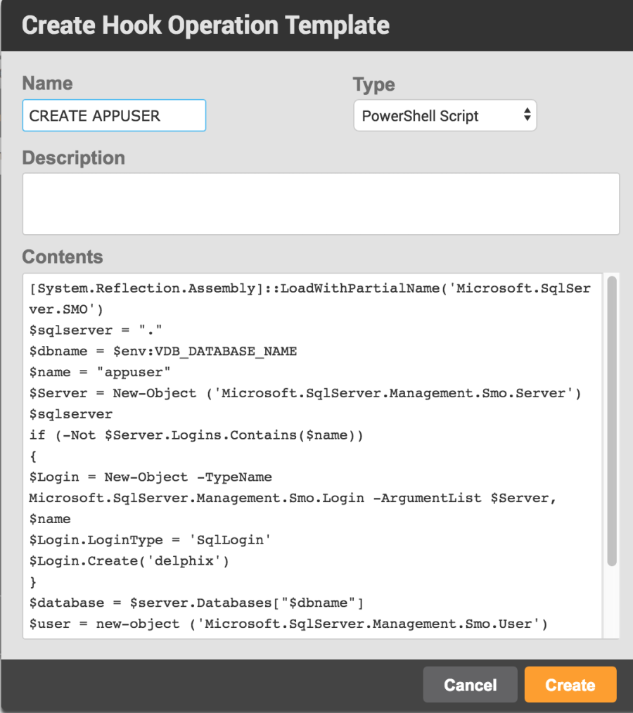

  2. Click Create

  3. Click Close

## <a id="exercise13">Exercise 13 - Provision a VDB with Hook Template

In this exercise, you will:

  * Create a VDB called qadb

  * Use the Hook Operation Template we created previously

  * Log into the Target Instance

  * Verify the Hook Operation Template was successful

**Steps**

1. Click the AdventureWorks2008R2 dSource in the MS SQL Databases group

2. Select the most recent snapshot and click the Provision icon

3. Select WINTARGET on the left pane of the wizard and click Next

4. Select the dataset group "MS SQL Databases group"

5. Enter the Database Name: qadb

6. Click Next to accept default policies

7. Click Next to proceed without masking

8. On the Hooks tab add a Configure Clone Hook (1. Click on the Plus sign. 2. Click on **Create from Template**)

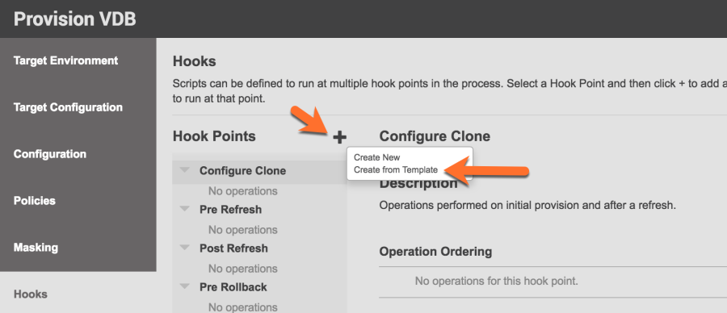

9. On the Hook Operation dialog box, verify that _Configure Clone_ is selected for the Hook Point

10. Enter a name - APPUSER

11. Click Create

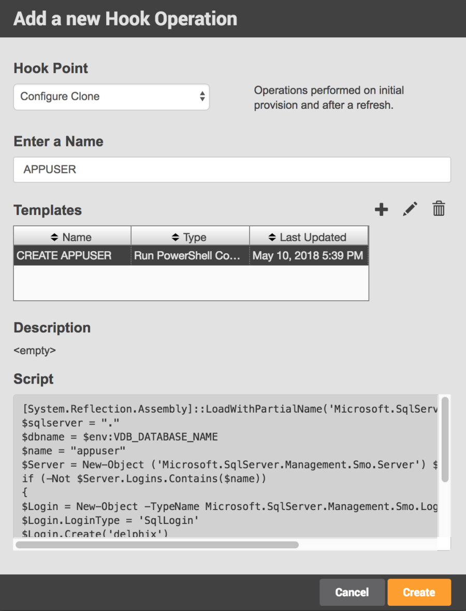

12. Verify settings and click Submit

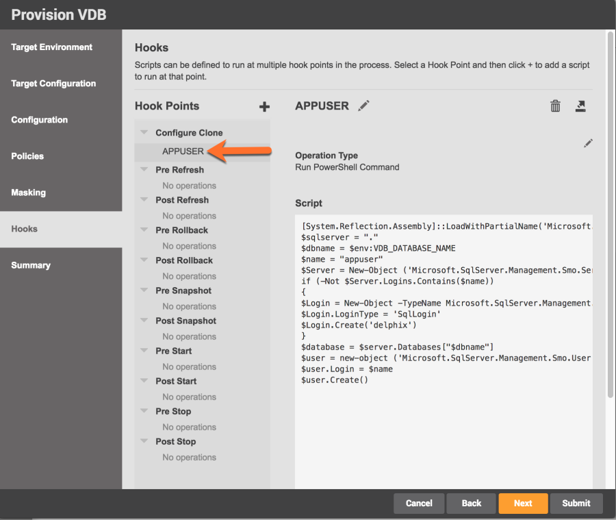
It may take a couple minutes for the VDB creation to complete. You can monitor
the progress on the left hand
side of the screen next to the _qadb_ object in the MS SQL Databases group. On
the Actions pane on the right hand side of the screen, you should see the
Provision virtual database _qadb_ item move to the Recently completed pane
without error. Once the VDB is created, you can verify that the VDB is
operational by:

1. Log into the Target via RDP

2. Go to Start -> All Programs -> Microsoft SQL Server 2008 R2 -> SQL Server Management Studio

  1. Under Authentication, select "SQL Server Authentication"

  2. Log in as **appuser/delphix**

3. Expand "Databases"

4. Select qadb -> Security -> Users

This will verify that the VDB is online and that the APPUSER user was created
by our hook.

## <a id="exercise14">Exercise 14 - Recovering a deleted table using log sync

  * Create a table

  * Delete the table

  * Backup transaction log

  * Recover the table from transaction log(log sync)

**Steps**

1. Create a table as follows on source server
  _select * into Logsync_tab from AdventureWorks2008R2.HumanResources.vEmployee;_
(  Note the time  )

2. Wait for few minutes (to give time for the table to be created)

3. Drop the table called **Logsync_tab** and note the time.

  `drop table Logsync_tab;`

4. Take a transaction log backup (right-click on AdventureWorks2008R2 folder, click Tasks --> Back Up, and select Transaction Log from the dropdown labeled "Backup Type")

5. Wait until the dSource Timeflow reflects this Transaction log time

6. Create a VDB by selecting date and time from the Timeflow

Choose the transaction log prior to latest log (Latest log is the log that has
create and drop table actions).
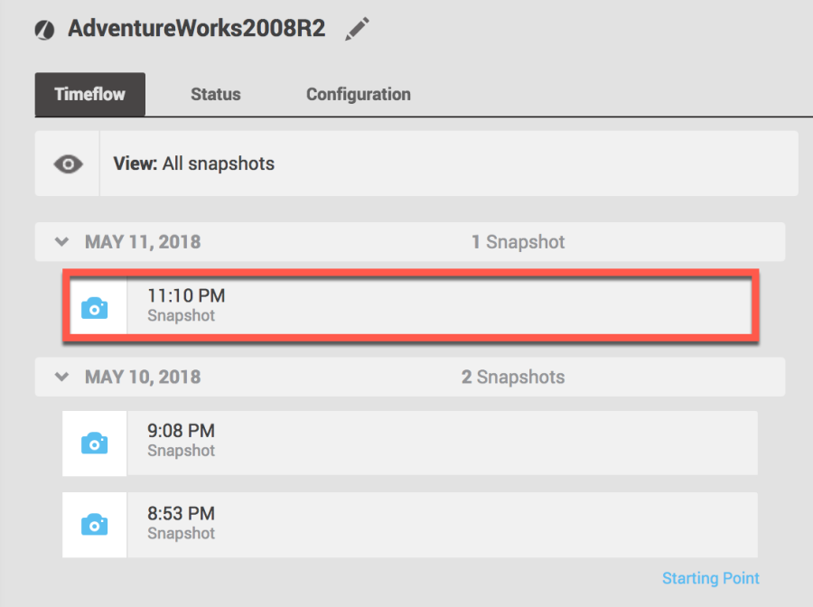

7. Expand the log by clicking on "Open LogSync" (second icon)

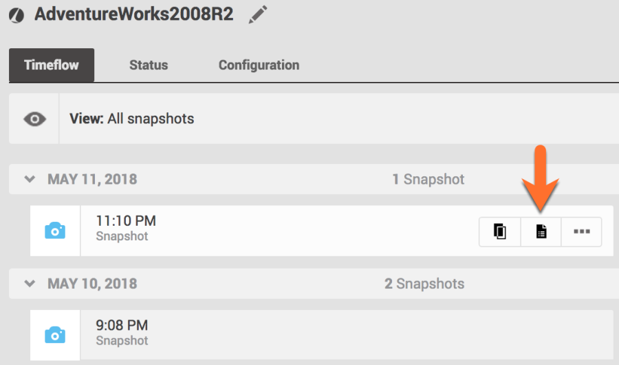

8. Change the date time to the time after the table creation

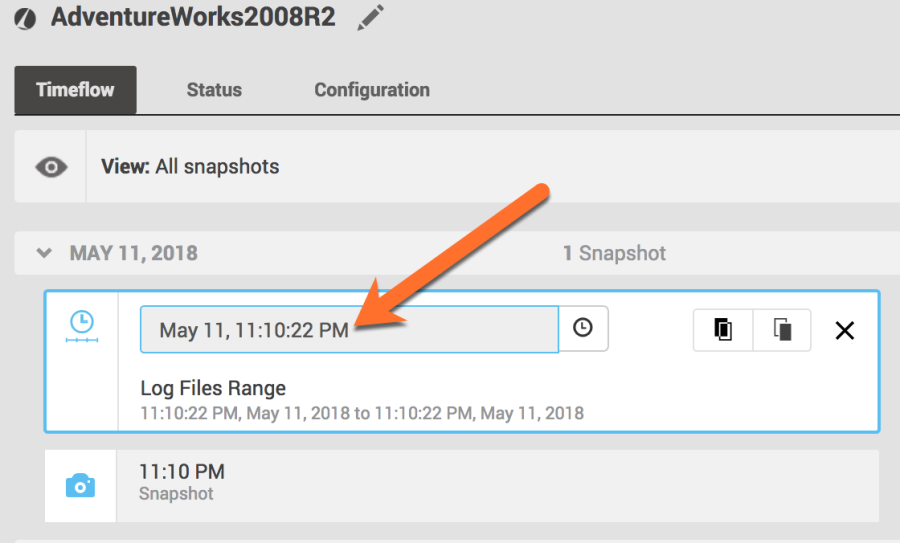

9. Create VDB by clicking on "provision VDB "(First icon). Name the VDB -  RecoverTable

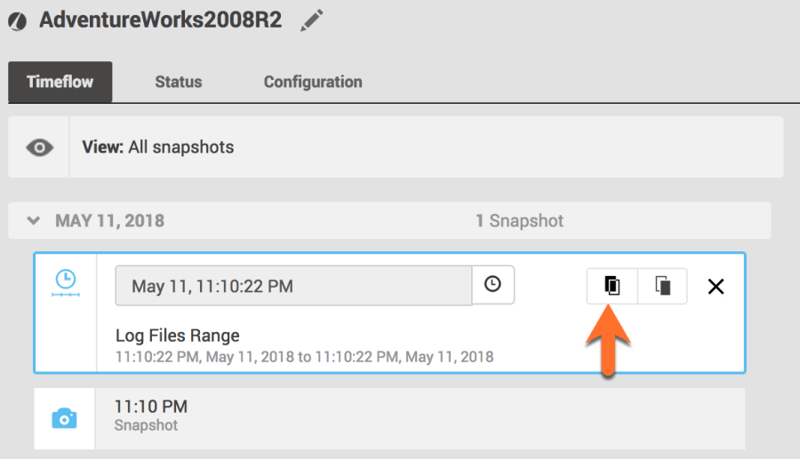

10. After the VDB is created, look for the table on target server.

* Log into the Target via RDP

* Click Start and go to SQL Server Management Studio

* Click Connect to log in as delphix\delphix_trgt

* Expand Databases

* Expand the " RecoverTable " virtual database

## <a id="exercise15">Exercise 15 - Delink a dSource

In this exercise you will

  * Delink a dSource

  * Note the changes to Timeline of the dSource caused by the delink operation

  * Note the VDB provisioned from the delinked dSource is unaffected.

Steps

1. Login to the Delphix Admin UI as a user with Delphix_Admin privileges.

2. Navigate to Manage  Datasets and click on the dSource "Adventureworks2008R2"

3. Unlink the dSource - Click on the ellipses (…) next to snapshot button and click on "Unlink dSource"

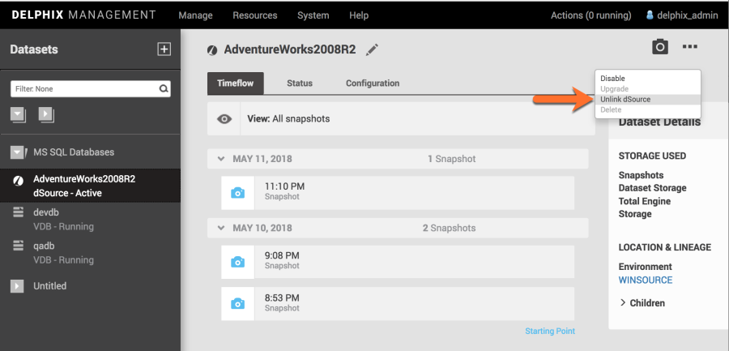

4. Click Unlink on the confirmation box that pops up.

5. Once action completes note the status of the dSource on the right hand side has changed to Detached. You will be unable to take additional snapshots of a detached dSource.

6. Note changes in the display. Click on Status and Configuration tabs and notice the changes.

7. Connect to the target VDB and confirm it is still running.

## <a id="exercise16">Exercise 16 - Create a new User with Delphix_Admin privileges

In this exercise you will

  * Create new user

  * Assign delphix_admin privileges to the new user.

**Steps**

1. Login to the Delphix UI as a _delphix_admin_

2. Click on Manage  Users

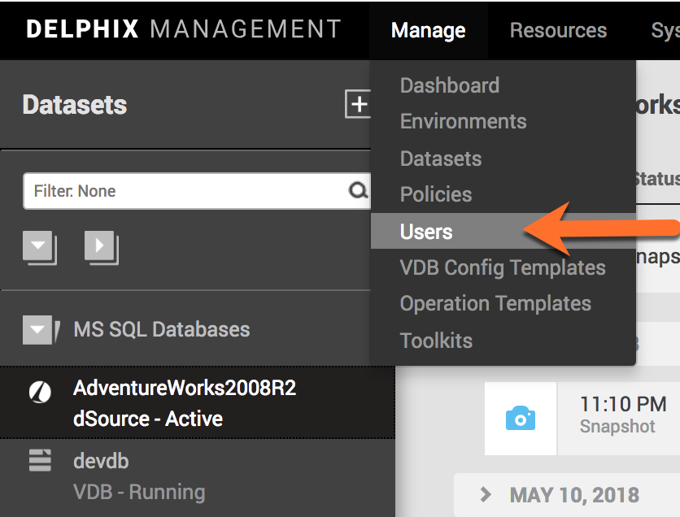

3. Click on the + sign to add user

4. Create a new Engine Administrator user called **DA_User** (set in "User Type" dropdown). You can set password as 'delphix'

5. Log out and re-login to the Delphix UI as **DA_User**

##  <a id="exercise17">Exercise 17 - Check the Audit logs for user related actions

In this exercise you will:

  * Explore options available to check the audit logs

  * Identify the record representing user creation of **DA_User** user from previous exercise

**Steps** :

1. Login to the Delphix UI as the admin user. 

2. Navigate to SystemAudit

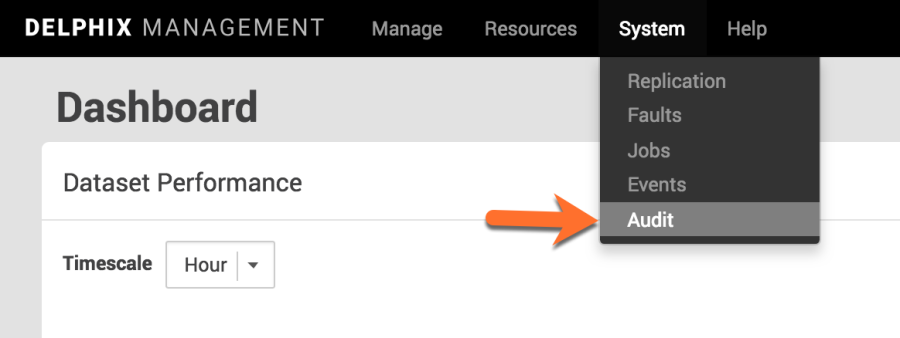

3. Display audit records for the past week. From the Predefined Range drop down pick 1 Week to show Audit logs from the past week.

4. Filter the records for USER. In the filter box on the top right hand side of the Audit page enter _User_ , to filter out only the user action related records.

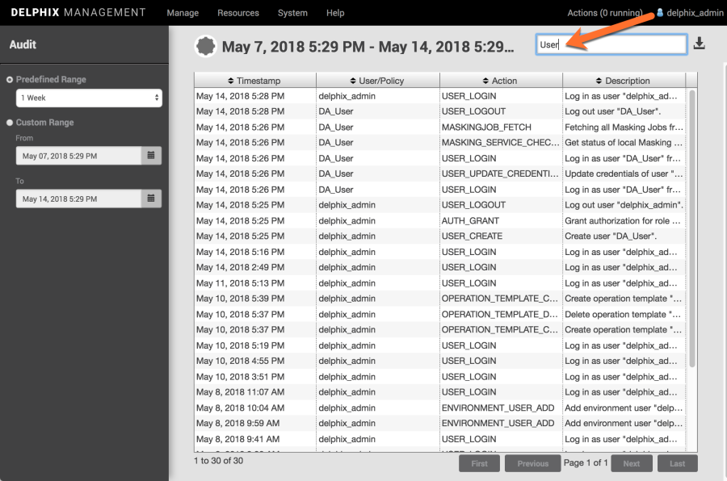

5. Look through the records displayed to identify logins by the DA_User
